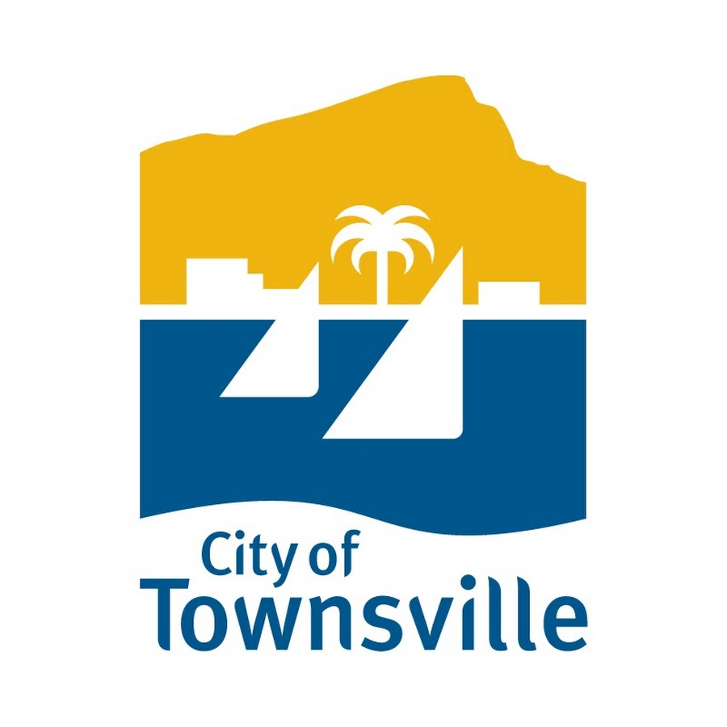
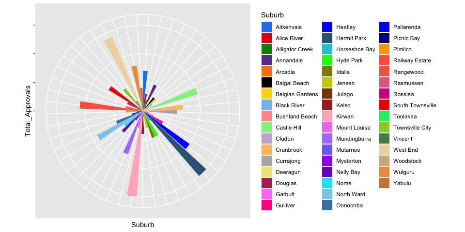
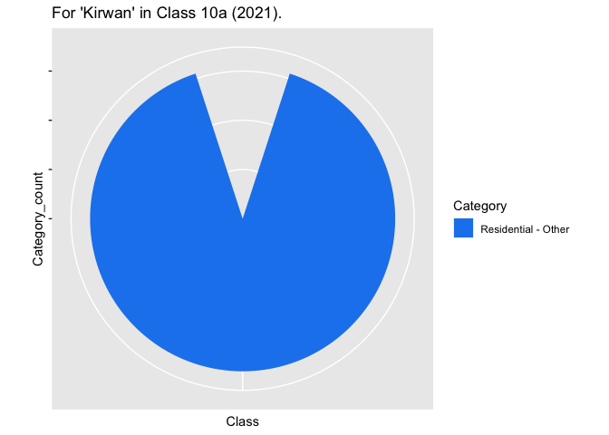
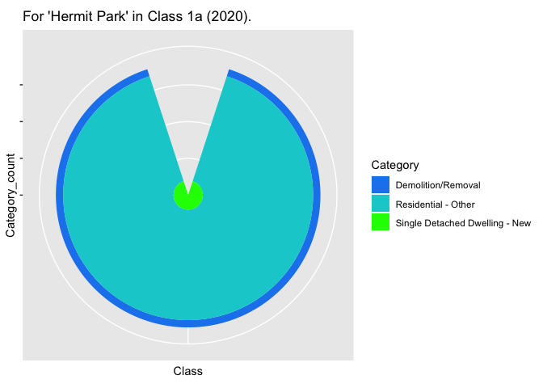

# Introduction

The analysis in the report is regarding **building certification lodgements** in the Townsville local government area. **Townsville is a city and a major port area in eastern Queensland, Australia.** Two data sets have been combined and used for the analysis from the  [www.data.gov.au](https://data.gov.au) website. 

First data set i.e. the building approval details have been extracted from [here](https://data.gov.au/data/dataset/tcc-building-approvals) ("Townsville City Council Building Approvals - data.gov.au", 2021) and includes number of building approvals from 2009 to 2021 and their corresponding details e.g. Decision, Class, Suburb etc. And the second data set i.e. City of Townsville's Suburb geometry has been extracted from [here](https://data.gov.au/dataset/ds-dga-81cbbedc-e35f-4266-980d-21a6159b2404/distribution/dist-dga-28812258-4cf4-46aa-aa43-0206d7c60920/details?q=) ("Townsville Suburbs - data.gov.au.", 2021) and includes the geometrical values for these Suburbs.

This report has been complied using R Studio ("RStudio Team", 2020), [Github](https://github.com/PranaliAngne/Team_Amigos_5513Assignment4) ("GitHub: Where the world builds software", 2021), Gitkraken("GitKraken Documentation", 2021) and Atom("A hackable text editor for the 21st Century", 2021).

**Project Details**

- Name: **Analyzing Building approvals data for the City of Townsville** (Assignment 4, ETC5513)

- Objective: Answering research questions regarding Year, Approvals, Class, Category, Suburb and Estimated Cost for Building Approvals in the city of Townsville.

**Research Questions**

1. To identify the year with maximum approvals and to analyze the data further to find out the suburb and estimate cost of building with respect to the most popular class in that year. And also find out the category that is most in demand for that class.

2. To analyze the suburb which was inferred from research question 1 and find out the year for which it had the maximum approvals. Also find out the class that occurred maximum times, category with respect to that class and estimate cost for these particular variables.




# Analysis

(Please use **plotly** (*Click on the figure/table to active plotly*) to hover through the figures/tables and maps for better understanding of the analysis)

\section*{Q1, Part A}


**Variable Names**

After data cleaning according to our research questions, we will be selecting the following variables:

<table class=" lightable-paper lightable-hover" style='font-family: "Arial Narrow", arial, helvetica, sans-serif; margin-left: auto; margin-right: auto;'>
<caption>(\#tab:tab1)Variable Names</caption>
<tbody>
  <tr>
   <td style="text-align:left;"> Application Type </td>
  </tr>
  <tr>
   <td style="text-align:left;"> Date Of Decision Notice </td>
  </tr>
  <tr>
   <td style="text-align:left;"> Decision </td>
  </tr>
  <tr>
   <td style="text-align:left;"> Class </td>
  </tr>
  <tr>
   <td style="text-align:left;"> Subcategory </td>
  </tr>
  <tr>
   <td style="text-align:left;"> Category </td>
  </tr>
  <tr>
   <td style="text-align:left;"> Estimated Cost </td>
  </tr>
  <tr>
   <td style="text-align:left;"> Suburb </td>
  </tr>
  <tr>
   <td style="text-align:left;"> Latitude </td>
  </tr>
  <tr>
   <td style="text-align:left;"> Longitude </td>
  </tr>
</tbody>
</table>

For table \@ref(tab:tab1), the **description of the variables** used in the data set:

+ **Application type**: Here, application for 'building certification lodgements'.

+ **Date of decision notice**: The date the building certifier made a notice that the works met the building codes.

+ **Decision**: Current status of the works as recorded with Council.

+ **Class**: The building classification as per the list on page one.

+ **Sub-category (Council category descriptors)**: This category is a subdivision of class. Provides information regarding additions, alterations, subdwell etc in it.

+ **Category**: Townsville City Council has published on its website for a number of years a summary of building approval data using the certain categories.

+ **Estimated values**: The monetary value of the proposed building work.

+ **Suburb**: The suburb where the building work is taking place.

+ **Latitude and Longitude**: Geometrical dimensions. 

## Answering **Research Question 1.**

### Finding **Year** with **maximum approvals** as a decision, overall.

<div class="figure" style="text-align: center">

```{=html}
<div class="plotly html-widget html-fill-item-overflow-hidden html-fill-item" id="htmlwidget-a1b727dadc14b80e1e23" style="width:864px;height:480px;"></div>
<script type="application/json" data-for="htmlwidget-a1b727dadc14b80e1e23">{"x":{"data":[{"orientation":"v","width":[0.300000000000182,0.179999999999836,0.224999999999909,0.300000000000182,0.224999999999909,0.300000000000182,0.224999999999909,0.300000000000182,0.224999999999909,0.300000000000182,0.179999999999836,0.224999999999909,0.300000000000182],"base":[0,0,0,0,0,0,0,0,0,0,0,0,0],"x":[2008.7,2009.64,2010.6625,2011.7,2012.6625,2013.7,2014.6625,2015.7,2016.6625,2017.7,2018.64,2019.6625,2020.7],"y":[481,327,255,290,341,363,291,259,266,273,504,920,885],"text":["Year: 2009<br />Total number of Decision:  481<br />Decision: #Approved","Year: 2010<br />Total number of Decision:  327<br />Decision: #Approved","Year: 2011<br />Total number of Decision:  255<br />Decision: #Approved","Year: 2012<br />Total number of Decision:  290<br />Decision: #Approved","Year: 2013<br />Total number of Decision:  341<br />Decision: #Approved","Year: 2014<br />Total number of Decision:  363<br />Decision: #Approved","Year: 2015<br />Total number of Decision:  291<br />Decision: #Approved","Year: 2016<br />Total number of Decision:  259<br />Decision: #Approved","Year: 2017<br />Total number of Decision:  266<br />Decision: #Approved","Year: 2018<br />Total number of Decision:  273<br />Decision: #Approved","Year: 2019<br />Total number of Decision:  504<br />Decision: #Approved","Year: 2020<br />Total number of Decision:  920<br />Decision: #Approved","Year: 2021<br />Total number of Decision:  885<br />Decision: #Approved"],"type":"bar","textposition":"none","marker":{"autocolorscale":false,"color":"rgba(27,158,119,1)","line":{"width":1.88976377952756,"color":"transparent"}},"name":"#Approved","legendgroup":"#Approved","showlegend":true,"xaxis":"x","yaxis":"y","hoverinfo":"text","frame":null},{"orientation":"v","width":0.179999999999836,"base":0,"x":[2009.82],"y":[1],"text":"Year: 2010<br />Total number of Decision:    1<br />Decision: Amended","type":"bar","textposition":"none","marker":{"autocolorscale":false,"color":"rgba(217,95,2,1)","line":{"width":1.88976377952756,"color":"transparent"}},"name":"Amended","legendgroup":"Amended","showlegend":true,"xaxis":"x","yaxis":"y","hoverinfo":"text","frame":null},{"orientation":"v","width":[0.179999999999836,0.224999999999909,0.300000000000182,0.224999999999909,0.300000000000182,0.224999999999909,0.300000000000182,0.224999999999909,0.300000000000182,0.179999999999836,0.224999999999909,0.300000000000182],"base":[0,0,0,0,0,0,0,0,0,0,0,0],"x":[2010,2010.8875,2012,2012.8875,2014,2014.8875,2016,2016.8875,2018,2018.82,2019.8875,2021],"y":[5,19,16,24,23,15,9,24,29,41,145,137],"text":["Year: 2010<br />Total number of Decision:    5<br />Decision: Amendreqst","Year: 2011<br />Total number of Decision:   19<br />Decision: Amendreqst","Year: 2012<br />Total number of Decision:   16<br />Decision: Amendreqst","Year: 2013<br />Total number of Decision:   24<br />Decision: Amendreqst","Year: 2014<br />Total number of Decision:   23<br />Decision: Amendreqst","Year: 2015<br />Total number of Decision:   15<br />Decision: Amendreqst","Year: 2016<br />Total number of Decision:    9<br />Decision: Amendreqst","Year: 2017<br />Total number of Decision:   24<br />Decision: Amendreqst","Year: 2018<br />Total number of Decision:   29<br />Decision: Amendreqst","Year: 2019<br />Total number of Decision:   41<br />Decision: Amendreqst","Year: 2020<br />Total number of Decision:  145<br />Decision: Amendreqst","Year: 2021<br />Total number of Decision:  137<br />Decision: Amendreqst"],"type":"bar","textposition":"none","marker":{"autocolorscale":false,"color":"rgba(117,112,179,1)","line":{"width":1.88976377952756,"color":"transparent"}},"name":"Amendreqst","legendgroup":"Amendreqst","showlegend":true,"xaxis":"x","yaxis":"y","hoverinfo":"text","frame":null},{"orientation":"v","width":0.179999999999836,"base":0,"x":[2019],"y":[1],"text":"Year: 2019<br />Total number of Decision:    1<br />Decision: Complete","type":"bar","textposition":"none","marker":{"autocolorscale":false,"color":"rgba(231,41,138,1)","line":{"width":1.88976377952756,"color":"transparent"}},"name":"Complete","legendgroup":"Complete","showlegend":true,"xaxis":"x","yaxis":"y","hoverinfo":"text","frame":null},{"orientation":"v","width":[0.224999999999909,0.224999999999909],"base":[0,0],"x":[2011.1125,2013.1125],"y":[1,2],"text":["Year: 2011<br />Total number of Decision:    1<br />Decision: Finalfail","Year: 2013<br />Total number of Decision:    2<br />Decision: Finalfail"],"type":"bar","textposition":"none","marker":{"autocolorscale":false,"color":"rgba(102,166,30,1)","line":{"width":1.88976377952756,"color":"transparent"}},"name":"Finalfail","legendgroup":"Finalfail","showlegend":true,"xaxis":"x","yaxis":"y","hoverinfo":"text","frame":null},{"orientation":"v","width":[0.300000000000182,0.179999999999836,0.224999999999909,0.300000000000182,0.224999999999909,0.300000000000182,0.224999999999909,0.300000000000182,0.224999999999909,0.300000000000182,0.179999999999836,0.224999999999909,0.300000000000182],"base":[0,0,0,0,0,0,0,0,0,0,0,0,0],"x":[2009,2010.18,2011.3375,2012.3,2013.3375,2014.3,2015.1125,2016.3,2017.1125,2018.3,2019.18,2020.1125,2021.3],"y":[4125,3711,3523,3875,3467,3316,3089,2759,2666,2464,2656,2600,278],"text":["Year: 2009<br />Total number of Decision: 4125<br />Decision: Finalised","Year: 2010<br />Total number of Decision: 3711<br />Decision: Finalised","Year: 2011<br />Total number of Decision: 3523<br />Decision: Finalised","Year: 2012<br />Total number of Decision: 3875<br />Decision: Finalised","Year: 2013<br />Total number of Decision: 3467<br />Decision: Finalised","Year: 2014<br />Total number of Decision: 3316<br />Decision: Finalised","Year: 2015<br />Total number of Decision: 3089<br />Decision: Finalised","Year: 2016<br />Total number of Decision: 2759<br />Decision: Finalised","Year: 2017<br />Total number of Decision: 2666<br />Decision: Finalised","Year: 2018<br />Total number of Decision: 2464<br />Decision: Finalised","Year: 2019<br />Total number of Decision: 2656<br />Decision: Finalised","Year: 2020<br />Total number of Decision: 2600<br />Decision: Finalised","Year: 2021<br />Total number of Decision:  278<br />Decision: Finalised"],"type":"bar","textposition":"none","marker":{"autocolorscale":false,"color":"rgba(230,171,2,1)","line":{"width":1.88976377952756,"color":"transparent"}},"name":"Finalised","legendgroup":"Finalised","showlegend":true,"xaxis":"x","yaxis":"y","hoverinfo":"text","frame":null},{"orientation":"v","width":[0.224999999999909,0.224999999999909,0.179999999999836,0.224999999999909],"base":[0,0,0,0],"x":[2015.3375,2017.3375,2019.36,2020.3375],"y":[2,2,8,5],"text":["Year: 2015<br />Total number of Decision:    2<br />Decision: Finalpart","Year: 2017<br />Total number of Decision:    2<br />Decision: Finalpart","Year: 2019<br />Total number of Decision:    8<br />Decision: Finalpart","Year: 2020<br />Total number of Decision:    5<br />Decision: Finalpart"],"type":"bar","textposition":"none","marker":{"autocolorscale":false,"color":"rgba(166,118,29,1)","line":{"width":1.88976377952756,"color":"transparent"}},"name":"Finalpart","legendgroup":"Finalpart","showlegend":true,"xaxis":"x","yaxis":"y","hoverinfo":"text","frame":null},{"orientation":"v","width":[0.300000000000182,0.179999999999836],"base":[0,0],"x":[2009.3,2010.36],"y":[1,1],"text":["Year: 2009<br />Total number of Decision:    1<br />Decision: Pooldecomm","Year: 2010<br />Total number of Decision:    1<br />Decision: Pooldecomm"],"type":"bar","textposition":"none","marker":{"autocolorscale":false,"color":"rgba(102,102,102,1)","line":{"width":1.88976377952756,"color":"transparent"}},"name":"Pooldecomm","legendgroup":"Pooldecomm","showlegend":true,"xaxis":"x","yaxis":"y","hoverinfo":"text","frame":null}],"layout":{"margin":{"t":29.1506849315069,"r":7.30593607305936,"b":43.1050228310502,"l":48.9497716894977},"plot_bgcolor":"rgba(235,235,235,1)","paper_bgcolor":"rgba(255,255,255,1)","font":{"color":"rgba(0,0,0,1)","family":"","size":14.6118721461187},"xaxis":{"domain":[0,1],"automargin":true,"type":"linear","autorange":false,"range":[2007.905,2022.095],"tickmode":"array","ticktext":["2008","2012","2016","2020"],"tickvals":[2008,2012,2016,2020],"categoryorder":"array","categoryarray":["2008","2012","2016","2020"],"nticks":null,"ticks":"outside","tickcolor":"rgba(51,51,51,1)","ticklen":3.65296803652968,"tickwidth":0.66417600664176,"showticklabels":true,"tickfont":{"color":"rgba(77,77,77,1)","family":"","size":11.689497716895},"tickangle":-0,"showline":false,"linecolor":null,"linewidth":0,"showgrid":true,"gridcolor":"rgba(255,255,255,1)","gridwidth":0.66417600664176,"zeroline":false,"anchor":"y","title":{"text":"Year","font":{"color":"rgba(0,0,0,1)","family":"","size":14.6118721461187}},"hoverformat":".2f"},"yaxis":{"domain":[0,1],"automargin":true,"type":"linear","autorange":false,"range":[-206.25,4331.25],"tickmode":"array","ticktext":["0","1000","2000","3000","4000"],"tickvals":[0,1000,2000,3000,4000],"categoryorder":"array","categoryarray":["0","1000","2000","3000","4000"],"nticks":null,"ticks":"outside","tickcolor":"rgba(51,51,51,1)","ticklen":3.65296803652968,"tickwidth":0.66417600664176,"showticklabels":true,"tickfont":{"color":"rgba(77,77,77,1)","family":"","size":11.689497716895},"tickangle":-0,"showline":false,"linecolor":null,"linewidth":0,"showgrid":true,"gridcolor":"rgba(255,255,255,1)","gridwidth":0.66417600664176,"zeroline":false,"anchor":"x","title":{"text":"Total count of Decision","font":{"color":"rgba(0,0,0,1)","family":"","size":14.6118721461187}},"hoverformat":".2f"},"shapes":[{"type":"rect","fillcolor":null,"line":{"color":null,"width":0,"linetype":[]},"yref":"paper","xref":"paper","x0":0,"x1":1,"y0":0,"y1":1}],"showlegend":true,"legend":{"bgcolor":"rgba(255,255,255,1)","bordercolor":"transparent","borderwidth":1.88976377952756,"font":{"color":"rgba(0,0,0,1)","family":"","size":11.689497716895},"title":{"text":"Decision","font":{"color":"rgba(0,0,0,1)","family":"","size":14.6118721461187}}},"hovermode":"closest","barmode":"relative"},"config":{"doubleClick":"reset","modeBarButtonsToAdd":["hoverclosest","hovercompare"],"showSendToCloud":false},"source":"A","attrs":{"352b1d4c0ee7":{"x":{},"y":{},"fill":{},"type":"bar"}},"cur_data":"352b1d4c0ee7","visdat":{"352b1d4c0ee7":["function (y) ","x"]},"highlight":{"on":"plotly_click","persistent":false,"dynamic":false,"selectize":false,"opacityDim":0.2,"selected":{"opacity":1},"debounce":0},"shinyEvents":["plotly_hover","plotly_click","plotly_selected","plotly_relayout","plotly_brushed","plotly_brushing","plotly_clickannotation","plotly_doubleclick","plotly_deselect","plotly_afterplot","plotly_sunburstclick"],"base_url":"https://plot.ly"},"evals":[],"jsHooks":[]}</script>
```

<p class="caption">(\#fig:graph1)Year v/s Decision count</p>
</div>

From the graph \@ref(fig:graph1), we see that, **finalized projects have maximum count**, but we will **consider the count of approved projects** into consideration because: 

Finalized projects are projects sent by architects to be approved by the regulation committee and the approved projects are the **confirmed** projects. Thus, it makes more sense to consider approved projects over finalized while deciding the **best year**.

+ The year **2020** has maximum **approvals** till now.

### Finding **class** occuring in maximum suburbs and finding its total count, for approved projects in 2020.

*(Keeping, 'Year as 2020' and 'Decision as Approved', constant)*


<div class="figure" style="text-align: center">

```{=html}
<div class="plotly html-widget html-fill-item-overflow-hidden html-fill-item" id="htmlwidget-98791c3f122f7b58e6ff" style="width:768px;height:480px;"></div>
<script type="application/json" data-for="htmlwidget-98791c3f122f7b58e6ff">{"x":{"data":[{"visible":false,"name":"CHGClass","legendgroup":"CHGClass","showlegend":true,"xaxis":"x","yaxis":"y","hoverinfo":"text","frame":null},{"visible":false,"name":"Class 10a","legendgroup":"Class 10a","showlegend":true,"xaxis":"x","yaxis":"y","hoverinfo":"text","frame":null},{"visible":false,"name":"Class 10b","legendgroup":"Class 10b","showlegend":true,"xaxis":"x","yaxis":"y","hoverinfo":"text","frame":null},{"visible":false,"name":"Class 1a","legendgroup":"Class 1a","showlegend":true,"xaxis":"x","yaxis":"y","hoverinfo":"text","frame":null},{"visible":false,"name":"Class 1b","legendgroup":"Class 1b","showlegend":true,"xaxis":"x","yaxis":"y","hoverinfo":"text","frame":null},{"visible":false,"name":"Class 2","legendgroup":"Class 2","showlegend":true,"xaxis":"x","yaxis":"y","hoverinfo":"text","frame":null},{"visible":false,"name":"Class 3","legendgroup":"Class 3","showlegend":true,"xaxis":"x","yaxis":"y","hoverinfo":"text","frame":null},{"visible":false,"name":"Class 4","legendgroup":"Class 4","showlegend":true,"xaxis":"x","yaxis":"y","hoverinfo":"text","frame":null},{"visible":false,"name":"Class 5","legendgroup":"Class 5","showlegend":true,"xaxis":"x","yaxis":"y","hoverinfo":"text","frame":null},{"visible":false,"name":"Class 6","legendgroup":"Class 6","showlegend":true,"xaxis":"x","yaxis":"y","hoverinfo":"text","frame":null},{"visible":false,"name":"Class 7a","legendgroup":"Class 7a","showlegend":true,"xaxis":"x","yaxis":"y","hoverinfo":"text","frame":null},{"visible":false,"name":"Class 7b","legendgroup":"Class 7b","showlegend":true,"xaxis":"x","yaxis":"y","hoverinfo":"text","frame":null},{"visible":false,"name":"Class 8","legendgroup":"Class 8","showlegend":true,"xaxis":"x","yaxis":"y","hoverinfo":"text","frame":null},{"visible":false,"name":"Class 9a","legendgroup":"Class 9a","showlegend":true,"xaxis":"x","yaxis":"y","hoverinfo":"text","frame":null},{"visible":false,"name":"Class 9b","legendgroup":"Class 9b","showlegend":true,"xaxis":"x","yaxis":"y","hoverinfo":"text","frame":null},{"visible":false,"name":"Class 9c","legendgroup":"Class 9c","showlegend":true,"xaxis":"x","yaxis":"y","hoverinfo":"text","frame":null},{"x":[146.1052367,146.1052367,147.1588673,147.1588673,146.1052367],"y":[-19.68703055,-18.91855845,-18.91855845,-19.68703055,-19.68703055],"text":"","type":"scatter","mode":"lines","line":{"width":1.88976377952756,"color":"transparent","dash":"solid"},"fill":"toself","fillcolor":"rgba(0,0,0,0.3)","hoveron":"fills","showlegend":false,"xaxis":"x","yaxis":"y","hoverinfo":"text","frame":null},{"x":[146.771005,146.943634,146.81057],"y":[-19.298781,-19.418449,-19.246356],"text":["Class: CHGClass<br />Longitude: 146.7710<br />Latitude: -19.29878","Class: CHGClass<br />Longitude: 146.9436<br />Latitude: -19.41845","Class: CHGClass<br />Longitude: 146.8106<br />Latitude: -19.24636"],"type":"scatter","mode":"markers","marker":{"autocolorscale":false,"color":"rgba(248,118,109,1)","opacity":1,"size":5.66929133858268,"symbol":"circle","line":{"width":1.88976377952756,"color":"rgba(0,0,0,1)"}},"hoveron":"points","name":"CHGClass","legendgroup":"CHGClass","showlegend":false,"xaxis":"x","yaxis":"y","hoverinfo":"text","frame":null},{"x":[146.734083,146.716362,146.786455,146.674412,146.786455,146.793646,146.728832,146.674412,146.751,146.728832,146.771005,146.718538,146.409508,146.72303,146.612847,146.676404,146.751,146.786298,146.60246,146.690384,146.60246,146.943634,146.638607,146.643491,146.643491,146.643491,146.676404,146.718538,146.786298,146.816126,146.77539,146.697595,146.786777,146.804551,146.638607,146.690384,146.676404,146.612847,146.792479,146.718538,146.81057,146.728832,146.718538,146.848903,146.751,146.734083,146.848903,146.761373,146.638607,146.786298,146.866087,146.734083,146.7928,146.817719,146.830625,146.7928,146.718538,146.819388,146.761373,146.943634,146.72303,146.813161,146.792479,146.718538,146.813161,146.718538,146.747495,146.718538,146.728832,146.848903,146.77539,146.793646,146.932644,146.785176,146.81057,146.697595,146.726516,146.718538,146.747495,146.785176,146.718538,146.39184,146.932644,146.799359,146.674412,146.674412,146.638607,146.60246,146.73413,146.747495,146.861744,146.786298,146.785176,146.697595,146.747495,146.734083,146.804551,146.761373,146.676404,146.819388,146.690384,146.816126,146.718538,146.747495,146.751,146.779184,146.753552,146.726516,146.79609,146.544011,146.409508,146.786298,146.697595,146.697595,146.747495,146.799359,146.848903,146.792479,146.409508,146.792479,146.718538,146.792479,146.83964,146.764107,146.829036,146.848903,146.830625,146.512322,146.764107,146.643491,146.697595,146.662697,146.676404,146.676404,146.896392,146.7928,146.697595,146.409508,146.60246,146.612847,146.728832,146.690384,146.643491,146.761373,146.728832,146.747495,146.716362,146.598354,146.60246,146.819388,146.830625,146.643491,146.718538,146.816126,146.932644,146.512322,146.848903,146.716362,146.792479,146.786298,146.674412,146.802132,146.60246,146.751,146.734083,146.734083,146.72303,146.753552,146.734083,146.728832,146.77539,146.60246,146.697595,146.726516,146.726516,146.728832,146.718538,146.813161,146.718538,146.819388,146.819388,146.830625,146.817719,146.848903,146.70322,146.783796,146.718538,146.718538,146.718538,146.676404,146.726516,146.943634,146.734083,146.785176,146.718538,146.612847,146.830625,146.643491,146.932644,146.676404,146.848903,146.728832,146.718538,146.786298,147.110975,146.751,146.943634,146.7928,146.718538,146.753552,146.716362,146.70322,146.83964,146.697595,146.819388,146.662697,146.60246,146.943634,146.718538,146.674412,146.39184,146.60246,146.77539,146.662697,146.771005,146.662697,146.676404,146.848903,146.761373,146.728832,146.662697,146.716362,146.786298,146.716362,146.716362,146.802132,146.747495,146.816126,146.72303,146.77539,146.848903,146.783796,146.512322,146.643491,146.747495,146.804551,146.751,146.804551,146.786298,146.676404,146.716362,146.793646,146.718538,146.830625,146.690384,146.861744,146.932644,146.728832,146.676404,146.751,146.7928,146.718538,146.793646,146.786298,146.728832,146.662697,146.866087,146.747495,146.676404,146.643491,146.728832,146.786298,146.72303,146.409508,146.943634],"y":[-19.275994,-19.330433,-19.237884,-19.251789,-19.237884,-19.287178,-19.383759,-19.251789,-19.307,-19.383759,-19.298781,-19.300649,-19.041205,-19.351765,-19.201933,-19.199067,-19.307,-19.309518,-19.328267,-19.317658,-19.328267,-19.418449,-19.311678,-19.261521,-19.261521,-19.261521,-19.199067,-19.300649,-19.309518,-19.329286,-19.284662,-19.240829,-19.285476,-19.280603,-19.311678,-19.317658,-19.199067,-19.201933,-19.247192,-19.300649,-19.246356,-19.383759,-19.300649,-19.155701,-19.307,-19.275994,-19.155701,-19.262654,-19.311678,-19.309518,-19.148461,-19.275994,-19.265,-19.299739,-19.260595,-19.265,-19.300649,-19.277349,-19.262654,-19.418449,-19.351765,-19.307255,-19.247192,-19.300649,-19.307255,-19.300649,-19.320946,-19.300649,-19.383759,-19.155701,-19.284662,-19.287178,-19.3633,-19.298297,-19.246356,-19.240829,-19.310878,-19.300649,-19.320946,-19.298297,-19.300649,-19.044717,-19.3633,-19.256659,-19.251789,-19.251789,-19.311678,-19.328267,-19.26078,-19.320946,-19.126024,-19.309518,-19.298297,-19.240829,-19.320946,-19.275994,-19.280603,-19.262654,-19.199067,-19.277349,-19.317658,-19.329286,-19.300649,-19.320946,-19.307,-19.275211,-19.289413,-19.310878,-19.276767,-19.178678,-19.041205,-19.309518,-19.240829,-19.240829,-19.320946,-19.256659,-19.155701,-19.247192,-19.041205,-19.247192,-19.300649,-19.247192,-19.175569,-19.282634,-19.315952,-19.155701,-19.260595,-19.204903,-19.282634,-19.261521,-19.240829,-19.225907,-19.199067,-19.199067,-19.375193,-19.265,-19.240829,-19.041205,-19.328267,-19.201933,-19.383759,-19.317658,-19.261521,-19.262654,-19.383759,-19.320946,-19.330433,-19.262397,-19.328267,-19.277349,-19.260595,-19.261521,-19.300649,-19.329286,-19.3633,-19.204903,-19.155701,-19.330433,-19.247192,-19.309518,-19.251789,-19.295023,-19.328267,-19.307,-19.275994,-19.275994,-19.351765,-19.289413,-19.275994,-19.383759,-19.284662,-19.328267,-19.240829,-19.310878,-19.310878,-19.383759,-19.300649,-19.307255,-19.300649,-19.277349,-19.277349,-19.260595,-19.299739,-19.155701,-19.28495,-19.133271,-19.300649,-19.300649,-19.300649,-19.199067,-19.310878,-19.418449,-19.275994,-19.298297,-19.300649,-19.201933,-19.260595,-19.261521,-19.3633,-19.199067,-19.155701,-19.383759,-19.300649,-19.309518,-19.387738,-19.307,-19.418449,-19.265,-19.300649,-19.289413,-19.330433,-19.28495,-19.175569,-19.240829,-19.277349,-19.225907,-19.328267,-19.418449,-19.300649,-19.251789,-19.044717,-19.328267,-19.284662,-19.225907,-19.298781,-19.225907,-19.199067,-19.155701,-19.262654,-19.383759,-19.225907,-19.330433,-19.309518,-19.330433,-19.330433,-19.295023,-19.320946,-19.329286,-19.351765,-19.284662,-19.155701,-19.133271,-19.204903,-19.261521,-19.320946,-19.280603,-19.307,-19.280603,-19.309518,-19.199067,-19.330433,-19.287178,-19.300649,-19.260595,-19.317658,-19.126024,-19.3633,-19.383759,-19.199067,-19.307,-19.265,-19.300649,-19.287178,-19.309518,-19.383759,-19.225907,-19.148461,-19.320946,-19.199067,-19.261521,-19.383759,-19.309518,-19.351765,-19.041205,-19.418449],"text":["Class: Class 10a<br />Longitude: 146.7341<br />Latitude: -19.27599","Class: Class 10a<br />Longitude: 146.7164<br />Latitude: -19.33043","Class: Class 10a<br />Longitude: 146.7865<br />Latitude: -19.23788","Class: Class 10a<br />Longitude: 146.6744<br />Latitude: -19.25179","Class: Class 10a<br />Longitude: 146.7865<br />Latitude: -19.23788","Class: Class 10a<br />Longitude: 146.7936<br />Latitude: -19.28718","Class: Class 10a<br />Longitude: 146.7288<br />Latitude: -19.38376","Class: Class 10a<br />Longitude: 146.6744<br />Latitude: -19.25179","Class: Class 10a<br />Longitude: 146.7510<br />Latitude: -19.30700","Class: Class 10a<br />Longitude: 146.7288<br />Latitude: -19.38376","Class: Class 10a<br />Longitude: 146.7710<br />Latitude: -19.29878","Class: Class 10a<br />Longitude: 146.7185<br />Latitude: -19.30065","Class: Class 10a<br />Longitude: 146.4095<br />Latitude: -19.04121","Class: Class 10a<br />Longitude: 146.7230<br />Latitude: -19.35177","Class: Class 10a<br />Longitude: 146.6128<br />Latitude: -19.20193","Class: Class 10a<br />Longitude: 146.6764<br />Latitude: -19.19907","Class: Class 10a<br />Longitude: 146.7510<br />Latitude: -19.30700","Class: Class 10a<br />Longitude: 146.7863<br />Latitude: -19.30952","Class: Class 10a<br />Longitude: 146.6025<br />Latitude: -19.32827","Class: Class 10a<br />Longitude: 146.6904<br />Latitude: -19.31766","Class: Class 10a<br />Longitude: 146.6025<br />Latitude: -19.32827","Class: Class 10a<br />Longitude: 146.9436<br />Latitude: -19.41845","Class: Class 10a<br />Longitude: 146.6386<br />Latitude: -19.31168","Class: Class 10a<br />Longitude: 146.6435<br />Latitude: -19.26152","Class: Class 10a<br />Longitude: 146.6435<br />Latitude: -19.26152","Class: Class 10a<br />Longitude: 146.6435<br />Latitude: -19.26152","Class: Class 10a<br />Longitude: 146.6764<br />Latitude: -19.19907","Class: Class 10a<br />Longitude: 146.7185<br />Latitude: -19.30065","Class: Class 10a<br />Longitude: 146.7863<br />Latitude: -19.30952","Class: Class 10a<br />Longitude: 146.8161<br />Latitude: -19.32929","Class: Class 10a<br />Longitude: 146.7754<br />Latitude: -19.28466","Class: Class 10a<br />Longitude: 146.6976<br />Latitude: -19.24083","Class: Class 10a<br />Longitude: 146.7868<br />Latitude: -19.28548","Class: Class 10a<br />Longitude: 146.8046<br />Latitude: -19.28060","Class: Class 10a<br />Longitude: 146.6386<br />Latitude: -19.31168","Class: Class 10a<br />Longitude: 146.6904<br />Latitude: -19.31766","Class: Class 10a<br />Longitude: 146.6764<br />Latitude: -19.19907","Class: Class 10a<br />Longitude: 146.6128<br />Latitude: -19.20193","Class: Class 10a<br />Longitude: 146.7925<br />Latitude: -19.24719","Class: Class 10a<br />Longitude: 146.7185<br />Latitude: -19.30065","Class: Class 10a<br />Longitude: 146.8106<br />Latitude: -19.24636","Class: Class 10a<br />Longitude: 146.7288<br />Latitude: -19.38376","Class: Class 10a<br />Longitude: 146.7185<br />Latitude: -19.30065","Class: Class 10a<br />Longitude: 146.8489<br />Latitude: -19.15570","Class: Class 10a<br />Longitude: 146.7510<br />Latitude: -19.30700","Class: Class 10a<br />Longitude: 146.7341<br />Latitude: -19.27599","Class: Class 10a<br />Longitude: 146.8489<br />Latitude: -19.15570","Class: Class 10a<br />Longitude: 146.7614<br />Latitude: -19.26265","Class: Class 10a<br />Longitude: 146.6386<br />Latitude: -19.31168","Class: Class 10a<br />Longitude: 146.7863<br />Latitude: -19.30952","Class: Class 10a<br />Longitude: 146.8661<br />Latitude: -19.14846","Class: Class 10a<br />Longitude: 146.7341<br />Latitude: -19.27599","Class: Class 10a<br />Longitude: 146.7928<br />Latitude: -19.26500","Class: Class 10a<br />Longitude: 146.8177<br />Latitude: -19.29974","Class: Class 10a<br />Longitude: 146.8306<br />Latitude: -19.26059","Class: Class 10a<br />Longitude: 146.7928<br />Latitude: -19.26500","Class: Class 10a<br />Longitude: 146.7185<br />Latitude: -19.30065","Class: Class 10a<br />Longitude: 146.8194<br />Latitude: -19.27735","Class: Class 10a<br />Longitude: 146.7614<br />Latitude: -19.26265","Class: Class 10a<br />Longitude: 146.9436<br />Latitude: -19.41845","Class: Class 10a<br />Longitude: 146.7230<br />Latitude: -19.35177","Class: Class 10a<br />Longitude: 146.8132<br />Latitude: -19.30726","Class: Class 10a<br />Longitude: 146.7925<br />Latitude: -19.24719","Class: Class 10a<br />Longitude: 146.7185<br />Latitude: -19.30065","Class: Class 10a<br />Longitude: 146.8132<br />Latitude: -19.30726","Class: Class 10a<br />Longitude: 146.7185<br />Latitude: -19.30065","Class: Class 10a<br />Longitude: 146.7475<br />Latitude: -19.32095","Class: Class 10a<br />Longitude: 146.7185<br />Latitude: -19.30065","Class: Class 10a<br />Longitude: 146.7288<br />Latitude: -19.38376","Class: Class 10a<br />Longitude: 146.8489<br />Latitude: -19.15570","Class: Class 10a<br />Longitude: 146.7754<br />Latitude: -19.28466","Class: Class 10a<br />Longitude: 146.7936<br />Latitude: -19.28718","Class: Class 10a<br />Longitude: 146.9326<br />Latitude: -19.36330","Class: Class 10a<br />Longitude: 146.7852<br />Latitude: -19.29830","Class: Class 10a<br />Longitude: 146.8106<br />Latitude: -19.24636","Class: Class 10a<br />Longitude: 146.6976<br />Latitude: -19.24083","Class: Class 10a<br />Longitude: 146.7265<br />Latitude: -19.31088","Class: Class 10a<br />Longitude: 146.7185<br />Latitude: -19.30065","Class: Class 10a<br />Longitude: 146.7475<br />Latitude: -19.32095","Class: Class 10a<br />Longitude: 146.7852<br />Latitude: -19.29830","Class: Class 10a<br />Longitude: 146.7185<br />Latitude: -19.30065","Class: Class 10a<br />Longitude: 146.3918<br />Latitude: -19.04472","Class: Class 10a<br />Longitude: 146.9326<br />Latitude: -19.36330","Class: Class 10a<br />Longitude: 146.7994<br />Latitude: -19.25666","Class: Class 10a<br />Longitude: 146.6744<br />Latitude: -19.25179","Class: Class 10a<br />Longitude: 146.6744<br />Latitude: -19.25179","Class: Class 10a<br />Longitude: 146.6386<br />Latitude: -19.31168","Class: Class 10a<br />Longitude: 146.6025<br />Latitude: -19.32827","Class: Class 10a<br />Longitude: 146.7341<br />Latitude: -19.26078","Class: Class 10a<br />Longitude: 146.7475<br />Latitude: -19.32095","Class: Class 10a<br />Longitude: 146.8617<br />Latitude: -19.12602","Class: Class 10a<br />Longitude: 146.7863<br />Latitude: -19.30952","Class: Class 10a<br />Longitude: 146.7852<br />Latitude: -19.29830","Class: Class 10a<br />Longitude: 146.6976<br />Latitude: -19.24083","Class: Class 10a<br />Longitude: 146.7475<br />Latitude: -19.32095","Class: Class 10a<br />Longitude: 146.7341<br />Latitude: -19.27599","Class: Class 10a<br />Longitude: 146.8046<br />Latitude: -19.28060","Class: Class 10a<br />Longitude: 146.7614<br />Latitude: -19.26265","Class: Class 10a<br />Longitude: 146.6764<br />Latitude: -19.19907","Class: Class 10a<br />Longitude: 146.8194<br />Latitude: -19.27735","Class: Class 10a<br />Longitude: 146.6904<br />Latitude: -19.31766","Class: Class 10a<br />Longitude: 146.8161<br />Latitude: -19.32929","Class: Class 10a<br />Longitude: 146.7185<br />Latitude: -19.30065","Class: Class 10a<br />Longitude: 146.7475<br />Latitude: -19.32095","Class: Class 10a<br />Longitude: 146.7510<br />Latitude: -19.30700","Class: Class 10a<br />Longitude: 146.7792<br />Latitude: -19.27521","Class: Class 10a<br />Longitude: 146.7536<br />Latitude: -19.28941","Class: Class 10a<br />Longitude: 146.7265<br />Latitude: -19.31088","Class: Class 10a<br />Longitude: 146.7961<br />Latitude: -19.27677","Class: Class 10a<br />Longitude: 146.5440<br />Latitude: -19.17868","Class: Class 10a<br />Longitude: 146.4095<br />Latitude: -19.04121","Class: Class 10a<br />Longitude: 146.7863<br />Latitude: -19.30952","Class: Class 10a<br />Longitude: 146.6976<br />Latitude: -19.24083","Class: Class 10a<br />Longitude: 146.6976<br />Latitude: -19.24083","Class: Class 10a<br />Longitude: 146.7475<br />Latitude: -19.32095","Class: Class 10a<br />Longitude: 146.7994<br />Latitude: -19.25666","Class: Class 10a<br />Longitude: 146.8489<br />Latitude: -19.15570","Class: Class 10a<br />Longitude: 146.7925<br />Latitude: -19.24719","Class: Class 10a<br />Longitude: 146.4095<br />Latitude: -19.04121","Class: Class 10a<br />Longitude: 146.7925<br />Latitude: -19.24719","Class: Class 10a<br />Longitude: 146.7185<br />Latitude: -19.30065","Class: Class 10a<br />Longitude: 146.7925<br />Latitude: -19.24719","Class: Class 10a<br />Longitude: 146.8396<br />Latitude: -19.17557","Class: Class 10a<br />Longitude: 146.7641<br />Latitude: -19.28263","Class: Class 10a<br />Longitude: 146.8290<br />Latitude: -19.31595","Class: Class 10a<br />Longitude: 146.8489<br />Latitude: -19.15570","Class: Class 10a<br />Longitude: 146.8306<br />Latitude: -19.26059","Class: Class 10a<br />Longitude: 146.5123<br />Latitude: -19.20490","Class: Class 10a<br />Longitude: 146.7641<br />Latitude: -19.28263","Class: Class 10a<br />Longitude: 146.6435<br />Latitude: -19.26152","Class: Class 10a<br />Longitude: 146.6976<br />Latitude: -19.24083","Class: Class 10a<br />Longitude: 146.6627<br />Latitude: -19.22591","Class: Class 10a<br />Longitude: 146.6764<br />Latitude: -19.19907","Class: Class 10a<br />Longitude: 146.6764<br />Latitude: -19.19907","Class: Class 10a<br />Longitude: 146.8964<br />Latitude: -19.37519","Class: Class 10a<br />Longitude: 146.7928<br />Latitude: -19.26500","Class: Class 10a<br />Longitude: 146.6976<br />Latitude: -19.24083","Class: Class 10a<br />Longitude: 146.4095<br />Latitude: -19.04121","Class: Class 10a<br />Longitude: 146.6025<br />Latitude: -19.32827","Class: Class 10a<br />Longitude: 146.6128<br />Latitude: -19.20193","Class: Class 10a<br />Longitude: 146.7288<br />Latitude: -19.38376","Class: Class 10a<br />Longitude: 146.6904<br />Latitude: -19.31766","Class: Class 10a<br />Longitude: 146.6435<br />Latitude: -19.26152","Class: Class 10a<br />Longitude: 146.7614<br />Latitude: -19.26265","Class: Class 10a<br />Longitude: 146.7288<br />Latitude: -19.38376","Class: Class 10a<br />Longitude: 146.7475<br />Latitude: -19.32095","Class: Class 10a<br />Longitude: 146.7164<br />Latitude: -19.33043","Class: Class 10a<br />Longitude: 146.5984<br />Latitude: -19.26240","Class: Class 10a<br />Longitude: 146.6025<br />Latitude: -19.32827","Class: Class 10a<br />Longitude: 146.8194<br />Latitude: -19.27735","Class: Class 10a<br />Longitude: 146.8306<br />Latitude: -19.26059","Class: Class 10a<br />Longitude: 146.6435<br />Latitude: -19.26152","Class: Class 10a<br />Longitude: 146.7185<br />Latitude: -19.30065","Class: Class 10a<br />Longitude: 146.8161<br />Latitude: -19.32929","Class: Class 10a<br />Longitude: 146.9326<br />Latitude: -19.36330","Class: Class 10a<br />Longitude: 146.5123<br />Latitude: -19.20490","Class: Class 10a<br />Longitude: 146.8489<br />Latitude: -19.15570","Class: Class 10a<br />Longitude: 146.7164<br />Latitude: -19.33043","Class: Class 10a<br />Longitude: 146.7925<br />Latitude: -19.24719","Class: Class 10a<br />Longitude: 146.7863<br />Latitude: -19.30952","Class: Class 10a<br />Longitude: 146.6744<br />Latitude: -19.25179","Class: Class 10a<br />Longitude: 146.8021<br />Latitude: -19.29502","Class: Class 10a<br />Longitude: 146.6025<br />Latitude: -19.32827","Class: Class 10a<br />Longitude: 146.7510<br />Latitude: -19.30700","Class: Class 10a<br />Longitude: 146.7341<br />Latitude: -19.27599","Class: Class 10a<br />Longitude: 146.7341<br />Latitude: -19.27599","Class: Class 10a<br />Longitude: 146.7230<br />Latitude: -19.35177","Class: Class 10a<br />Longitude: 146.7536<br />Latitude: -19.28941","Class: Class 10a<br />Longitude: 146.7341<br />Latitude: -19.27599","Class: Class 10a<br />Longitude: 146.7288<br />Latitude: -19.38376","Class: Class 10a<br />Longitude: 146.7754<br />Latitude: -19.28466","Class: Class 10a<br />Longitude: 146.6025<br />Latitude: -19.32827","Class: Class 10a<br />Longitude: 146.6976<br />Latitude: -19.24083","Class: Class 10a<br />Longitude: 146.7265<br />Latitude: -19.31088","Class: Class 10a<br />Longitude: 146.7265<br />Latitude: -19.31088","Class: Class 10a<br />Longitude: 146.7288<br />Latitude: -19.38376","Class: Class 10a<br />Longitude: 146.7185<br />Latitude: -19.30065","Class: Class 10a<br />Longitude: 146.8132<br />Latitude: -19.30726","Class: Class 10a<br />Longitude: 146.7185<br />Latitude: -19.30065","Class: Class 10a<br />Longitude: 146.8194<br />Latitude: -19.27735","Class: Class 10a<br />Longitude: 146.8194<br />Latitude: -19.27735","Class: Class 10a<br />Longitude: 146.8306<br />Latitude: -19.26059","Class: Class 10a<br />Longitude: 146.8177<br />Latitude: -19.29974","Class: Class 10a<br />Longitude: 146.8489<br />Latitude: -19.15570","Class: Class 10a<br />Longitude: 146.7032<br />Latitude: -19.28495","Class: Class 10a<br />Longitude: 146.7838<br />Latitude: -19.13327","Class: Class 10a<br />Longitude: 146.7185<br />Latitude: -19.30065","Class: Class 10a<br />Longitude: 146.7185<br />Latitude: -19.30065","Class: Class 10a<br />Longitude: 146.7185<br />Latitude: -19.30065","Class: Class 10a<br />Longitude: 146.6764<br />Latitude: -19.19907","Class: Class 10a<br />Longitude: 146.7265<br />Latitude: -19.31088","Class: Class 10a<br />Longitude: 146.9436<br />Latitude: -19.41845","Class: Class 10a<br />Longitude: 146.7341<br />Latitude: -19.27599","Class: Class 10a<br />Longitude: 146.7852<br />Latitude: -19.29830","Class: Class 10a<br />Longitude: 146.7185<br />Latitude: -19.30065","Class: Class 10a<br />Longitude: 146.6128<br />Latitude: -19.20193","Class: Class 10a<br />Longitude: 146.8306<br />Latitude: -19.26059","Class: Class 10a<br />Longitude: 146.6435<br />Latitude: -19.26152","Class: Class 10a<br />Longitude: 146.9326<br />Latitude: -19.36330","Class: Class 10a<br />Longitude: 146.6764<br />Latitude: -19.19907","Class: Class 10a<br />Longitude: 146.8489<br />Latitude: -19.15570","Class: Class 10a<br />Longitude: 146.7288<br />Latitude: -19.38376","Class: Class 10a<br />Longitude: 146.7185<br />Latitude: -19.30065","Class: Class 10a<br />Longitude: 146.7863<br />Latitude: -19.30952","Class: Class 10a<br />Longitude: 147.1110<br />Latitude: -19.38774","Class: Class 10a<br />Longitude: 146.7510<br />Latitude: -19.30700","Class: Class 10a<br />Longitude: 146.9436<br />Latitude: -19.41845","Class: Class 10a<br />Longitude: 146.7928<br />Latitude: -19.26500","Class: Class 10a<br />Longitude: 146.7185<br />Latitude: -19.30065","Class: Class 10a<br />Longitude: 146.7536<br />Latitude: -19.28941","Class: Class 10a<br />Longitude: 146.7164<br />Latitude: -19.33043","Class: Class 10a<br />Longitude: 146.7032<br />Latitude: -19.28495","Class: Class 10a<br />Longitude: 146.8396<br />Latitude: -19.17557","Class: Class 10a<br />Longitude: 146.6976<br />Latitude: -19.24083","Class: Class 10a<br />Longitude: 146.8194<br />Latitude: -19.27735","Class: Class 10a<br />Longitude: 146.6627<br />Latitude: -19.22591","Class: Class 10a<br />Longitude: 146.6025<br />Latitude: -19.32827","Class: Class 10a<br />Longitude: 146.9436<br />Latitude: -19.41845","Class: Class 10a<br />Longitude: 146.7185<br />Latitude: -19.30065","Class: Class 10a<br />Longitude: 146.6744<br />Latitude: -19.25179","Class: Class 10a<br />Longitude: 146.3918<br />Latitude: -19.04472","Class: Class 10a<br />Longitude: 146.6025<br />Latitude: -19.32827","Class: Class 10a<br />Longitude: 146.7754<br />Latitude: -19.28466","Class: Class 10a<br />Longitude: 146.6627<br />Latitude: -19.22591","Class: Class 10a<br />Longitude: 146.7710<br />Latitude: -19.29878","Class: Class 10a<br />Longitude: 146.6627<br />Latitude: -19.22591","Class: Class 10a<br />Longitude: 146.6764<br />Latitude: -19.19907","Class: Class 10a<br />Longitude: 146.8489<br />Latitude: -19.15570","Class: Class 10a<br />Longitude: 146.7614<br />Latitude: -19.26265","Class: Class 10a<br />Longitude: 146.7288<br />Latitude: -19.38376","Class: Class 10a<br />Longitude: 146.6627<br />Latitude: -19.22591","Class: Class 10a<br />Longitude: 146.7164<br />Latitude: -19.33043","Class: Class 10a<br />Longitude: 146.7863<br />Latitude: -19.30952","Class: Class 10a<br />Longitude: 146.7164<br />Latitude: -19.33043","Class: Class 10a<br />Longitude: 146.7164<br />Latitude: -19.33043","Class: Class 10a<br />Longitude: 146.8021<br />Latitude: -19.29502","Class: Class 10a<br />Longitude: 146.7475<br />Latitude: -19.32095","Class: Class 10a<br />Longitude: 146.8161<br />Latitude: -19.32929","Class: Class 10a<br />Longitude: 146.7230<br />Latitude: -19.35177","Class: Class 10a<br />Longitude: 146.7754<br />Latitude: -19.28466","Class: Class 10a<br />Longitude: 146.8489<br />Latitude: -19.15570","Class: Class 10a<br />Longitude: 146.7838<br />Latitude: -19.13327","Class: Class 10a<br />Longitude: 146.5123<br />Latitude: -19.20490","Class: Class 10a<br />Longitude: 146.6435<br />Latitude: -19.26152","Class: Class 10a<br />Longitude: 146.7475<br />Latitude: -19.32095","Class: Class 10a<br />Longitude: 146.8046<br />Latitude: -19.28060","Class: Class 10a<br />Longitude: 146.7510<br />Latitude: -19.30700","Class: Class 10a<br />Longitude: 146.8046<br />Latitude: -19.28060","Class: Class 10a<br />Longitude: 146.7863<br />Latitude: -19.30952","Class: Class 10a<br />Longitude: 146.6764<br />Latitude: -19.19907","Class: Class 10a<br />Longitude: 146.7164<br />Latitude: -19.33043","Class: Class 10a<br />Longitude: 146.7936<br />Latitude: -19.28718","Class: Class 10a<br />Longitude: 146.7185<br />Latitude: -19.30065","Class: Class 10a<br />Longitude: 146.8306<br />Latitude: -19.26059","Class: Class 10a<br />Longitude: 146.6904<br />Latitude: -19.31766","Class: Class 10a<br />Longitude: 146.8617<br />Latitude: -19.12602","Class: Class 10a<br />Longitude: 146.9326<br />Latitude: -19.36330","Class: Class 10a<br />Longitude: 146.7288<br />Latitude: -19.38376","Class: Class 10a<br />Longitude: 146.6764<br />Latitude: -19.19907","Class: Class 10a<br />Longitude: 146.7510<br />Latitude: -19.30700","Class: Class 10a<br />Longitude: 146.7928<br />Latitude: -19.26500","Class: Class 10a<br />Longitude: 146.7185<br />Latitude: -19.30065","Class: Class 10a<br />Longitude: 146.7936<br />Latitude: -19.28718","Class: Class 10a<br />Longitude: 146.7863<br />Latitude: -19.30952","Class: Class 10a<br />Longitude: 146.7288<br />Latitude: -19.38376","Class: Class 10a<br />Longitude: 146.6627<br />Latitude: -19.22591","Class: Class 10a<br />Longitude: 146.8661<br />Latitude: -19.14846","Class: Class 10a<br />Longitude: 146.7475<br />Latitude: -19.32095","Class: Class 10a<br />Longitude: 146.6764<br />Latitude: -19.19907","Class: Class 10a<br />Longitude: 146.6435<br />Latitude: -19.26152","Class: Class 10a<br />Longitude: 146.7288<br />Latitude: -19.38376","Class: Class 10a<br />Longitude: 146.7863<br />Latitude: -19.30952","Class: Class 10a<br />Longitude: 146.7230<br />Latitude: -19.35177","Class: Class 10a<br />Longitude: 146.4095<br />Latitude: -19.04121","Class: Class 10a<br />Longitude: 146.9436<br />Latitude: -19.41845"],"type":"scatter","mode":"markers","marker":{"autocolorscale":false,"color":"rgba(230,134,19,1)","opacity":1,"size":5.66929133858268,"symbol":"circle","line":{"width":1.88976377952756,"color":"rgba(0,0,0,1)"}},"hoveron":"points","name":"Class 10a","legendgroup":"Class 10a","showlegend":false,"xaxis":"x","yaxis":"y","hoverinfo":"text","frame":null},{"x":[146.153129,146.747495,146.802132,146.802132,146.802132,146.802132,146.761373,146.81057,146.77539,146.676404,146.813161,146.786455,146.409508,146.79609,146.728832,146.728832,146.690384,146.676404,146.728832,146.697595,146.728832,146.697595,146.512322,146.816126,146.734083,146.718538,146.676404,146.861744,146.718538,146.718538,146.728832,146.676404,146.764107,146.690384,146.896392,146.728832,146.662697,146.718538,146.813161,146.734083,146.786298,146.761373,146.662697,146.751,146.643491,146.718538,146.753552,146.676404,146.799359,146.697595,146.81057,146.728832,146.676404,146.83964,146.734083,146.761373,146.697595,146.83964,146.786298,146.544011,146.814815,146.643491,146.751,146.60246,146.792479,146.77539,146.81057,146.662697,146.512322,146.409508,146.786298,146.697595,146.60246,146.734083,146.7928,146.716362,146.697595,146.7928,146.804551,146.817719,146.81057,146.71255,146.60246,146.804551,146.786298,146.734083,146.697595,146.77539,146.861744,146.761373,146.60246,146.409508,146.728832,146.643491,146.804551,null,146.802132,146.786777,146.728832,146.896392,146.676404,146.771005,146.676404,146.643491,146.728832,146.771005,146.676404,146.753552,146.786298,146.643491,146.943634,146.814815,146.814815,146.814815,146.728832,146.817719,146.779184,146.861744,146.813161,146.813161,146.544011,146.77539,146.728832,146.7928,146.60246,146.662697,146.718538,146.716362,146.734083,146.81057,146.830625,146.734083,146.785176,146.848903,146.747495,146.662697,146.70322,146.779184,146.643491,146.81057,146.676404,146.662697,146.813161,146.643491,146.690384,146.81057,146.60246,146.72303,146.848903,146.7928,146.70322,146.728832,146.728832,146.799359],"y":[-19.320258,-19.320946,-19.295023,-19.295023,-19.295023,-19.295023,-19.262654,-19.246356,-19.284662,-19.199067,-19.307255,-19.237884,-19.041205,-19.276767,-19.383759,-19.383759,-19.317658,-19.199067,-19.383759,-19.240829,-19.383759,-19.240829,-19.204903,-19.329286,-19.275994,-19.300649,-19.199067,-19.126024,-19.300649,-19.300649,-19.383759,-19.199067,-19.282634,-19.317658,-19.375193,-19.383759,-19.225907,-19.300649,-19.307255,-19.275994,-19.309518,-19.262654,-19.225907,-19.307,-19.261521,-19.300649,-19.289413,-19.199067,-19.256659,-19.240829,-19.246356,-19.383759,-19.199067,-19.175569,-19.275994,-19.262654,-19.240829,-19.175569,-19.309518,-19.178678,-19.259749,-19.261521,-19.307,-19.328267,-19.247192,-19.284662,-19.246356,-19.225907,-19.204903,-19.041205,-19.309518,-19.240829,-19.328267,-19.275994,-19.265,-19.330433,-19.240829,-19.265,-19.280603,-19.299739,-19.246356,-19.27187,-19.328267,-19.280603,-19.309518,-19.275994,-19.240829,-19.284662,-19.126024,-19.262654,-19.328267,-19.041205,-19.383759,-19.261521,-19.280603,null,-19.295023,-19.285476,-19.383759,-19.375193,-19.199067,-19.298781,-19.199067,-19.261521,-19.383759,-19.298781,-19.199067,-19.289413,-19.309518,-19.261521,-19.418449,-19.259749,-19.259749,-19.259749,-19.383759,-19.299739,-19.275211,-19.126024,-19.307255,-19.307255,-19.178678,-19.284662,-19.383759,-19.265,-19.328267,-19.225907,-19.300649,-19.330433,-19.275994,-19.246356,-19.260595,-19.275994,-19.298297,-19.155701,-19.320946,-19.225907,-19.28495,-19.275211,-19.261521,-19.246356,-19.199067,-19.225907,-19.307255,-19.261521,-19.317658,-19.246356,-19.328267,-19.351765,-19.155701,-19.265,-19.28495,-19.383759,-19.383759,-19.256659],"text":["Class: Class 10b<br />Longitude: 146.1531<br />Latitude: -19.32026","Class: Class 10b<br />Longitude: 146.7475<br />Latitude: -19.32095","Class: Class 10b<br />Longitude: 146.8021<br />Latitude: -19.29502","Class: Class 10b<br />Longitude: 146.8021<br />Latitude: -19.29502","Class: Class 10b<br />Longitude: 146.8021<br />Latitude: -19.29502","Class: Class 10b<br />Longitude: 146.8021<br />Latitude: -19.29502","Class: Class 10b<br />Longitude: 146.7614<br />Latitude: -19.26265","Class: Class 10b<br />Longitude: 146.8106<br />Latitude: -19.24636","Class: Class 10b<br />Longitude: 146.7754<br />Latitude: -19.28466","Class: Class 10b<br />Longitude: 146.6764<br />Latitude: -19.19907","Class: Class 10b<br />Longitude: 146.8132<br />Latitude: -19.30726","Class: Class 10b<br />Longitude: 146.7865<br />Latitude: -19.23788","Class: Class 10b<br />Longitude: 146.4095<br />Latitude: -19.04121","Class: Class 10b<br />Longitude: 146.7961<br />Latitude: -19.27677","Class: Class 10b<br />Longitude: 146.7288<br />Latitude: -19.38376","Class: Class 10b<br />Longitude: 146.7288<br />Latitude: -19.38376","Class: Class 10b<br />Longitude: 146.6904<br />Latitude: -19.31766","Class: Class 10b<br />Longitude: 146.6764<br />Latitude: -19.19907","Class: Class 10b<br />Longitude: 146.7288<br />Latitude: -19.38376","Class: Class 10b<br />Longitude: 146.6976<br />Latitude: -19.24083","Class: Class 10b<br />Longitude: 146.7288<br />Latitude: -19.38376","Class: Class 10b<br />Longitude: 146.6976<br />Latitude: -19.24083","Class: Class 10b<br />Longitude: 146.5123<br />Latitude: -19.20490","Class: Class 10b<br />Longitude: 146.8161<br />Latitude: -19.32929","Class: Class 10b<br />Longitude: 146.7341<br />Latitude: -19.27599","Class: Class 10b<br />Longitude: 146.7185<br />Latitude: -19.30065","Class: Class 10b<br />Longitude: 146.6764<br />Latitude: -19.19907","Class: Class 10b<br />Longitude: 146.8617<br />Latitude: -19.12602","Class: Class 10b<br />Longitude: 146.7185<br />Latitude: -19.30065","Class: Class 10b<br />Longitude: 146.7185<br />Latitude: -19.30065","Class: Class 10b<br />Longitude: 146.7288<br />Latitude: -19.38376","Class: Class 10b<br />Longitude: 146.6764<br />Latitude: -19.19907","Class: Class 10b<br />Longitude: 146.7641<br />Latitude: -19.28263","Class: Class 10b<br />Longitude: 146.6904<br />Latitude: -19.31766","Class: Class 10b<br />Longitude: 146.8964<br />Latitude: -19.37519","Class: Class 10b<br />Longitude: 146.7288<br />Latitude: -19.38376","Class: Class 10b<br />Longitude: 146.6627<br />Latitude: -19.22591","Class: Class 10b<br />Longitude: 146.7185<br />Latitude: -19.30065","Class: Class 10b<br />Longitude: 146.8132<br />Latitude: -19.30726","Class: Class 10b<br />Longitude: 146.7341<br />Latitude: -19.27599","Class: Class 10b<br />Longitude: 146.7863<br />Latitude: -19.30952","Class: Class 10b<br />Longitude: 146.7614<br />Latitude: -19.26265","Class: Class 10b<br />Longitude: 146.6627<br />Latitude: -19.22591","Class: Class 10b<br />Longitude: 146.7510<br />Latitude: -19.30700","Class: Class 10b<br />Longitude: 146.6435<br />Latitude: -19.26152","Class: Class 10b<br />Longitude: 146.7185<br />Latitude: -19.30065","Class: Class 10b<br />Longitude: 146.7536<br />Latitude: -19.28941","Class: Class 10b<br />Longitude: 146.6764<br />Latitude: -19.19907","Class: Class 10b<br />Longitude: 146.7994<br />Latitude: -19.25666","Class: Class 10b<br />Longitude: 146.6976<br />Latitude: -19.24083","Class: Class 10b<br />Longitude: 146.8106<br />Latitude: -19.24636","Class: Class 10b<br />Longitude: 146.7288<br />Latitude: -19.38376","Class: Class 10b<br />Longitude: 146.6764<br />Latitude: -19.19907","Class: Class 10b<br />Longitude: 146.8396<br />Latitude: -19.17557","Class: Class 10b<br />Longitude: 146.7341<br />Latitude: -19.27599","Class: Class 10b<br />Longitude: 146.7614<br />Latitude: -19.26265","Class: Class 10b<br />Longitude: 146.6976<br />Latitude: -19.24083","Class: Class 10b<br />Longitude: 146.8396<br />Latitude: -19.17557","Class: Class 10b<br />Longitude: 146.7863<br />Latitude: -19.30952","Class: Class 10b<br />Longitude: 146.5440<br />Latitude: -19.17868","Class: Class 10b<br />Longitude: 146.8148<br />Latitude: -19.25975","Class: Class 10b<br />Longitude: 146.6435<br />Latitude: -19.26152","Class: Class 10b<br />Longitude: 146.7510<br />Latitude: -19.30700","Class: Class 10b<br />Longitude: 146.6025<br />Latitude: -19.32827","Class: Class 10b<br />Longitude: 146.7925<br />Latitude: -19.24719","Class: Class 10b<br />Longitude: 146.7754<br />Latitude: -19.28466","Class: Class 10b<br />Longitude: 146.8106<br />Latitude: -19.24636","Class: Class 10b<br />Longitude: 146.6627<br />Latitude: -19.22591","Class: Class 10b<br />Longitude: 146.5123<br />Latitude: -19.20490","Class: Class 10b<br />Longitude: 146.4095<br />Latitude: -19.04121","Class: Class 10b<br />Longitude: 146.7863<br />Latitude: -19.30952","Class: Class 10b<br />Longitude: 146.6976<br />Latitude: -19.24083","Class: Class 10b<br />Longitude: 146.6025<br />Latitude: -19.32827","Class: Class 10b<br />Longitude: 146.7341<br />Latitude: -19.27599","Class: Class 10b<br />Longitude: 146.7928<br />Latitude: -19.26500","Class: Class 10b<br />Longitude: 146.7164<br />Latitude: -19.33043","Class: Class 10b<br />Longitude: 146.6976<br />Latitude: -19.24083","Class: Class 10b<br />Longitude: 146.7928<br />Latitude: -19.26500","Class: Class 10b<br />Longitude: 146.8046<br />Latitude: -19.28060","Class: Class 10b<br />Longitude: 146.8177<br />Latitude: -19.29974","Class: Class 10b<br />Longitude: 146.8106<br />Latitude: -19.24636","Class: Class 10b<br />Longitude: 146.7125<br />Latitude: -19.27187","Class: Class 10b<br />Longitude: 146.6025<br />Latitude: -19.32827","Class: Class 10b<br />Longitude: 146.8046<br />Latitude: -19.28060","Class: Class 10b<br />Longitude: 146.7863<br />Latitude: -19.30952","Class: Class 10b<br />Longitude: 146.7341<br />Latitude: -19.27599","Class: Class 10b<br />Longitude: 146.6976<br />Latitude: -19.24083","Class: Class 10b<br />Longitude: 146.7754<br />Latitude: -19.28466","Class: Class 10b<br />Longitude: 146.8617<br />Latitude: -19.12602","Class: Class 10b<br />Longitude: 146.7614<br />Latitude: -19.26265","Class: Class 10b<br />Longitude: 146.6025<br />Latitude: -19.32827","Class: Class 10b<br />Longitude: 146.4095<br />Latitude: -19.04121","Class: Class 10b<br />Longitude: 146.7288<br />Latitude: -19.38376","Class: Class 10b<br />Longitude: 146.6435<br />Latitude: -19.26152","Class: Class 10b<br />Longitude: 146.8046<br />Latitude: -19.28060","Class: Class 10b<br />Longitude:       NA<br />Latitude:        NA","Class: Class 10b<br />Longitude: 146.8021<br />Latitude: -19.29502","Class: Class 10b<br />Longitude: 146.7868<br />Latitude: -19.28548","Class: Class 10b<br />Longitude: 146.7288<br />Latitude: -19.38376","Class: Class 10b<br />Longitude: 146.8964<br />Latitude: -19.37519","Class: Class 10b<br />Longitude: 146.6764<br />Latitude: -19.19907","Class: Class 10b<br />Longitude: 146.7710<br />Latitude: -19.29878","Class: Class 10b<br />Longitude: 146.6764<br />Latitude: -19.19907","Class: Class 10b<br />Longitude: 146.6435<br />Latitude: -19.26152","Class: Class 10b<br />Longitude: 146.7288<br />Latitude: -19.38376","Class: Class 10b<br />Longitude: 146.7710<br />Latitude: -19.29878","Class: Class 10b<br />Longitude: 146.6764<br />Latitude: -19.19907","Class: Class 10b<br />Longitude: 146.7536<br />Latitude: -19.28941","Class: Class 10b<br />Longitude: 146.7863<br />Latitude: -19.30952","Class: Class 10b<br />Longitude: 146.6435<br />Latitude: -19.26152","Class: Class 10b<br />Longitude: 146.9436<br />Latitude: -19.41845","Class: Class 10b<br />Longitude: 146.8148<br />Latitude: -19.25975","Class: Class 10b<br />Longitude: 146.8148<br />Latitude: -19.25975","Class: Class 10b<br />Longitude: 146.8148<br />Latitude: -19.25975","Class: Class 10b<br />Longitude: 146.7288<br />Latitude: -19.38376","Class: Class 10b<br />Longitude: 146.8177<br />Latitude: -19.29974","Class: Class 10b<br />Longitude: 146.7792<br />Latitude: -19.27521","Class: Class 10b<br />Longitude: 146.8617<br />Latitude: -19.12602","Class: Class 10b<br />Longitude: 146.8132<br />Latitude: -19.30726","Class: Class 10b<br />Longitude: 146.8132<br />Latitude: -19.30726","Class: Class 10b<br />Longitude: 146.5440<br />Latitude: -19.17868","Class: Class 10b<br />Longitude: 146.7754<br />Latitude: -19.28466","Class: Class 10b<br />Longitude: 146.7288<br />Latitude: -19.38376","Class: Class 10b<br />Longitude: 146.7928<br />Latitude: -19.26500","Class: Class 10b<br />Longitude: 146.6025<br />Latitude: -19.32827","Class: Class 10b<br />Longitude: 146.6627<br />Latitude: -19.22591","Class: Class 10b<br />Longitude: 146.7185<br />Latitude: -19.30065","Class: Class 10b<br />Longitude: 146.7164<br />Latitude: -19.33043","Class: Class 10b<br />Longitude: 146.7341<br />Latitude: -19.27599","Class: Class 10b<br />Longitude: 146.8106<br />Latitude: -19.24636","Class: Class 10b<br />Longitude: 146.8306<br />Latitude: -19.26059","Class: Class 10b<br />Longitude: 146.7341<br />Latitude: -19.27599","Class: Class 10b<br />Longitude: 146.7852<br />Latitude: -19.29830","Class: Class 10b<br />Longitude: 146.8489<br />Latitude: -19.15570","Class: Class 10b<br />Longitude: 146.7475<br />Latitude: -19.32095","Class: Class 10b<br />Longitude: 146.6627<br />Latitude: -19.22591","Class: Class 10b<br />Longitude: 146.7032<br />Latitude: -19.28495","Class: Class 10b<br />Longitude: 146.7792<br />Latitude: -19.27521","Class: Class 10b<br />Longitude: 146.6435<br />Latitude: -19.26152","Class: Class 10b<br />Longitude: 146.8106<br />Latitude: -19.24636","Class: Class 10b<br />Longitude: 146.6764<br />Latitude: -19.19907","Class: Class 10b<br />Longitude: 146.6627<br />Latitude: -19.22591","Class: Class 10b<br />Longitude: 146.8132<br />Latitude: -19.30726","Class: Class 10b<br />Longitude: 146.6435<br />Latitude: -19.26152","Class: Class 10b<br />Longitude: 146.6904<br />Latitude: -19.31766","Class: Class 10b<br />Longitude: 146.8106<br />Latitude: -19.24636","Class: Class 10b<br />Longitude: 146.6025<br />Latitude: -19.32827","Class: Class 10b<br />Longitude: 146.7230<br />Latitude: -19.35177","Class: Class 10b<br />Longitude: 146.8489<br />Latitude: -19.15570","Class: Class 10b<br />Longitude: 146.7928<br />Latitude: -19.26500","Class: Class 10b<br />Longitude: 146.7032<br />Latitude: -19.28495","Class: Class 10b<br />Longitude: 146.7288<br />Latitude: -19.38376","Class: Class 10b<br />Longitude: 146.7288<br />Latitude: -19.38376","Class: Class 10b<br />Longitude: 146.7994<br />Latitude: -19.25666"],"type":"scatter","mode":"markers","marker":{"autocolorscale":false,"color":"rgba(205,150,0,1)","opacity":1,"size":5.66929133858268,"symbol":"circle","line":{"width":1.88976377952756,"color":"rgba(0,0,0,1)"}},"hoveron":"points","name":"Class 10b","legendgroup":"Class 10b","showlegend":false,"xaxis":"x","yaxis":"y","hoverinfo":"text","frame":null},{"x":[146.697595,146.690384,146.830625,146.932644,146.804551,146.662697,146.716362,146.71255,146.544011,146.676404,146.802132,146.802132,146.802132,146.802132,146.697595,146.786298,146.586265,146.804551,146.943634,146.802132,146.896392,146.861744,146.718538,146.718538,146.804551,146.753552,146.718538,146.751,146.612847,146.830625,146.77539,146.60246,146.662697,146.643491,146.799359,146.779184,146.848903,146.676404,146.728832,146.662697,146.643491,146.612847,146.662697,146.690384,146.697595,146.690384,146.697595,146.643491,146.643491,146.71255,146.786455,146.718538,146.771005,146.690384,146.643491,146.734083,146.662697,146.932644,146.779184,146.816126,146.747495,146.785176,146.60246,146.817719,146.81057,146.690384,146.802132,146.817719,146.512322,146.804551,146.638607,146.751,146.751,146.77539,146.697595,146.728832,146.779184,146.7928,146.785176,146.813161,146.761373,146.804551,146.77539,146.690384,146.734083,146.60246,146.70322,146.643491,146.819388,146.662697,146.697595,146.896392,146.817719,146.70322,146.70322,146.718538,146.786298,146.728832,146.792479,146.799359,146.792479,146.785176,146.771005,146.690384,146.816126,146.816126,146.697595,146.690384,146.697595,146.60246,146.761373,146.830625,146.77539,146.409508,146.697595,146.690384,146.676404,146.816126,146.643491,146.793646,146.728832,146.814815,146.848903,146.753552,146.819388,146.690384,146.7928,146.697595,146.643491,146.747495,146.676404,146.60246,146.7928,146.7928,146.676404,146.697595,146.943634,146.81057,146.643491,146.676404,146.690384,146.697595,146.697595,146.830625,146.764107,146.813161,146.697595,146.761373,146.819388,146.792479,146.761373,146.943634,146.697595,146.697595,146.761373,146.697595,146.718538,146.804551,146.747495,146.819388,146.71255,146.697595,146.830625,146.662697,146.734083,146.819388,146.70322,146.802132,146.81057,146.799359,146.83964,146.697595,146.697595,146.697595,146.697595,146.728832,146.816126,146.409508,146.697595,146.734083,146.817719,146.697595,146.786298,146.804551,146.81057,146.896392,146.71255,146.60246,146.728832,146.728832,146.409508,146.718538,146.690384,146.643491,146.861744,146.779184,146.814815,146.662697,146.81057,146.866087,146.932644,146.751,146.751,146.848903,146.81057,146.512322,146.747495,146.819388,146.60246,146.804551,146.643491,146.753552,146.786298,146.60246,146.747495,146.81057,146.785176,146.676404,146.819388,146.779184,146.81057,146.690384,146.814815,146.804551,146.718538,146.751,146.779184,146.771005,146.932644,146.643491,146.814815,146.804551,146.943634,146.71255,146.71255,146.816126,146.819388,146.786777,146.830625,146.799359,146.83964,146.674412,146.643491,146.643491,146.598354,146.79609,146.802132,146.7928,146.586265,146.751,146.7928,146.7928,146.718538,146.79609,146.612847,146.786777,146.753552,146.804551,146.816126,146.697595,146.786298,146.792479,146.734083,146.802132,146.804551,146.932644,146.772912,146.676404,146.598354,146.814815,146.861744,146.643491,146.814815,146.799359,146.747495,146.7928,146.819388,146.814815,146.814815,146.814815,146.771005,146.819388,146.690384,146.816126,146.7928,146.718538,146.804551,146.786777,146.753552,146.718538,146.753552,146.734083,146.718538,146.819388,146.734083,146.690384,146.819388,146.8538,146.830625,146.829036,146.799359,146.819388,146.804551,146.734083,146.771005,146.779184,146.409508,146.785176,146.816126,146.72303,146.753552,146.799359,146.799359,146.813161,146.814815,146.819388,146.866087,146.643491,146.409508,146.734083,146.786777,146.786298,146.697595,146.804551,146.932644,146.819388,146.771005,146.817719,146.802132,146.785176,146.7928,146.612847,146.690384,146.814815,146.814815,146.814815,146.598354,146.816126,146.718538,146.747495,146.29248,146.83964,146.598354,146.764107,146.7928,146.81057,146.896392,146.81057,146.861744,146.753552,146.409508,146.830625,146.813161,146.785176,146.638607,146.785176,146.785176,146.785176,146.802132,146.60246,146.861744,146.79609,146.817719,146.772912,146.848903,146.718538,146.799359,146.734083,146.799359,146.718538,146.728832,146.753552,146.793646,146.7928,146.813161,146.848903,146.804551,146.79609,146.718538,146.819388,146.779184,146.786298,146.638607,146.771005,146.793646,146.728832,146.830625,146.7928,146.804551,146.793646,146.761373,146.802132,146.785176,146.79609,146.817719,146.799359,146.79609,146.816126,146.7928,146.799359,147.015706,146.753552,146.761373,146.81057,146.799359,146.804551],"y":[-19.240829,-19.317658,-19.260595,-19.3633,-19.280603,-19.225907,-19.330433,-19.27187,-19.178678,-19.199067,-19.295023,-19.295023,-19.295023,-19.295023,-19.240829,-19.309518,-19.146903,-19.280603,-19.418449,-19.295023,-19.375193,-19.126024,-19.300649,-19.300649,-19.280603,-19.289413,-19.300649,-19.307,-19.201933,-19.260595,-19.284662,-19.328267,-19.225907,-19.261521,-19.256659,-19.275211,-19.155701,-19.199067,-19.383759,-19.225907,-19.261521,-19.201933,-19.225907,-19.317658,-19.240829,-19.317658,-19.240829,-19.261521,-19.261521,-19.27187,-19.237884,-19.300649,-19.298781,-19.317658,-19.261521,-19.275994,-19.225907,-19.3633,-19.275211,-19.329286,-19.320946,-19.298297,-19.328267,-19.299739,-19.246356,-19.317658,-19.295023,-19.299739,-19.204903,-19.280603,-19.311678,-19.307,-19.307,-19.284662,-19.240829,-19.383759,-19.275211,-19.265,-19.298297,-19.307255,-19.262654,-19.280603,-19.284662,-19.317658,-19.275994,-19.328267,-19.28495,-19.261521,-19.277349,-19.225907,-19.240829,-19.375193,-19.299739,-19.28495,-19.28495,-19.300649,-19.309518,-19.383759,-19.247192,-19.256659,-19.247192,-19.298297,-19.298781,-19.317658,-19.329286,-19.329286,-19.240829,-19.317658,-19.240829,-19.328267,-19.262654,-19.260595,-19.284662,-19.041205,-19.240829,-19.317658,-19.199067,-19.329286,-19.261521,-19.287178,-19.383759,-19.259749,-19.155701,-19.289413,-19.277349,-19.317658,-19.265,-19.240829,-19.261521,-19.320946,-19.199067,-19.328267,-19.265,-19.265,-19.199067,-19.240829,-19.418449,-19.246356,-19.261521,-19.199067,-19.317658,-19.240829,-19.240829,-19.260595,-19.282634,-19.307255,-19.240829,-19.262654,-19.277349,-19.247192,-19.262654,-19.418449,-19.240829,-19.240829,-19.262654,-19.240829,-19.300649,-19.280603,-19.320946,-19.277349,-19.27187,-19.240829,-19.260595,-19.225907,-19.275994,-19.277349,-19.28495,-19.295023,-19.246356,-19.256659,-19.175569,-19.240829,-19.240829,-19.240829,-19.240829,-19.383759,-19.329286,-19.041205,-19.240829,-19.275994,-19.299739,-19.240829,-19.309518,-19.280603,-19.246356,-19.375193,-19.27187,-19.328267,-19.383759,-19.383759,-19.041205,-19.300649,-19.317658,-19.261521,-19.126024,-19.275211,-19.259749,-19.225907,-19.246356,-19.148461,-19.3633,-19.307,-19.307,-19.155701,-19.246356,-19.204903,-19.320946,-19.277349,-19.328267,-19.280603,-19.261521,-19.289413,-19.309518,-19.328267,-19.320946,-19.246356,-19.298297,-19.199067,-19.277349,-19.275211,-19.246356,-19.317658,-19.259749,-19.280603,-19.300649,-19.307,-19.275211,-19.298781,-19.3633,-19.261521,-19.259749,-19.280603,-19.418449,-19.27187,-19.27187,-19.329286,-19.277349,-19.285476,-19.260595,-19.256659,-19.175569,-19.251789,-19.261521,-19.261521,-19.262397,-19.276767,-19.295023,-19.265,-19.146903,-19.307,-19.265,-19.265,-19.300649,-19.276767,-19.201933,-19.285476,-19.289413,-19.280603,-19.329286,-19.240829,-19.309518,-19.247192,-19.275994,-19.295023,-19.280603,-19.3633,-19.201853,-19.199067,-19.262397,-19.259749,-19.126024,-19.261521,-19.259749,-19.256659,-19.320946,-19.265,-19.277349,-19.259749,-19.259749,-19.259749,-19.298781,-19.277349,-19.317658,-19.329286,-19.265,-19.300649,-19.280603,-19.285476,-19.289413,-19.300649,-19.289413,-19.275994,-19.300649,-19.277349,-19.275994,-19.317658,-19.277349,-19.6521,-19.260595,-19.315952,-19.256659,-19.277349,-19.280603,-19.275994,-19.298781,-19.275211,-19.041205,-19.298297,-19.329286,-19.351765,-19.289413,-19.256659,-19.256659,-19.307255,-19.259749,-19.277349,-19.148461,-19.261521,-19.041205,-19.275994,-19.285476,-19.309518,-19.240829,-19.280603,-19.3633,-19.277349,-19.298781,-19.299739,-19.295023,-19.298297,-19.265,-19.201933,-19.317658,-19.259749,-19.259749,-19.259749,-19.262397,-19.329286,-19.300649,-19.320946,-18.953489,-19.175569,-19.262397,-19.282634,-19.265,-19.246356,-19.375193,-19.246356,-19.126024,-19.289413,-19.041205,-19.260595,-19.307255,-19.298297,-19.311678,-19.298297,-19.298297,-19.298297,-19.295023,-19.328267,-19.126024,-19.276767,-19.299739,-19.201853,-19.155701,-19.300649,-19.256659,-19.275994,-19.256659,-19.300649,-19.383759,-19.289413,-19.287178,-19.265,-19.307255,-19.155701,-19.280603,-19.276767,-19.300649,-19.277349,-19.275211,-19.309518,-19.311678,-19.298781,-19.287178,-19.383759,-19.260595,-19.265,-19.280603,-19.287178,-19.262654,-19.295023,-19.298297,-19.276767,-19.299739,-19.256659,-19.276767,-19.329286,-19.265,-19.256659,-19.327209,-19.289413,-19.262654,-19.246356,-19.256659,-19.280603],"text":["Class: Class 1a<br />Longitude: 146.6976<br />Latitude: -19.24083","Class: Class 1a<br />Longitude: 146.6904<br />Latitude: -19.31766","Class: Class 1a<br />Longitude: 146.8306<br />Latitude: -19.26059","Class: Class 1a<br />Longitude: 146.9326<br />Latitude: -19.36330","Class: Class 1a<br />Longitude: 146.8046<br />Latitude: -19.28060","Class: Class 1a<br />Longitude: 146.6627<br />Latitude: -19.22591","Class: Class 1a<br />Longitude: 146.7164<br />Latitude: -19.33043","Class: Class 1a<br />Longitude: 146.7125<br />Latitude: -19.27187","Class: Class 1a<br />Longitude: 146.5440<br />Latitude: -19.17868","Class: Class 1a<br />Longitude: 146.6764<br />Latitude: -19.19907","Class: Class 1a<br />Longitude: 146.8021<br />Latitude: -19.29502","Class: Class 1a<br />Longitude: 146.8021<br />Latitude: -19.29502","Class: Class 1a<br />Longitude: 146.8021<br />Latitude: -19.29502","Class: Class 1a<br />Longitude: 146.8021<br />Latitude: -19.29502","Class: Class 1a<br />Longitude: 146.6976<br />Latitude: -19.24083","Class: Class 1a<br />Longitude: 146.7863<br />Latitude: -19.30952","Class: Class 1a<br />Longitude: 146.5863<br />Latitude: -19.14690","Class: Class 1a<br />Longitude: 146.8046<br />Latitude: -19.28060","Class: Class 1a<br />Longitude: 146.9436<br />Latitude: -19.41845","Class: Class 1a<br />Longitude: 146.8021<br />Latitude: -19.29502","Class: Class 1a<br />Longitude: 146.8964<br />Latitude: -19.37519","Class: Class 1a<br />Longitude: 146.8617<br />Latitude: -19.12602","Class: Class 1a<br />Longitude: 146.7185<br />Latitude: -19.30065","Class: Class 1a<br />Longitude: 146.7185<br />Latitude: -19.30065","Class: Class 1a<br />Longitude: 146.8046<br />Latitude: -19.28060","Class: Class 1a<br />Longitude: 146.7536<br />Latitude: -19.28941","Class: Class 1a<br />Longitude: 146.7185<br />Latitude: -19.30065","Class: Class 1a<br />Longitude: 146.7510<br />Latitude: -19.30700","Class: Class 1a<br />Longitude: 146.6128<br />Latitude: -19.20193","Class: Class 1a<br />Longitude: 146.8306<br />Latitude: -19.26059","Class: Class 1a<br />Longitude: 146.7754<br />Latitude: -19.28466","Class: Class 1a<br />Longitude: 146.6025<br />Latitude: -19.32827","Class: Class 1a<br />Longitude: 146.6627<br />Latitude: -19.22591","Class: Class 1a<br />Longitude: 146.6435<br />Latitude: -19.26152","Class: Class 1a<br />Longitude: 146.7994<br />Latitude: -19.25666","Class: Class 1a<br />Longitude: 146.7792<br />Latitude: -19.27521","Class: Class 1a<br />Longitude: 146.8489<br />Latitude: -19.15570","Class: Class 1a<br />Longitude: 146.6764<br />Latitude: -19.19907","Class: Class 1a<br />Longitude: 146.7288<br />Latitude: -19.38376","Class: Class 1a<br />Longitude: 146.6627<br />Latitude: -19.22591","Class: Class 1a<br />Longitude: 146.6435<br />Latitude: -19.26152","Class: Class 1a<br />Longitude: 146.6128<br />Latitude: -19.20193","Class: Class 1a<br />Longitude: 146.6627<br />Latitude: -19.22591","Class: Class 1a<br />Longitude: 146.6904<br />Latitude: -19.31766","Class: Class 1a<br />Longitude: 146.6976<br />Latitude: -19.24083","Class: Class 1a<br />Longitude: 146.6904<br />Latitude: -19.31766","Class: Class 1a<br />Longitude: 146.6976<br />Latitude: -19.24083","Class: Class 1a<br />Longitude: 146.6435<br />Latitude: -19.26152","Class: Class 1a<br />Longitude: 146.6435<br />Latitude: -19.26152","Class: Class 1a<br />Longitude: 146.7125<br />Latitude: -19.27187","Class: Class 1a<br />Longitude: 146.7865<br />Latitude: -19.23788","Class: Class 1a<br />Longitude: 146.7185<br />Latitude: -19.30065","Class: Class 1a<br />Longitude: 146.7710<br />Latitude: -19.29878","Class: Class 1a<br />Longitude: 146.6904<br />Latitude: -19.31766","Class: Class 1a<br />Longitude: 146.6435<br />Latitude: -19.26152","Class: Class 1a<br />Longitude: 146.7341<br />Latitude: -19.27599","Class: Class 1a<br />Longitude: 146.6627<br />Latitude: -19.22591","Class: Class 1a<br />Longitude: 146.9326<br />Latitude: -19.36330","Class: Class 1a<br />Longitude: 146.7792<br />Latitude: -19.27521","Class: Class 1a<br />Longitude: 146.8161<br />Latitude: -19.32929","Class: Class 1a<br />Longitude: 146.7475<br />Latitude: -19.32095","Class: Class 1a<br />Longitude: 146.7852<br />Latitude: -19.29830","Class: Class 1a<br />Longitude: 146.6025<br />Latitude: -19.32827","Class: Class 1a<br />Longitude: 146.8177<br />Latitude: -19.29974","Class: Class 1a<br />Longitude: 146.8106<br />Latitude: -19.24636","Class: Class 1a<br />Longitude: 146.6904<br />Latitude: -19.31766","Class: Class 1a<br />Longitude: 146.8021<br />Latitude: -19.29502","Class: Class 1a<br />Longitude: 146.8177<br />Latitude: -19.29974","Class: Class 1a<br />Longitude: 146.5123<br />Latitude: -19.20490","Class: Class 1a<br />Longitude: 146.8046<br />Latitude: -19.28060","Class: Class 1a<br />Longitude: 146.6386<br />Latitude: -19.31168","Class: Class 1a<br />Longitude: 146.7510<br />Latitude: -19.30700","Class: Class 1a<br />Longitude: 146.7510<br />Latitude: -19.30700","Class: Class 1a<br />Longitude: 146.7754<br />Latitude: -19.28466","Class: Class 1a<br />Longitude: 146.6976<br />Latitude: -19.24083","Class: Class 1a<br />Longitude: 146.7288<br />Latitude: -19.38376","Class: Class 1a<br />Longitude: 146.7792<br />Latitude: -19.27521","Class: Class 1a<br />Longitude: 146.7928<br />Latitude: -19.26500","Class: Class 1a<br />Longitude: 146.7852<br />Latitude: -19.29830","Class: Class 1a<br />Longitude: 146.8132<br />Latitude: -19.30726","Class: Class 1a<br />Longitude: 146.7614<br />Latitude: -19.26265","Class: Class 1a<br />Longitude: 146.8046<br />Latitude: -19.28060","Class: Class 1a<br />Longitude: 146.7754<br />Latitude: -19.28466","Class: Class 1a<br />Longitude: 146.6904<br />Latitude: -19.31766","Class: Class 1a<br />Longitude: 146.7341<br />Latitude: -19.27599","Class: Class 1a<br />Longitude: 146.6025<br />Latitude: -19.32827","Class: Class 1a<br />Longitude: 146.7032<br />Latitude: -19.28495","Class: Class 1a<br />Longitude: 146.6435<br />Latitude: -19.26152","Class: Class 1a<br />Longitude: 146.8194<br />Latitude: -19.27735","Class: Class 1a<br />Longitude: 146.6627<br />Latitude: -19.22591","Class: Class 1a<br />Longitude: 146.6976<br />Latitude: -19.24083","Class: Class 1a<br />Longitude: 146.8964<br />Latitude: -19.37519","Class: Class 1a<br />Longitude: 146.8177<br />Latitude: -19.29974","Class: Class 1a<br />Longitude: 146.7032<br />Latitude: -19.28495","Class: Class 1a<br />Longitude: 146.7032<br />Latitude: -19.28495","Class: Class 1a<br />Longitude: 146.7185<br />Latitude: -19.30065","Class: Class 1a<br />Longitude: 146.7863<br />Latitude: -19.30952","Class: Class 1a<br />Longitude: 146.7288<br />Latitude: -19.38376","Class: Class 1a<br />Longitude: 146.7925<br />Latitude: -19.24719","Class: Class 1a<br />Longitude: 146.7994<br />Latitude: -19.25666","Class: Class 1a<br />Longitude: 146.7925<br />Latitude: -19.24719","Class: Class 1a<br />Longitude: 146.7852<br />Latitude: -19.29830","Class: Class 1a<br />Longitude: 146.7710<br />Latitude: -19.29878","Class: Class 1a<br />Longitude: 146.6904<br />Latitude: -19.31766","Class: Class 1a<br />Longitude: 146.8161<br />Latitude: -19.32929","Class: Class 1a<br />Longitude: 146.8161<br />Latitude: -19.32929","Class: Class 1a<br />Longitude: 146.6976<br />Latitude: -19.24083","Class: Class 1a<br />Longitude: 146.6904<br />Latitude: -19.31766","Class: Class 1a<br />Longitude: 146.6976<br />Latitude: -19.24083","Class: Class 1a<br />Longitude: 146.6025<br />Latitude: -19.32827","Class: Class 1a<br />Longitude: 146.7614<br />Latitude: -19.26265","Class: Class 1a<br />Longitude: 146.8306<br />Latitude: -19.26059","Class: Class 1a<br />Longitude: 146.7754<br />Latitude: -19.28466","Class: Class 1a<br />Longitude: 146.4095<br />Latitude: -19.04121","Class: Class 1a<br />Longitude: 146.6976<br />Latitude: -19.24083","Class: Class 1a<br />Longitude: 146.6904<br />Latitude: -19.31766","Class: Class 1a<br />Longitude: 146.6764<br />Latitude: -19.19907","Class: Class 1a<br />Longitude: 146.8161<br />Latitude: -19.32929","Class: Class 1a<br />Longitude: 146.6435<br />Latitude: -19.26152","Class: Class 1a<br />Longitude: 146.7936<br />Latitude: -19.28718","Class: Class 1a<br />Longitude: 146.7288<br />Latitude: -19.38376","Class: Class 1a<br />Longitude: 146.8148<br />Latitude: -19.25975","Class: Class 1a<br />Longitude: 146.8489<br />Latitude: -19.15570","Class: Class 1a<br />Longitude: 146.7536<br />Latitude: -19.28941","Class: Class 1a<br />Longitude: 146.8194<br />Latitude: -19.27735","Class: Class 1a<br />Longitude: 146.6904<br />Latitude: -19.31766","Class: Class 1a<br />Longitude: 146.7928<br />Latitude: -19.26500","Class: Class 1a<br />Longitude: 146.6976<br />Latitude: -19.24083","Class: Class 1a<br />Longitude: 146.6435<br />Latitude: -19.26152","Class: Class 1a<br />Longitude: 146.7475<br />Latitude: -19.32095","Class: Class 1a<br />Longitude: 146.6764<br />Latitude: -19.19907","Class: Class 1a<br />Longitude: 146.6025<br />Latitude: -19.32827","Class: Class 1a<br />Longitude: 146.7928<br />Latitude: -19.26500","Class: Class 1a<br />Longitude: 146.7928<br />Latitude: -19.26500","Class: Class 1a<br />Longitude: 146.6764<br />Latitude: -19.19907","Class: Class 1a<br />Longitude: 146.6976<br />Latitude: -19.24083","Class: Class 1a<br />Longitude: 146.9436<br />Latitude: -19.41845","Class: Class 1a<br />Longitude: 146.8106<br />Latitude: -19.24636","Class: Class 1a<br />Longitude: 146.6435<br />Latitude: -19.26152","Class: Class 1a<br />Longitude: 146.6764<br />Latitude: -19.19907","Class: Class 1a<br />Longitude: 146.6904<br />Latitude: -19.31766","Class: Class 1a<br />Longitude: 146.6976<br />Latitude: -19.24083","Class: Class 1a<br />Longitude: 146.6976<br />Latitude: -19.24083","Class: Class 1a<br />Longitude: 146.8306<br />Latitude: -19.26059","Class: Class 1a<br />Longitude: 146.7641<br />Latitude: -19.28263","Class: Class 1a<br />Longitude: 146.8132<br />Latitude: -19.30726","Class: Class 1a<br />Longitude: 146.6976<br />Latitude: -19.24083","Class: Class 1a<br />Longitude: 146.7614<br />Latitude: -19.26265","Class: Class 1a<br />Longitude: 146.8194<br />Latitude: -19.27735","Class: Class 1a<br />Longitude: 146.7925<br />Latitude: -19.24719","Class: Class 1a<br />Longitude: 146.7614<br />Latitude: -19.26265","Class: Class 1a<br />Longitude: 146.9436<br />Latitude: -19.41845","Class: Class 1a<br />Longitude: 146.6976<br />Latitude: -19.24083","Class: Class 1a<br />Longitude: 146.6976<br />Latitude: -19.24083","Class: Class 1a<br />Longitude: 146.7614<br />Latitude: -19.26265","Class: Class 1a<br />Longitude: 146.6976<br />Latitude: -19.24083","Class: Class 1a<br />Longitude: 146.7185<br />Latitude: -19.30065","Class: Class 1a<br />Longitude: 146.8046<br />Latitude: -19.28060","Class: Class 1a<br />Longitude: 146.7475<br />Latitude: -19.32095","Class: Class 1a<br />Longitude: 146.8194<br />Latitude: -19.27735","Class: Class 1a<br />Longitude: 146.7125<br />Latitude: -19.27187","Class: Class 1a<br />Longitude: 146.6976<br />Latitude: -19.24083","Class: Class 1a<br />Longitude: 146.8306<br />Latitude: -19.26059","Class: Class 1a<br />Longitude: 146.6627<br />Latitude: -19.22591","Class: Class 1a<br />Longitude: 146.7341<br />Latitude: -19.27599","Class: Class 1a<br />Longitude: 146.8194<br />Latitude: -19.27735","Class: Class 1a<br />Longitude: 146.7032<br />Latitude: -19.28495","Class: Class 1a<br />Longitude: 146.8021<br />Latitude: -19.29502","Class: Class 1a<br />Longitude: 146.8106<br />Latitude: -19.24636","Class: Class 1a<br />Longitude: 146.7994<br />Latitude: -19.25666","Class: Class 1a<br />Longitude: 146.8396<br />Latitude: -19.17557","Class: Class 1a<br />Longitude: 146.6976<br />Latitude: -19.24083","Class: Class 1a<br />Longitude: 146.6976<br />Latitude: -19.24083","Class: Class 1a<br />Longitude: 146.6976<br />Latitude: -19.24083","Class: Class 1a<br />Longitude: 146.6976<br />Latitude: -19.24083","Class: Class 1a<br />Longitude: 146.7288<br />Latitude: -19.38376","Class: Class 1a<br />Longitude: 146.8161<br />Latitude: -19.32929","Class: Class 1a<br />Longitude: 146.4095<br />Latitude: -19.04121","Class: Class 1a<br />Longitude: 146.6976<br />Latitude: -19.24083","Class: Class 1a<br />Longitude: 146.7341<br />Latitude: -19.27599","Class: Class 1a<br />Longitude: 146.8177<br />Latitude: -19.29974","Class: Class 1a<br />Longitude: 146.6976<br />Latitude: -19.24083","Class: Class 1a<br />Longitude: 146.7863<br />Latitude: -19.30952","Class: Class 1a<br />Longitude: 146.8046<br />Latitude: -19.28060","Class: Class 1a<br />Longitude: 146.8106<br />Latitude: -19.24636","Class: Class 1a<br />Longitude: 146.8964<br />Latitude: -19.37519","Class: Class 1a<br />Longitude: 146.7125<br />Latitude: -19.27187","Class: Class 1a<br />Longitude: 146.6025<br />Latitude: -19.32827","Class: Class 1a<br />Longitude: 146.7288<br />Latitude: -19.38376","Class: Class 1a<br />Longitude: 146.7288<br />Latitude: -19.38376","Class: Class 1a<br />Longitude: 146.4095<br />Latitude: -19.04121","Class: Class 1a<br />Longitude: 146.7185<br />Latitude: -19.30065","Class: Class 1a<br />Longitude: 146.6904<br />Latitude: -19.31766","Class: Class 1a<br />Longitude: 146.6435<br />Latitude: -19.26152","Class: Class 1a<br />Longitude: 146.8617<br />Latitude: -19.12602","Class: Class 1a<br />Longitude: 146.7792<br />Latitude: -19.27521","Class: Class 1a<br />Longitude: 146.8148<br />Latitude: -19.25975","Class: Class 1a<br />Longitude: 146.6627<br />Latitude: -19.22591","Class: Class 1a<br />Longitude: 146.8106<br />Latitude: -19.24636","Class: Class 1a<br />Longitude: 146.8661<br />Latitude: -19.14846","Class: Class 1a<br />Longitude: 146.9326<br />Latitude: -19.36330","Class: Class 1a<br />Longitude: 146.7510<br />Latitude: -19.30700","Class: Class 1a<br />Longitude: 146.7510<br />Latitude: -19.30700","Class: Class 1a<br />Longitude: 146.8489<br />Latitude: -19.15570","Class: Class 1a<br />Longitude: 146.8106<br />Latitude: -19.24636","Class: Class 1a<br />Longitude: 146.5123<br />Latitude: -19.20490","Class: Class 1a<br />Longitude: 146.7475<br />Latitude: -19.32095","Class: Class 1a<br />Longitude: 146.8194<br />Latitude: -19.27735","Class: Class 1a<br />Longitude: 146.6025<br />Latitude: -19.32827","Class: Class 1a<br />Longitude: 146.8046<br />Latitude: -19.28060","Class: Class 1a<br />Longitude: 146.6435<br />Latitude: -19.26152","Class: Class 1a<br />Longitude: 146.7536<br />Latitude: -19.28941","Class: Class 1a<br />Longitude: 146.7863<br />Latitude: -19.30952","Class: Class 1a<br />Longitude: 146.6025<br />Latitude: -19.32827","Class: Class 1a<br />Longitude: 146.7475<br />Latitude: -19.32095","Class: Class 1a<br />Longitude: 146.8106<br />Latitude: -19.24636","Class: Class 1a<br />Longitude: 146.7852<br />Latitude: -19.29830","Class: Class 1a<br />Longitude: 146.6764<br />Latitude: -19.19907","Class: Class 1a<br />Longitude: 146.8194<br />Latitude: -19.27735","Class: Class 1a<br />Longitude: 146.7792<br />Latitude: -19.27521","Class: Class 1a<br />Longitude: 146.8106<br />Latitude: -19.24636","Class: Class 1a<br />Longitude: 146.6904<br />Latitude: -19.31766","Class: Class 1a<br />Longitude: 146.8148<br />Latitude: -19.25975","Class: Class 1a<br />Longitude: 146.8046<br />Latitude: -19.28060","Class: Class 1a<br />Longitude: 146.7185<br />Latitude: -19.30065","Class: Class 1a<br />Longitude: 146.7510<br />Latitude: -19.30700","Class: Class 1a<br />Longitude: 146.7792<br />Latitude: -19.27521","Class: Class 1a<br />Longitude: 146.7710<br />Latitude: -19.29878","Class: Class 1a<br />Longitude: 146.9326<br />Latitude: -19.36330","Class: Class 1a<br />Longitude: 146.6435<br />Latitude: -19.26152","Class: Class 1a<br />Longitude: 146.8148<br />Latitude: -19.25975","Class: Class 1a<br />Longitude: 146.8046<br />Latitude: -19.28060","Class: Class 1a<br />Longitude: 146.9436<br />Latitude: -19.41845","Class: Class 1a<br />Longitude: 146.7125<br />Latitude: -19.27187","Class: Class 1a<br />Longitude: 146.7125<br />Latitude: -19.27187","Class: Class 1a<br />Longitude: 146.8161<br />Latitude: -19.32929","Class: Class 1a<br />Longitude: 146.8194<br />Latitude: -19.27735","Class: Class 1a<br />Longitude: 146.7868<br />Latitude: -19.28548","Class: Class 1a<br />Longitude: 146.8306<br />Latitude: -19.26059","Class: Class 1a<br />Longitude: 146.7994<br />Latitude: -19.25666","Class: Class 1a<br />Longitude: 146.8396<br />Latitude: -19.17557","Class: Class 1a<br />Longitude: 146.6744<br />Latitude: -19.25179","Class: Class 1a<br />Longitude: 146.6435<br />Latitude: -19.26152","Class: Class 1a<br />Longitude: 146.6435<br />Latitude: -19.26152","Class: Class 1a<br />Longitude: 146.5984<br />Latitude: -19.26240","Class: Class 1a<br />Longitude: 146.7961<br />Latitude: -19.27677","Class: Class 1a<br />Longitude: 146.8021<br />Latitude: -19.29502","Class: Class 1a<br />Longitude: 146.7928<br />Latitude: -19.26500","Class: Class 1a<br />Longitude: 146.5863<br />Latitude: -19.14690","Class: Class 1a<br />Longitude: 146.7510<br />Latitude: -19.30700","Class: Class 1a<br />Longitude: 146.7928<br />Latitude: -19.26500","Class: Class 1a<br />Longitude: 146.7928<br />Latitude: -19.26500","Class: Class 1a<br />Longitude: 146.7185<br />Latitude: -19.30065","Class: Class 1a<br />Longitude: 146.7961<br />Latitude: -19.27677","Class: Class 1a<br />Longitude: 146.6128<br />Latitude: -19.20193","Class: Class 1a<br />Longitude: 146.7868<br />Latitude: -19.28548","Class: Class 1a<br />Longitude: 146.7536<br />Latitude: -19.28941","Class: Class 1a<br />Longitude: 146.8046<br />Latitude: -19.28060","Class: Class 1a<br />Longitude: 146.8161<br />Latitude: -19.32929","Class: Class 1a<br />Longitude: 146.6976<br />Latitude: -19.24083","Class: Class 1a<br />Longitude: 146.7863<br />Latitude: -19.30952","Class: Class 1a<br />Longitude: 146.7925<br />Latitude: -19.24719","Class: Class 1a<br />Longitude: 146.7341<br />Latitude: -19.27599","Class: Class 1a<br />Longitude: 146.8021<br />Latitude: -19.29502","Class: Class 1a<br />Longitude: 146.8046<br />Latitude: -19.28060","Class: Class 1a<br />Longitude: 146.9326<br />Latitude: -19.36330","Class: Class 1a<br />Longitude: 146.7729<br />Latitude: -19.20185","Class: Class 1a<br />Longitude: 146.6764<br />Latitude: -19.19907","Class: Class 1a<br />Longitude: 146.5984<br />Latitude: -19.26240","Class: Class 1a<br />Longitude: 146.8148<br />Latitude: -19.25975","Class: Class 1a<br />Longitude: 146.8617<br />Latitude: -19.12602","Class: Class 1a<br />Longitude: 146.6435<br />Latitude: -19.26152","Class: Class 1a<br />Longitude: 146.8148<br />Latitude: -19.25975","Class: Class 1a<br />Longitude: 146.7994<br />Latitude: -19.25666","Class: Class 1a<br />Longitude: 146.7475<br />Latitude: -19.32095","Class: Class 1a<br />Longitude: 146.7928<br />Latitude: -19.26500","Class: Class 1a<br />Longitude: 146.8194<br />Latitude: -19.27735","Class: Class 1a<br />Longitude: 146.8148<br />Latitude: -19.25975","Class: Class 1a<br />Longitude: 146.8148<br />Latitude: -19.25975","Class: Class 1a<br />Longitude: 146.8148<br />Latitude: -19.25975","Class: Class 1a<br />Longitude: 146.7710<br />Latitude: -19.29878","Class: Class 1a<br />Longitude: 146.8194<br />Latitude: -19.27735","Class: Class 1a<br />Longitude: 146.6904<br />Latitude: -19.31766","Class: Class 1a<br />Longitude: 146.8161<br />Latitude: -19.32929","Class: Class 1a<br />Longitude: 146.7928<br />Latitude: -19.26500","Class: Class 1a<br />Longitude: 146.7185<br />Latitude: -19.30065","Class: Class 1a<br />Longitude: 146.8046<br />Latitude: -19.28060","Class: Class 1a<br />Longitude: 146.7868<br />Latitude: -19.28548","Class: Class 1a<br />Longitude: 146.7536<br />Latitude: -19.28941","Class: Class 1a<br />Longitude: 146.7185<br />Latitude: -19.30065","Class: Class 1a<br />Longitude: 146.7536<br />Latitude: -19.28941","Class: Class 1a<br />Longitude: 146.7341<br />Latitude: -19.27599","Class: Class 1a<br />Longitude: 146.7185<br />Latitude: -19.30065","Class: Class 1a<br />Longitude: 146.8194<br />Latitude: -19.27735","Class: Class 1a<br />Longitude: 146.7341<br />Latitude: -19.27599","Class: Class 1a<br />Longitude: 146.6904<br />Latitude: -19.31766","Class: Class 1a<br />Longitude: 146.8194<br />Latitude: -19.27735","Class: Class 1a<br />Longitude: 146.8538<br />Latitude: -19.65210","Class: Class 1a<br />Longitude: 146.8306<br />Latitude: -19.26059","Class: Class 1a<br />Longitude: 146.8290<br />Latitude: -19.31595","Class: Class 1a<br />Longitude: 146.7994<br />Latitude: -19.25666","Class: Class 1a<br />Longitude: 146.8194<br />Latitude: -19.27735","Class: Class 1a<br />Longitude: 146.8046<br />Latitude: -19.28060","Class: Class 1a<br />Longitude: 146.7341<br />Latitude: -19.27599","Class: Class 1a<br />Longitude: 146.7710<br />Latitude: -19.29878","Class: Class 1a<br />Longitude: 146.7792<br />Latitude: -19.27521","Class: Class 1a<br />Longitude: 146.4095<br />Latitude: -19.04121","Class: Class 1a<br />Longitude: 146.7852<br />Latitude: -19.29830","Class: Class 1a<br />Longitude: 146.8161<br />Latitude: -19.32929","Class: Class 1a<br />Longitude: 146.7230<br />Latitude: -19.35177","Class: Class 1a<br />Longitude: 146.7536<br />Latitude: -19.28941","Class: Class 1a<br />Longitude: 146.7994<br />Latitude: -19.25666","Class: Class 1a<br />Longitude: 146.7994<br />Latitude: -19.25666","Class: Class 1a<br />Longitude: 146.8132<br />Latitude: -19.30726","Class: Class 1a<br />Longitude: 146.8148<br />Latitude: -19.25975","Class: Class 1a<br />Longitude: 146.8194<br />Latitude: -19.27735","Class: Class 1a<br />Longitude: 146.8661<br />Latitude: -19.14846","Class: Class 1a<br />Longitude: 146.6435<br />Latitude: -19.26152","Class: Class 1a<br />Longitude: 146.4095<br />Latitude: -19.04121","Class: Class 1a<br />Longitude: 146.7341<br />Latitude: -19.27599","Class: Class 1a<br />Longitude: 146.7868<br />Latitude: -19.28548","Class: Class 1a<br />Longitude: 146.7863<br />Latitude: -19.30952","Class: Class 1a<br />Longitude: 146.6976<br />Latitude: -19.24083","Class: Class 1a<br />Longitude: 146.8046<br />Latitude: -19.28060","Class: Class 1a<br />Longitude: 146.9326<br />Latitude: -19.36330","Class: Class 1a<br />Longitude: 146.8194<br />Latitude: -19.27735","Class: Class 1a<br />Longitude: 146.7710<br />Latitude: -19.29878","Class: Class 1a<br />Longitude: 146.8177<br />Latitude: -19.29974","Class: Class 1a<br />Longitude: 146.8021<br />Latitude: -19.29502","Class: Class 1a<br />Longitude: 146.7852<br />Latitude: -19.29830","Class: Class 1a<br />Longitude: 146.7928<br />Latitude: -19.26500","Class: Class 1a<br />Longitude: 146.6128<br />Latitude: -19.20193","Class: Class 1a<br />Longitude: 146.6904<br />Latitude: -19.31766","Class: Class 1a<br />Longitude: 146.8148<br />Latitude: -19.25975","Class: Class 1a<br />Longitude: 146.8148<br />Latitude: -19.25975","Class: Class 1a<br />Longitude: 146.8148<br />Latitude: -19.25975","Class: Class 1a<br />Longitude: 146.5984<br />Latitude: -19.26240","Class: Class 1a<br />Longitude: 146.8161<br />Latitude: -19.32929","Class: Class 1a<br />Longitude: 146.7185<br />Latitude: -19.30065","Class: Class 1a<br />Longitude: 146.7475<br />Latitude: -19.32095","Class: Class 1a<br />Longitude: 146.2925<br />Latitude: -18.95349","Class: Class 1a<br />Longitude: 146.8396<br />Latitude: -19.17557","Class: Class 1a<br />Longitude: 146.5984<br />Latitude: -19.26240","Class: Class 1a<br />Longitude: 146.7641<br />Latitude: -19.28263","Class: Class 1a<br />Longitude: 146.7928<br />Latitude: -19.26500","Class: Class 1a<br />Longitude: 146.8106<br />Latitude: -19.24636","Class: Class 1a<br />Longitude: 146.8964<br />Latitude: -19.37519","Class: Class 1a<br />Longitude: 146.8106<br />Latitude: -19.24636","Class: Class 1a<br />Longitude: 146.8617<br />Latitude: -19.12602","Class: Class 1a<br />Longitude: 146.7536<br />Latitude: -19.28941","Class: Class 1a<br />Longitude: 146.4095<br />Latitude: -19.04121","Class: Class 1a<br />Longitude: 146.8306<br />Latitude: -19.26059","Class: Class 1a<br />Longitude: 146.8132<br />Latitude: -19.30726","Class: Class 1a<br />Longitude: 146.7852<br />Latitude: -19.29830","Class: Class 1a<br />Longitude: 146.6386<br />Latitude: -19.31168","Class: Class 1a<br />Longitude: 146.7852<br />Latitude: -19.29830","Class: Class 1a<br />Longitude: 146.7852<br />Latitude: -19.29830","Class: Class 1a<br />Longitude: 146.7852<br />Latitude: -19.29830","Class: Class 1a<br />Longitude: 146.8021<br />Latitude: -19.29502","Class: Class 1a<br />Longitude: 146.6025<br />Latitude: -19.32827","Class: Class 1a<br />Longitude: 146.8617<br />Latitude: -19.12602","Class: Class 1a<br />Longitude: 146.7961<br />Latitude: -19.27677","Class: Class 1a<br />Longitude: 146.8177<br />Latitude: -19.29974","Class: Class 1a<br />Longitude: 146.7729<br />Latitude: -19.20185","Class: Class 1a<br />Longitude: 146.8489<br />Latitude: -19.15570","Class: Class 1a<br />Longitude: 146.7185<br />Latitude: -19.30065","Class: Class 1a<br />Longitude: 146.7994<br />Latitude: -19.25666","Class: Class 1a<br />Longitude: 146.7341<br />Latitude: -19.27599","Class: Class 1a<br />Longitude: 146.7994<br />Latitude: -19.25666","Class: Class 1a<br />Longitude: 146.7185<br />Latitude: -19.30065","Class: Class 1a<br />Longitude: 146.7288<br />Latitude: -19.38376","Class: Class 1a<br />Longitude: 146.7536<br />Latitude: -19.28941","Class: Class 1a<br />Longitude: 146.7936<br />Latitude: -19.28718","Class: Class 1a<br />Longitude: 146.7928<br />Latitude: -19.26500","Class: Class 1a<br />Longitude: 146.8132<br />Latitude: -19.30726","Class: Class 1a<br />Longitude: 146.8489<br />Latitude: -19.15570","Class: Class 1a<br />Longitude: 146.8046<br />Latitude: -19.28060","Class: Class 1a<br />Longitude: 146.7961<br />Latitude: -19.27677","Class: Class 1a<br />Longitude: 146.7185<br />Latitude: -19.30065","Class: Class 1a<br />Longitude: 146.8194<br />Latitude: -19.27735","Class: Class 1a<br />Longitude: 146.7792<br />Latitude: -19.27521","Class: Class 1a<br />Longitude: 146.7863<br />Latitude: -19.30952","Class: Class 1a<br />Longitude: 146.6386<br />Latitude: -19.31168","Class: Class 1a<br />Longitude: 146.7710<br />Latitude: -19.29878","Class: Class 1a<br />Longitude: 146.7936<br />Latitude: -19.28718","Class: Class 1a<br />Longitude: 146.7288<br />Latitude: -19.38376","Class: Class 1a<br />Longitude: 146.8306<br />Latitude: -19.26059","Class: Class 1a<br />Longitude: 146.7928<br />Latitude: -19.26500","Class: Class 1a<br />Longitude: 146.8046<br />Latitude: -19.28060","Class: Class 1a<br />Longitude: 146.7936<br />Latitude: -19.28718","Class: Class 1a<br />Longitude: 146.7614<br />Latitude: -19.26265","Class: Class 1a<br />Longitude: 146.8021<br />Latitude: -19.29502","Class: Class 1a<br />Longitude: 146.7852<br />Latitude: -19.29830","Class: Class 1a<br />Longitude: 146.7961<br />Latitude: -19.27677","Class: Class 1a<br />Longitude: 146.8177<br />Latitude: -19.29974","Class: Class 1a<br />Longitude: 146.7994<br />Latitude: -19.25666","Class: Class 1a<br />Longitude: 146.7961<br />Latitude: -19.27677","Class: Class 1a<br />Longitude: 146.8161<br />Latitude: -19.32929","Class: Class 1a<br />Longitude: 146.7928<br />Latitude: -19.26500","Class: Class 1a<br />Longitude: 146.7994<br />Latitude: -19.25666","Class: Class 1a<br />Longitude: 147.0157<br />Latitude: -19.32721","Class: Class 1a<br />Longitude: 146.7536<br />Latitude: -19.28941","Class: Class 1a<br />Longitude: 146.7614<br />Latitude: -19.26265","Class: Class 1a<br />Longitude: 146.8106<br />Latitude: -19.24636","Class: Class 1a<br />Longitude: 146.7994<br />Latitude: -19.25666","Class: Class 1a<br />Longitude: 146.8046<br />Latitude: -19.28060"],"type":"scatter","mode":"markers","marker":{"autocolorscale":false,"color":"rgba(171,163,0,1)","opacity":1,"size":5.66929133858268,"symbol":"circle","line":{"width":1.88976377952756,"color":"rgba(0,0,0,1)"}},"hoveron":"points","name":"Class 1a","legendgroup":"Class 1a","showlegend":false,"xaxis":"x","yaxis":"y","hoverinfo":"text","frame":null},{"x":[146.77539],"y":[-19.284662],"text":"Class: Class 1b<br />Longitude: 146.7754<br />Latitude: -19.28466","type":"scatter","mode":"markers","marker":{"autocolorscale":false,"color":"rgba(124,174,0,1)","opacity":1,"size":5.66929133858268,"symbol":"circle","line":{"width":1.88976377952756,"color":"rgba(0,0,0,1)"}},"hoveron":"points","name":"Class 1b","legendgroup":"Class 1b","showlegend":false,"xaxis":"x","yaxis":"y","hoverinfo":"text","frame":null},{"x":[146.81057,146.81057,146.81057,146.814815],"y":[-19.246356,-19.246356,-19.246356,-19.259749],"text":["Class: Class 2<br />Longitude: 146.8106<br />Latitude: -19.24636","Class: Class 2<br />Longitude: 146.8106<br />Latitude: -19.24636","Class: Class 2<br />Longitude: 146.8106<br />Latitude: -19.24636","Class: Class 2<br />Longitude: 146.8148<br />Latitude: -19.25975"],"type":"scatter","mode":"markers","marker":{"autocolorscale":false,"color":"rgba(12,183,2,1)","opacity":1,"size":5.66929133858268,"symbol":"circle","line":{"width":1.88976377952756,"color":"rgba(0,0,0,1)"}},"hoveron":"points","name":"Class 2","legendgroup":"Class 2","showlegend":false,"xaxis":"x","yaxis":"y","hoverinfo":"text","frame":null},{"x":[146.802132,146.747495,146.802132,146.816126,146.802132],"y":[-19.295023,-19.320946,-19.295023,-19.329286,-19.295023],"text":["Class: Class 3<br />Longitude: 146.8021<br />Latitude: -19.29502","Class: Class 3<br />Longitude: 146.7475<br />Latitude: -19.32095","Class: Class 3<br />Longitude: 146.8021<br />Latitude: -19.29502","Class: Class 3<br />Longitude: 146.8161<br />Latitude: -19.32929","Class: Class 3<br />Longitude: 146.8021<br />Latitude: -19.29502"],"type":"scatter","mode":"markers","marker":{"autocolorscale":false,"color":"rgba(0,190,103,1)","opacity":1,"size":5.66929133858268,"symbol":"circle","line":{"width":1.88976377952756,"color":"rgba(0,0,0,1)"}},"hoveron":"points","name":"Class 3","legendgroup":"Class 3","showlegend":false,"xaxis":"x","yaxis":"y","hoverinfo":"text","frame":null},{"x":[146.73413],"y":[-19.26078],"text":"Class: Class 4<br />Longitude: 146.7341<br />Latitude: -19.26078","type":"scatter","mode":"markers","marker":{"autocolorscale":false,"color":"rgba(0,193,154,1)","opacity":1,"size":5.66929133858268,"symbol":"circle","line":{"width":1.88976377952756,"color":"rgba(0,0,0,1)"}},"hoveron":"points","name":"Class 4","legendgroup":"Class 4","showlegend":false,"xaxis":"x","yaxis":"y","hoverinfo":"text","frame":null},{"x":[146.814815,146.814815,146.814815,146.751,146.718538,146.81057,146.771005,146.8425,146.7928,146.814815,146.830625,146.771005,146.726516],"y":[-19.259749,-19.259749,-19.259749,-19.307,-19.300649,-19.246356,-19.298781,-19.344,-19.265,-19.259749,-19.260595,-19.298781,-19.310878],"text":["Class: Class 5<br />Longitude: 146.8148<br />Latitude: -19.25975","Class: Class 5<br />Longitude: 146.8148<br />Latitude: -19.25975","Class: Class 5<br />Longitude: 146.8148<br />Latitude: -19.25975","Class: Class 5<br />Longitude: 146.7510<br />Latitude: -19.30700","Class: Class 5<br />Longitude: 146.7185<br />Latitude: -19.30065","Class: Class 5<br />Longitude: 146.8106<br />Latitude: -19.24636","Class: Class 5<br />Longitude: 146.7710<br />Latitude: -19.29878","Class: Class 5<br />Longitude: 146.8425<br />Latitude: -19.34400","Class: Class 5<br />Longitude: 146.7928<br />Latitude: -19.26500","Class: Class 5<br />Longitude: 146.8148<br />Latitude: -19.25975","Class: Class 5<br />Longitude: 146.8306<br />Latitude: -19.26059","Class: Class 5<br />Longitude: 146.7710<br />Latitude: -19.29878","Class: Class 5<br />Longitude: 146.7265<br />Latitude: -19.31088"],"type":"scatter","mode":"markers","marker":{"autocolorscale":false,"color":"rgba(0,191,196,1)","opacity":1,"size":5.66929133858268,"symbol":"circle","line":{"width":1.88976377952756,"color":"rgba(0,0,0,1)"}},"hoveron":"points","name":"Class 5","legendgroup":"Class 5","showlegend":false,"xaxis":"x","yaxis":"y","hoverinfo":"text","frame":null},{"x":[146.813161,146.896392,146.779184,146.726516,146.72303,146.718538,146.771005,146.726516,146.761373,146.726516,146.771005,146.761373,146.772912,146.81057,146.697595,146.761373,146.771005,146.861744,146.819388,146.813161,146.761373,146.786298,146.814815,146.814815,146.81057],"y":[-19.307255,-19.375193,-19.275211,-19.310878,-19.351765,-19.300649,-19.298781,-19.310878,-19.262654,-19.310878,-19.298781,-19.262654,-19.201853,-19.246356,-19.240829,-19.262654,-19.298781,-19.126024,-19.277349,-19.307255,-19.262654,-19.309518,-19.259749,-19.259749,-19.246356],"text":["Class: Class 6<br />Longitude: 146.8132<br />Latitude: -19.30726","Class: Class 6<br />Longitude: 146.8964<br />Latitude: -19.37519","Class: Class 6<br />Longitude: 146.7792<br />Latitude: -19.27521","Class: Class 6<br />Longitude: 146.7265<br />Latitude: -19.31088","Class: Class 6<br />Longitude: 146.7230<br />Latitude: -19.35177","Class: Class 6<br />Longitude: 146.7185<br />Latitude: -19.30065","Class: Class 6<br />Longitude: 146.7710<br />Latitude: -19.29878","Class: Class 6<br />Longitude: 146.7265<br />Latitude: -19.31088","Class: Class 6<br />Longitude: 146.7614<br />Latitude: -19.26265","Class: Class 6<br />Longitude: 146.7265<br />Latitude: -19.31088","Class: Class 6<br />Longitude: 146.7710<br />Latitude: -19.29878","Class: Class 6<br />Longitude: 146.7614<br />Latitude: -19.26265","Class: Class 6<br />Longitude: 146.7729<br />Latitude: -19.20185","Class: Class 6<br />Longitude: 146.8106<br />Latitude: -19.24636","Class: Class 6<br />Longitude: 146.6976<br />Latitude: -19.24083","Class: Class 6<br />Longitude: 146.7614<br />Latitude: -19.26265","Class: Class 6<br />Longitude: 146.7710<br />Latitude: -19.29878","Class: Class 6<br />Longitude: 146.8617<br />Latitude: -19.12602","Class: Class 6<br />Longitude: 146.8194<br />Latitude: -19.27735","Class: Class 6<br />Longitude: 146.8132<br />Latitude: -19.30726","Class: Class 6<br />Longitude: 146.7614<br />Latitude: -19.26265","Class: Class 6<br />Longitude: 146.7863<br />Latitude: -19.30952","Class: Class 6<br />Longitude: 146.8148<br />Latitude: -19.25975","Class: Class 6<br />Longitude: 146.8148<br />Latitude: -19.25975","Class: Class 6<br />Longitude: 146.8106<br />Latitude: -19.24636"],"type":"scatter","mode":"markers","marker":{"autocolorscale":false,"color":"rgba(0,184,231,1)","opacity":1,"size":5.66929133858268,"symbol":"circle","line":{"width":1.88976377952756,"color":"rgba(0,0,0,1)"}},"hoveron":"points","name":"Class 6","legendgroup":"Class 6","showlegend":false,"xaxis":"x","yaxis":"y","hoverinfo":"text","frame":null},{"x":[146.761373,146.761373,146.761373],"y":[-19.262654,-19.262654,-19.262654],"text":"Class: Class 7a<br />Longitude: 146.7614<br />Latitude: -19.26265","type":"scatter","mode":"markers","marker":{"autocolorscale":false,"color":"rgba(0,169,255,1)","opacity":1,"size":5.66929133858268,"symbol":"circle","line":{"width":1.88976377952756,"color":"rgba(0,0,0,1)"}},"hoveron":"points","name":"Class 7a","legendgroup":"Class 7a","showlegend":false,"xaxis":"x","yaxis":"y","hoverinfo":"text","frame":null},{"x":[146.771005,null,146.70322,146.718468,146.734083,146.830625,146.761373],"y":[-19.298781,null,-19.28495,-19.253655,-19.275994,-19.260595,-19.262654],"text":["Class: Class 7b<br />Longitude: 146.7710<br />Latitude: -19.29878","Class: Class 7b<br />Longitude:       NA<br />Latitude:        NA","Class: Class 7b<br />Longitude: 146.7032<br />Latitude: -19.28495","Class: Class 7b<br />Longitude: 146.7185<br />Latitude: -19.25365","Class: Class 7b<br />Longitude: 146.7341<br />Latitude: -19.27599","Class: Class 7b<br />Longitude: 146.8306<br />Latitude: -19.26059","Class: Class 7b<br />Longitude: 146.7614<br />Latitude: -19.26265"],"type":"scatter","mode":"markers","marker":{"autocolorscale":false,"color":"rgba(132,148,255,1)","opacity":1,"size":5.66929133858268,"symbol":"circle","line":{"width":1.88976377952756,"color":"rgba(0,0,0,1)"}},"hoveron":"points","name":"Class 7b","legendgroup":"Class 7b","showlegend":false,"xaxis":"x","yaxis":"y","hoverinfo":"text","frame":null},{"x":[146.8425,146.761373,146.834555,146.73413,146.761373,146.761373,146.8425,146.73413],"y":[-19.344,-19.262654,-19.361988,-19.26078,-19.262654,-19.262654,-19.344,-19.26078],"text":["Class: Class 8<br />Longitude: 146.8425<br />Latitude: -19.34400","Class: Class 8<br />Longitude: 146.7614<br />Latitude: -19.26265","Class: Class 8<br />Longitude: 146.8346<br />Latitude: -19.36199","Class: Class 8<br />Longitude: 146.7341<br />Latitude: -19.26078","Class: Class 8<br />Longitude: 146.7614<br />Latitude: -19.26265","Class: Class 8<br />Longitude: 146.7614<br />Latitude: -19.26265","Class: Class 8<br />Longitude: 146.8425<br />Latitude: -19.34400","Class: Class 8<br />Longitude: 146.7341<br />Latitude: -19.26078"],"type":"scatter","mode":"markers","marker":{"autocolorscale":false,"color":"rgba(199,124,255,1)","opacity":1,"size":5.66929133858268,"symbol":"circle","line":{"width":1.88976377952756,"color":"rgba(0,0,0,1)"}},"hoveron":"points","name":"Class 8","legendgroup":"Class 8","showlegend":false,"xaxis":"x","yaxis":"y","hoverinfo":"text","frame":null},{"x":[146.786777],"y":[-19.285476],"text":"Class: Class 9a<br />Longitude: 146.7868<br />Latitude: -19.28548","type":"scatter","mode":"markers","marker":{"autocolorscale":false,"color":"rgba(237,104,237,1)","opacity":1,"size":5.66929133858268,"symbol":"circle","line":{"width":1.88976377952756,"color":"rgba(0,0,0,1)"}},"hoveron":"points","name":"Class 9a","legendgroup":"Class 9a","showlegend":false,"xaxis":"x","yaxis":"y","hoverinfo":"text","frame":null},{"x":[146.785176,146.81057,146.814815,146.819388,146.7928,146.72303,146.829036,146.544011,146.718538,146.761373,146.81057,146.674412,146.79609],"y":[-19.298297,-19.246356,-19.259749,-19.277349,-19.265,-19.351765,-19.315952,-19.178678,-19.300649,-19.262654,-19.246356,-19.251789,-19.276767],"text":["Class: Class 9b<br />Longitude: 146.7852<br />Latitude: -19.29830","Class: Class 9b<br />Longitude: 146.8106<br />Latitude: -19.24636","Class: Class 9b<br />Longitude: 146.8148<br />Latitude: -19.25975","Class: Class 9b<br />Longitude: 146.8194<br />Latitude: -19.27735","Class: Class 9b<br />Longitude: 146.7928<br />Latitude: -19.26500","Class: Class 9b<br />Longitude: 146.7230<br />Latitude: -19.35177","Class: Class 9b<br />Longitude: 146.8290<br />Latitude: -19.31595","Class: Class 9b<br />Longitude: 146.5440<br />Latitude: -19.17868","Class: Class 9b<br />Longitude: 146.7185<br />Latitude: -19.30065","Class: Class 9b<br />Longitude: 146.7614<br />Latitude: -19.26265","Class: Class 9b<br />Longitude: 146.8106<br />Latitude: -19.24636","Class: Class 9b<br />Longitude: 146.6744<br />Latitude: -19.25179","Class: Class 9b<br />Longitude: 146.7961<br />Latitude: -19.27677"],"type":"scatter","mode":"markers","marker":{"autocolorscale":false,"color":"rgba(255,97,204,1)","opacity":1,"size":5.66929133858268,"symbol":"circle","line":{"width":1.88976377952756,"color":"rgba(0,0,0,1)"}},"hoveron":"points","name":"Class 9b","legendgroup":"Class 9b","showlegend":false,"xaxis":"x","yaxis":"y","hoverinfo":"text","frame":null},{"x":[146.786298],"y":[-19.309518],"text":"Class: Class 9c<br />Longitude: 146.7863<br />Latitude: -19.30952","type":"scatter","mode":"markers","marker":{"autocolorscale":false,"color":"rgba(255,104,161,1)","opacity":1,"size":5.66929133858268,"symbol":"circle","line":{"width":1.88976377952756,"color":"rgba(0,0,0,1)"}},"hoveron":"points","name":"Class 9c","legendgroup":"Class 9c","showlegend":false,"xaxis":"x","yaxis":"y","hoverinfo":"text","frame":null}],"layout":{"margin":{"t":16,"r":0,"b":0,"l":0},"paper_bgcolor":"rgba(255,255,255,1)","font":{"color":"rgba(0,0,0,1)","family":"","size":14.6118721461187},"images":[{"source":"data:image/png;base64,iVBORw0KGgoAAAANSUhEUgAAAv4AAAJSCAYAAAC7u8EsAAAgAElEQVR4nOzdd3hc1Zk/8O80zWjUe7F6sSXLFXdLlixKaFmc0HaBUJIQ2hIWHpJdQgqwbEIICSHZwBIHSAwkPNk4wBoSjDGx5CLZkmzJRbZlq/deRqORpv/+8O9erD6SZubOjL6f5/Hzopm555w7Ktx57znvkdntdvuFCxewdOlSMLo3dnd3Izo6GnMxMDCAmpoabN68eU7HScVisaCpqQlWq1XqoRAREZEbDQwMoLS0FCtWrEBSUpLUw/FKNpsNcrncae3J7Ha73WmtkVtcvHgRMpkMGRkZUg/FIUNDQ+jq6pJ6GEREREReq62tDWq1GpGRkfNuQ37hwgUAAKM0sampCXOVmZmJnp4eDA4OzvlYKYSEhECtVks9DCIiIiKvZLPZUFVVhdLSUnR0dMy7HWb8vZTNZsOBAwdQUFAApVIp9XBmZTQa0dLSApvNJvVQiIiIyM16enoQEhICPz8/qYfitRoaGnD27FlkZWUhPT19Xm3IAemz3os91tbWYq7kcjk2b96M0tLSOR8rBbVajcTERCgUCqmHQkRERG6k0+lw9OhRVFRUSD0Ur5aamorrrrtu3hf9ADP+Xq+lpQU6nQ45OTlSD8Uher0e7e3tUg+DiIiI3MRiseDzzz+HyWTC9ddf7xUzFbyBwWBAd3c34uPjHb6T4vAc/5qamnFR6iy5r8a5SkxMhNFoRHd397yOd7fAwEBotVqph0FERERuolQqsWnTJqxfv54X/U7U2NiI06dP48CBAzCZTA4dw4y/jzhw4AC2bt3qFYtodTodOjs7pR4GERERkdcaHR3FmTNnMDY2hs2bN0OlUs16jENz/C9evDjj84zSZv0BYOvWrSgpKZn38e7EjD8RERHRwvj7+2PDhg3Ytm2beNFvNptx4MABlJSUYHh4eNIxzPj7kO7ubrS0tGDdunVSD2VWXV1dGBoaknoYRERE5EZ1dXXo6OjAxo0bWeHHBcxmM4qKijA2Nobk5GSsWrVq3PPTzvHnXH7vy/pHR0dDo9Ggubl53m24izBWIiIiWjx0Oh0GBgbmtY8RzU6lUqGwsBDr169HVlaW+Lher0dTUxMz/r7o0KFDWLt2LQIDA6UeyowsFguamppgtVqlHgoRERG5wfDwMCoqKrB06VIsWbJE6uEsGsePH0d7e/v4Of6eOpdfWAhqNps9Yjyujgut0LNlyxYcO3bM4zfLUiqViI2NlXoYRERE5CZBQUEoLCzkRb+bZWVlITY2lhl/XzU4OIhz585hy5YtUg9lVk1NTTAajVIPg4iIiMinOVzH31Vxrgs8hSy21OP2xDn+lwsNDUV0dLTT2nOl8PBwqYdAREREbtba2gqDwSD1MBYVZvx93NGjR7F06VKPv7huaWnB6Oio1MMgIiIiN9DpdCguLkZQUBC2b98u9XAWDYfq+LsqtrS0OOUk+vv7AQDCZ5je3l4AQG1trSTn5SlZfwDYtGkTKisrYbFYnNamKyQkJDi08QQRERF5v6CgIPj7+2N4eFhcw0mux4z/ImAwGFBRUYH8/HyphzIjvV6P9vZ2qYdBREREbmAwGDA2NubxsxJ8iWRz/KfaTcwdOjo6ZhyXp0Rnbm6l1WqRnp6O06dPO61NVwgMDIRSqZR6GEREROQGWq2WF/1uxoz/IlJZWYm4uDiPLqHZ2NgIk8kk9TCIiIiIfI4kc/z7+vpcczYOkjqbP9fY0NAAAOjq6gKAeW94tXbtWpw/fx5jY2PzOt4d5HK51EMgIiIiN6qpqcFnn33GIh9uwIz/ImMymXD48GEUFhZCJpNJPZxJWN2HiIhocTl9+jQaGxuRkZGB7OxsqYfj0ySb4+8uwuea6cYhZNGlzuq763308/PDqlWrUFFRMa/jXY0ZfyIiosUlPT0dERERCAsLk3ooPo8Z/0Xq3Llz0Gq1SE5Olnoo4/T394vlWImIiIjIeSSZ4+8sRqMRANDZ2Qngi119BUJpSKmz8p74fmZnZ6OlpUWy6krTCQoKknoIRERERD6JGf9FzGq1ori4GGlpaUhJSZF6OKKmpibxQx0REREtDna7HXV1dYiMjERoaKjUw/FJbp/jbzAYnDJwqbPsnhbnQ6FQ4Morr4TdbseBAwfQ3Nw877aciVl/IiKixUev1+PcuXM4fvw4mJd2DWb8SVRdXY3e3l74+flh+fLlCAkJkWQcVqsV9fX1/KUnIiJaZIqLi6HX63HNNdfAz89P6uH4HK+c4+8tu++6K7a1tc30djksJycHBQUFWLduHRobG3Hw4EE0NDS4/QJcoVBwZT8REdEitGXLFhQUFPCi30WY8acZtba2oqGhAVqtFsuXL4e/v79b+rXb7WhoaIDFYnFLf0RERES+zu1z/FtaWgBgwVlkYfdaqbPtro7CvHthbUR/fz+ALyoW1dfXz/JOLUxCQgK2bduGrKwsnDlzBocPHxarKLmSTCZDQkICFAqFy/siIiIiz2K325n8cwFm/GlObDYbamtr0dnZibi4OGRmZrq0P7vdjv7+fuj1elb6ISIiWiSqq6vR1NSEvLw8BAcHSz0cnyHJHH8hDg0NAbi0ivvyx2trawEAZrN5xsGPjIxIMm5vWxPhTHK5HEuXLkV+fj7UajUOHDgAnU7nsv5kMhkiIiKQnJyMzMxMBAcHQyaTuaw/IiIikp5cLofVahVnipBzMONPC2K1WnHixAnI5XKsXbsWcrncLf1aLBaYzWbxn9VqhUwmg1wuh8FgwOjoqFvGQURERM5nMplQXV2NhIQEREVFST0cn+H2Of6Mc4uNjY0AgN7eXgBfrG3wFAqFAhs2bEBaWhqKiorEtQeuplQq4e/vj+DgYERERCA6OhpRUVGIiIhAYmIi1wYQERF5MT8/P6xdu5YX/U7GjD851dmzZ6HX67FhwwZJp+SMjIw4rcwpERERkS+QdI4/o/fP+Z9o+fLlSE9PR1FRkaSLcQMCAhAdHS1Z/0RERLRwdrsdZ8+eRXd3t9RD8QnM+JNLjI2NoaSkBGvWrEF4eLhk4zAYDBgZGYFGo0FnZyd3AyYiIvIiBoMBn3/+Ofz8/HD11VdzKu8CuWyOf01NjUvaXexRIGTThbr+w8PDAC4thplKa2srgC/WDAjHuapGrkajQWFhIS5cuODyvQZmotVqERUVhaCgIKhUKsnGQURERHOn1WoRHh4Oq9XKuv5OwIw/uVxNTQ2Gh4exfv16Sceh0+ncsvkYEREROY/dbofZbIafn5/42NDQEIKCgtxWTdBXuGSOP7P93hVn2y9hoZYtW4akpCQUFRW5vK+Z8A8EERGR95HJZOMu+tvb23Hw4EEcOHCA5bvniBl/cpvR0VGUlJRg/fr1CAkJkWQMXV1d4sZxRERE5H2MRiOOHj0KnU6HrVu3IiIiQuoheQ3W8V9ksaOjA1Lx9/dHYWGhuA23FEJDQyXpl4iIiJxDrVYjPz8f11xzzbiL/pGREa4DmAUz/iSJ6upqmM1mrFmzxu19NzU1SVpqlIiIiJxLr9fjwIEDUKvV2LBhA8LCwqQekkfyqTr+g4ODACDuHiv1eKSOnjylJScnBxERESgrK3N738z6ExER+RZ/f39ERUXBaDRiYGBA6uF4LGb8SVIdHR1oaGjA1q1b3danzWZDXV0da/oTERH5GIPBAK1WK349NjYGuVw+bnHwYub1c/zr6uoAYNqLuIsXL3rEON0d5/tpV5gC466L4ri4OGRmZuLQoUNu61MulyMoKMgtfREREZH7XH7Rb7fbUVRUhP3794uzQRY7ZvzJI/T39+P06dPYtm2bW0pujo2Nobm52eX9EBERkXROnjyJ5uZmJCQkYO3atVIPR3I+UcffarXOeJLCCm+ps/DujrNd2E5XU1+4S+LOC+Pw8HCsXbsWxcXFblmRr9FoeNuPiIjIx61evRpXXXUVVq1aJT5msVgWbZEPZvzJo4yMjODYsWPYtm0bVCqVS/saGBhAT0+PS/sgIiIiz1JSUoL+/n5kZWUhIyND6uG4ldfP8Z8YZyPMfZ/vWgKpz2+h74uww53w+MQ5b9Odt7sEBARgy5YtOHjwoMs/jYeEhEAmk7m0DyIiIvIsMTExAIDW1laJR+J+zPiTRzKZTDh06BC2bNkybqGOs3V0dGB4eNhl7RMREZHnmVjtx2azwWQyQaPRSDwy13LKHP/z588DcP/c/omxra1tTiff0NAg6Xg9LU7H0bspzuTn54eCggIcPXrUpRfm4eHhLmubiIiIPNPEtX5nz57FZ599hpMnT0o4Ktdjxp88mtVqxaFDh7B27VqEhIS4pI/29nbo9XqXtE1ERESer6OjA5WVlbDb7bj22muhVCqlHpJL+NwcfyGL7yjhc4/U4/aU6GkUCgXy8/Nx8uRJ9PX1uaSPyMhIl7RLRERE3iEuLg5XXXUVCgsLx130+1r1H2b8ySvY7XYcOXIEmZmZ4qIcZ+rs7IROp3N6u0REROSdWlpaUFVVhaioKGzYsAEKhULqIS3Ygub4Sz2n39nZ64kVbxZbFAifBYW59S0tLVO9XW4lk8mQl5eHhoaGOa/lcER4eDgr/BAREZEoODgYfn5+6Onp8ZlCIMz4k9epqKhAVFQUkpOTndquxWJBY2MjbDabU9slIiIi72Q2m2EwGMatMzSZTF67CajPzfF3VvZfqG8v9biliiMjI7O/SRJZv349BgYGUFtb69R2lUolYmNjndomEREReS+VSjXuon9oaAj79u1DcXGxOFPEmzDjT16ruroaSqUSy5Ytc2q73d3dGBwcdGqbRERE5P3GxsZw5MgRGAwGrFq1yumzD1zNKXX8PT0aDIa5vCciqcctVWxqanLo/ZFaTk4OLBaL03cXjoqKglqtdmqbRDQ3crlc6iEQEU2i0Wiwfft2bN26FUlJSeLjFosF3pBLZ8afvF5VVRVCQ0ORkpLitDZtNhtaW1sxNjbmtDaJaGYKhQIRERHo7u6GXC7nehsi8goWiwX79++HSqXCunXrEBoaKvWQpiXv7u4GsPAssbB7r9TZamfN8Zd6vFLF3t5eh94fT7JmzRr09vaitbXVaW3K5XIkJiYiODh4xtf5QmkvIk9htVoh/D+JF/1E5C3kcjmCgoJgMBg8ohLiTJjxJ59x9OhRpKSkOH2BrtVqxcjIiHgLz8/PDxqNBna7HXK5HGNjYzAYDLDb7S7bZIyIiIg8l91uR39/P0JCQsQNwGw2G2QymUeVCx83iVKY2y111nm+UajyMjQ0NO585kr4tCZ11n3i3HUhAybUkh0YGFhQP/X19QDgFXPSHLF582bU1dU5/a6FQqFAcHAwQkJCEBISAn9/f8hkMnEOskajQXh4OCIiIhAeHu7UvomIiMjzyWQyREREjNv1t6SkBPv27UNnZ6eEIxuPGX/yOQcPHsTKlSsRFhbm9r7tdjtaW1u9ssQXEREROU9lZSVaW1sRFhaGvLw8qYcDYELG/3JCHXeps/iOxosXLzp+1g5wddZfr9c7dbzCbraO9t/Y2OjU/p3FYrEA+GJ8wt2budi2bRtOnjwJnU7nzKE5RCaTIS4ujhVJiIiIFrm1a9ciNzcX69atG/e4lDl3ZvzJJ1mtVhQXF2PTpk0ICAhwe/8jIyPihzEiIiIiADh16hRaW1uRnZ2N1NRUt/fvUFpSyJzOlkWWqrKPqxZUCtM1vCXr39PTAwBobm6esV9PrZbh6G7Jwhx+Ya3DVK9TKBTIyMjA0aNHJZl2ExAQwKw/ERERjePv7w+r1Ypz585J0j8z/uTTTCYTDh06hG3btsHPz8+tfXd1dWFoaAgKhQJWq9WtfRMREZFnGhoagt1ul6Te/5xTksLca6nn9E+McyVkvR393GMymQB8sQtwR0eHQ+MS3i8hC+/qDaGmu0shVPBx9gWosz83OvvnorGxEbm5uTh8+LBTx+mIyMhIseIPdwImIiIiAAgJCRl30d/S0oLKykq3bBrKjD8tCu3t7RgeHsayZcvc3rewB4AwlYmIiIhIUF5ejs7OTrdU/5nXJGThs4LUWX5Hs/5CPXxhZ9eJxwnn09DQAAAwm82zvAPjCWsghOOEC7y5Ztf7+/vn9PrpLPRuiKOEuxizma4Ck1A5yVm7RwtRuBsjfN8vXLiA+Ph4tLW1STLlJiAgAIGBgW6fakRERESeb/Xq1ViyZAkiIyNd3hcz/rRoDA4OoqGhAWvXrpWk/+HhYfFDCREREZG7LbjsyHT1/mtqaqZ83FVRyBoL2XchCtnl6Y4Tdvud7nnh+JkqyFwep9v9WMg+C+MSKhFNXCvgaMUdYc7+dP046+7BRBPv9sxWstLdd31m2n8hNDQUw8PDbplDN5WgoCCoVCpJ+iYiIiLvYLVaUVRUhIqKCnF/I2dhxp8WldHRUVRVVWHLli2S9M+sPxEREc3EYrHgwIEDGBsbQ1ZWFjIzM53WtlMLjc9WP55x6mg0GjEXQoWhua51WCihfv7E/oS7FBPXTEj1fgprLAYGBgB8sbbDbrfD398farV6XjsCO0NQUBA0Go0kfRMREZHnUyqVyMvLQ0ZGBuLj453aNjP+tOhYLBaUlJQgPz9fkv6NRqM4JYyIiIjIEUajccHlwZ2+tajU2V5vi45WxplIqCA0cV8FV2WyZxu/1O+jEIU1FDNRKpWIioqSbMqNWq1GSEiIJH0TERGR92lpacG+fftQWVm5oHaY8adF68CBAygsLJSkb6vVisbGRu7oS0RERLMaGhpCSUkJLBYLrrzySgQEBMyrHadn/C8n7HIrdRbY06NQWcjTTFexydOiXq+f1/llZ2cv+JPzfCkUCiQnJ7PKDxEREc0qJCQEBQUF2Lhx47wv+gFm/GmRO3fuHDQaDVJTUyXp32q1oqWlRVywTUREROSIkZERmEwmhIWFOXyMSzP+lxPqvUudHfaWODg4OPEtdKvZ9jeQOgr7KyxUdnY2urq6xH0V3E2hUCAhIYGZfyIiIpqTEydO4PDhw3O6JmLGnxY9u92OoqIibN68Gf7+/pKMwWw2o6mpyeEN3IiIiGhxa29vR2VlJcLCwrB161aHjnFbxv9yUmeLPT0Ku+4KlXvcRdgdTurzdzQKO/AK79N8q/TIZDLk5eWhpKREsgtvlUqFmJgYSfomIiIi7xMfH49rrrkGGzdudPgYZvyJ/j+dTodTp04hLy9PsjG0t7fPe7EyERERLW6VlZUYHR3F8uXLERoaOul5STL+wOy7zy62KNTjl4qn1eOfb1zIPgbBwcFISUlBVVXVvNtYqKioKMn6JiIiIu+m1+vR19eHM2fOTPk8M/5EE1RXVyMgIAApKSmS9N/V1eWyjdiIiIjIdwnVAoOCghARETHpebdk/IWLGEeztjU1NXN6va9Ed0/x8NVdlhcqJycHHR0d4loLd4uMjIRMJpOkbyIiIvJeCoUCKSkp4y76W1pa0NvbC4AZf6Ip2e12HDhwAFu3boVGo3F7/729vZJ98CAiIiLfYLFY8Mknn0AulyM3N9f5GX+hKoqzs7jCXQBfvxtgtVrhDsInP6nP192xvr4ewKXpNDMRKv0cOXJEkko/4eHh8PPzc3u/RERE5DuUSiUyMjJgs9mg1+uZ8SeayeDgIKqrq5Gbm+v2vrmrLxERETmD0WiEWq12TsbfaDQCAJqamgBIn9X11uis3WhnI/V5elqc6bNvaGgokpKScOrUqWlf4yoKhQKJiYlQq9Vu75uIiIh8h3AtwYw/kQPOnDmDoKAgJCcnu71vk8mEpqamGT+gEBEREc1mwRl/YddUqbO23j7339ULOUdGRlw6fm+Ps+36u2LFCjQ1Nbl9N2UA8PPzQ1hYmNv7JSIiIt/CjD+Rg4aHh1FTU4P169e7vW+73Y7GxkZJPngQERGRb3DKHH9h11lXZWMFtbW1Lu3H3dFdmzT52vvm6jidoKAgmM1mjI6Ozvg6V5DJZIiJiXF7v0REROQ7mPEnmoOxsTGUlZUhPz9fkv47OjowPDwsSd9ERETk3Rac8Xf17q8TCXXup3u9t831n3he3d3dU76uubkZwBf19w0GA4DpK9JYLBaPOD9vi7PRaDQIDQ0Vv0/uFh0dDbncLRtuExERkY9hxp9ojoRdfVevXj1uS2x3GRoamnUDMiIiIqKJFpQ6bG9vB+C67Otsn0kGBgZc2j/j4oo9PT1whEwmQ2FhIZqamlBZWen2MpshISHQaDRu7ZOIiIi8HzP+RAvQ2dmJc+fOobCw0K39Go1GccM8IiIiIkfMOePv6jn9Qpxr2cL6+nq3jIvRt6LAZrONi46KjY1FVlYWTpw4Mafj5ku4y2YwGFjbn4iIiOaEGX8iJzh//jxUKhXS09Pd1qfdbkdDQ4O4kJuIiIhoJnPK+M9WUcdZUafTzflEgC+ytd5W2YfRM7L+C5GVlYW+vj6H1wnMx8Rxd3Z2srY/EREROYwZfyInKioqwsaNG6HVat3WZ3t7O/R6vdv6IyIiIu/kcMZ/ZGQEgOuzr84qUyjcNZA6m8zoHdFZ8vLyUFpa6rTpN0ajEcD0425oaGBtfyIiInIIM/5ETqbX63H8+HEUFBS4rc/BwUHJNhUjIiIi7+BQmrCjowOA67OujY2N8z2PGQntSp1VZpQ2tra2Tvm4swUGBmLZsmWoqKhYUDtCuc7ZzuvixYsIDQ116/QiIiIi8j7M+BO5iHBhvnTpUrf0Z7PZ0NTUNOdSuERERLQ4TMr4Sz033lXctf8Ao2dGgclkAgC3lMBcunQpdDrdvNatzOc85XI54uPjIZPJFjx2IiIi8j3M+BO5WHFxMdatW4fAwEC39Dc0NOS0RfJERETkO8Zl/Ds7OwFIn5V1NXdVKGL0jCi13NxcHDt2bNa7DEJJzoWeb0hICEJCQpx5CkREROQDmPEncoORkRGUl5dj+/btbunPbrejublZLAdKRERENGmO/2LLyjY3N48bB6NvRE8rbRkQEICcnBwcOHAAAwMDk56vq6sD4LzzN5lMWLJkCRQKhUvOh4iIiLwPM/5EbmS1WnHq1CmMjo7iiiuugEajcWl/Y2NjaGlpAX/NiYiIaFzG32azAVg82X4BK/74ZvRECoUCa9euxdq1a3HixAlUVla67K5Tc3MzNBoNYmNjXX5eRERE5PmY8SeS0MDAAE6dOoW4uDiX1vvv6OjA8PCwy9onIiIizyf5HH+r1eq8s3GCsbExANJnqxkXFnt7e+HJenp6xFhQUICBgQEcOHDAZe9HbGws/Pz8XHtSRERE5NGY8SfyIOfOnUNPTw/WrFmD4OBgp7ZtsVjQ1tbGSj9ERESL1LiMv7uzsgaDwbln42RtbW0ApMtat7S0jItNTU1zOs7V46utrZ1ynMLjUmf93cVsNgOAw1NpZhp3dnY2oqKicOHCBRQVFcFkMi34fRDWECiVSiQlJbltIzEiIiLyLMz4E3kog8GAEydOICgoCCtXroRcPmlm3rz19fWhr69P/Fqr1UKpVMJiscBqtYpRo9GI09+IiIjIu4lXEu7O0l5+0eENpMhWl5SUoKioCEVFRSguLkZ1dbVYgUioUy+8XqgDbzQacfjwYZePW5gucuzYsXFjrKioGHcnx1ez/cIc/en6n/h5ej5rR7RaLaKjo7FkyRLs3bsX9fX1Tns/IiIikJKSgtjYWKSnpyMhIQGxsbFISEhAcnIy0tPTsXTpUiQlJSEuLg4ymWw+bxMRERF5EGb8PZROp0NoaCi+/OUvQy6Xw2q14uTJk9iyZQv+/Oc/T3tcUVERnnjiCVRWVrp8jCaTCUFBQdi+fTtUKhWAS9Ndzpw5g0OHDmH58uUuH8Ni0tjYiIaGBqxYsQJRUVFu7dtkMqGlpcXjFuMTERGR48bNHXBXPfvW1lann4g7mEwmAO7JVldUVCA+Ph579uzBhx9+iI8++ggnTpzA7t27Z3z/ysrKsGHDhoWe6oyEufxVVVXQarXYu3cvPv74Y3z88ccoLi7GDTfcgPfee8+lYwAuXQgDk9+/oaEhl/YrXPzO9n0UxtfQ0ODQ62eLJpMJ27dvR3V1NQ4dOoSzZ886dJwz3g8/Pz8kJyfD399/wW0RERGRNJjx91Avvvgijh07hvfff198rL29HYmJiRgaGkJbWxsefPBBtLe3w2Kx4OGHH8Z3v/td3Hbbbbj22mvR2NiIJUuW4OGHHwYAPPLIIygoKBDvBJSVlaGyshJPPPEEwsLC8Oqrr6K/vx8ffPABcnNzUVNTM2X7l3v11Vfx4Ycf4rPPPhMfs9vtKCgowC233ILrrrtuyjZ+8IMfIDw8HPv370dFRQXy8/Oxe/du1NbW4pvf/CZaWlqwbNky5ObmIjQ0FDfddBMefPBBNDY2QqVS4aWXXsK1117rhu+C5zKbzaisrIRMJsPatWuhVCrd1ndra6vHL8wnIiKiyaZdLShkNUdHRwEAIyMjAAC9Xg/giwomOp0OADA4OAjg0oZEANDf3w/gi3rqwpxoYW66t+vq6gLg/Gy/cEFVVlaGzMxMtLa2oqmpCQcPHsQNN9yA++67DwEBAbjnnnvw6KOP4sKFCygvL8f3v/99DA0NiRn/ffv2ITMzUxzv3r17kZmZiX379qG0tBQffPABdu/ejeeffx4KhQLnz5/Hrbfeir1798Jut0/b/uXKyspgs9nw+uuv4/XXX8cvfvELfOlLX4Jer8fXv/71advYt28f9uzZg7fffhvNzc3429/+hoaGBlx77bV4/PHHUV9fj/vuuw/PPPMMkpOTcd111+Ff/uVfcO7cOfzf//0fvvGNb4iVdCauTWlvbwfwxc+jMLde+HmereJRR0cHgMlz9CeSau2CEBsaGrBx40ao1WqUlpbi0KFDsNvtsx4nvF/C7/V8cCdgIiIi78SMv4dKTEyETCaDn58f1Go1EhMTsX37djz55JNQqVQwGAw4cuQI+vr60NDQgGeeeQaNjY3IzMxEb28vwsPD0dnZiZCQEPT29iIxMRHd3d2IiIjA+fPnkZaWhnj2U0gAACAASURBVD/+8Y94/fXXcejQIQDAzTffjK985Su45557pmx/dHQUCoVCHGN2djbWrFmDpKQk1NXV4cCBA3j77bdx7bXXQqlUTtnG0NAQQkNDceLECeTk5KC/vx/x8fF45ZVX8MEHH+DTTz8FcOnCVKvV4s0338Rzzz2HX/3qV2K/3/72t1FUVIT09HT3flM8WFdXF86ePYv09HQkJSW5vD+z2Yy2tjZx+hsRERF5PufVB1zELl68CMA5WVwA6OzsRFtbG06fPo3a2lpUV1dj7969eOqpp6BSqVBeXo5ly5bh448/Rl9fH4aHh7Fq1SqcOHECV1xxBaqrq5GcnIyQkBAAl6oDrVmzBtXV1UhLS0NaWhqASxn7q6++WjwP4W7BdO1fftGv0+lQU1ODn//853jxxRexe/du/NM//ROKioqgVCqnbaO6uhpJSUnIyckBAJSXl2P16tWorq5Gbm6u2H5tbS3S0tJQU1ODtLQ0VFVVif+++c1vjlvc6qqsujBHfyLhboPUWf/LY0xMDJYsWQKz2YxPP/0UfX194loQR9sR7t45QqVSITo62uHXExERkfSY8fdAe/bswb//+7/j/PnzUz7/wAMPYNmyZXjyyScBAHfccQfCwsIQGRkJvV6PnJwcfPLJJ9i9ezesVisKCwuxZs0aZGRk4Pjx49i1axcAYOvWrfjhD3+I66+/Hh0dHVi2bBkGBwfx0EMPTdn+a6+9Jo7hH//4B772ta+JU2sAoL6+Hjk5OTh79ixeeOGFKdtYsWIFSktL8c477wAAnn/+eXR3dyM6Ohr19fX4/e9/DwC4++67YbFYsHz5crS0tGDnzp0AgHfffRddXV1iuzSZzWbDqVOnMDIygiuuuMKlC3I7Ozvn9IGBiIiIpMOMv5NYLBYAzqnoU15ejvXr1wP4Yk3F5c8vX74cf/zjH/GHP/wBX//613H06FEkJiaivLwcGzduREhICI4dO4af//znuO222zA0NISNGzeivLxcrPhjsVhQVVUlfl1WVoYrrrgCcrl82vaBL+aGC30JzGYz0tLSkJ+fj1dffXXWMQrKysqwceNGfP3rX8cnn3yCr33ta7jpppvwj3/8Axs3bsRdd92FDz/8EM8++yy+853v4JlnnsFXv/pV8XhXZ9OnW5PiCVn+6aJcLodWq8X69etx5MgRHD9+fN53pWYTExMDtVrt0GuJiIhIWsz4e6DS0lIEBQVhxYoVUz5vt9vxwQcfoL29HVdddZW4y2pbWxu2bNmC8PBw7N69G52dnbjttttw5swZrFmzBpWVlcjJyUFcXBwMBgP27t2Lm2++GQBQU1MDnU6HDRs2TNv+mjVrxDGUl5dDpVKNewwAzp8/j8bGRlx77bVTttHX14fly5cjLi4OAPDJJ5+Ii1SNRiOOHTuG1atXY+vWrdi9ezc2bNiA5uZmfPjhhwgODsYtt9yCoKAgF73zvmloaAgVFRVYu3YtwsPDnd6+xWJBU1MTa/wTERF5OF74u0Bvby8iIyNx4cIFLF261OHY2tqKhIQEsR2r1QqFQjHpdVKx2+2QyWRiFNTV1SE9PR1ms1ncyGuuVq5ciYceegh33HEH/vjHP+J3v/sdTp48OeWOsSMjIwgICJjz+zvfqNfrERgYKPbf09ODqKgot/XvjJiZmYni4mIkJCTAZrPN6fjR0dFZpwuZTCa0tbWJ6x+IiIjI8/DCnzxCaWkpXnrpJTQ3NyMrKws/+clP3FKdZrG5cOECBgcHsWHDhik/VC2E3W5HR0eHOD2NiIiIPAvn+LtYXV0dAM+Y++2Jsb6+HgCwZcsWvP/++6ioqMC7774rXvQ7q2KSs2JNTY1HjGO+EQDS09Px+eefw2w2z/p6Yb8OR8hkMsTHxyMyMtLhY4iIiMh9mPEnWoRGR0dRUlKCvLw8lyzOHRkZQUdHB2w2m9PbJiIiovlhxt8NhEWP883SCrv5CoT67BMvqiZmx5ubm6ccz0IrEAl3MQTCvG5hl9zpCPsUzNb+xHnijh7H6Hj09/dHWloaDh8+PGn3YyE2NTVhvgICApCUlDTvNR9ERETkfMz4e4menh40NDSMK4UJAFVVVYiPj59xMyVhkXBtbS1UKhWSk5OdMqaamhoEBASMW5Dc3t4+blqJn58fsrOzERYWNqe2GxoaYLfbxc3GyDXMZjMOHjyITZs2jVvA7EwDAwPo6+tj9p+IiEhizPi72eDgIADHs7N9fX0AgDfffBNbtmwRs7OCG2+8UcyIT+XNN9/EG2+8AQB4+umncezYsXHPC9n1kZGRKY/v6OgY97XJZBL/+8EHH8Tx48cBfHFX4uWXX8YDDzyAV155Ba+88gq+//3vIzk5GeXl5ZOOBy5dFE7le9/7Hj777DPxa+EuhbCbridkzX0hNjQ0oKCgAEePHoVOp5v2dcLP7Vy1trYiLCwMqampCA8Pd/qCYiIiInIcM/5e4uabb0ZbWxvWrVsn7qDb1taG1NRUDA8PTztPe9WqVXjttdeQl5fn1PHYbDaEhISgpqYG8fHx4uP5+fm45557cP/994uPPfbYYzAYDOIHEEekpaVh9+7duOKKK5w6bpqazWbDwYMHsXr16jnfnZkLi8WC3t7eSbv9arVaWK1WGI1Gl/VNRES02DHjLyFH564DlzbMeu655/DnP/9ZvAtQVlaGlStXQq1W44UXXkBmZiYyMjJQUFCAuro63HDDDaiursbDDz+MM2fOiBfRv/nNb7Bu3TqsWLECN998MwYHB9Hb24uCggL86le/QnZ2NmJiYlBcXAwAU7Z97tw5hISEID4+XpzCYbVaceLEiUnTkYxGo7hx1FRt9fb24qqrrsJTTz2FwMBAHD9+HB0dHVi5ciUGBwfxpS99Cb///e/F9qTOkgvR2yv8XB7lcjmWLFmC06dPz1pJSbj7Mh3hro5Qseny45VKJYaHh5GSkgKj0YjExETI5XIkJCTAz88P8fHx8PPzG9eeVqudsT8iIiJyDDP+XqCzsxOJiYkYHh7GAw88gKysLDz99NP43ve+h4GBAdxwww146aWXsHfvXgQEBODJJ5+EzWbDV7/6VXz729/GyZMn8b//+79444038JWvfAV/+MMf8OmnnyIsLAwPPvgggoODUVhYiK9+9av4/e9/jzvvvBPPPfccOjs7cf3110/Z9qpVq7Bnzx588MEH4jhPnz6NDRs2oKamBgqFAnq9Hu+//z5+/OMfo6qqCufOnZuyrWuuuQb//M//jNdeew033HADysrK8J//+Z/Ys2cPbrzxRjzyyCO47777pPsGLDJHjhxBeno6YmNjJRuDXq/H2NgYAgIC4O/vD6PRiLa2tlk/dBAREdH0mPGXmJAtnynbf+zYMaxcuRIajQaPPfYYXnvtNVitVpSXl2PDhg246aabsHPnTnz22Wd48803cezYMYSFhYnPA5fuGGzcuBE/+9nP8PLLL4vTOW688UYcP34c5eXluOmmm3DnnXcCAPr7+xEXFzdt22VlZZMy+2VlZVAqlbjqqqtQWFiI++67DzU1NSguLkZmZuaM47zxxhtx9913IyIiAmVlZYiPj0dBQQFuv/32cRf9npAdnyr6UvY/NzcXNTU1aG1tnfZ1wl2BiVpaWpwyjvb2dkRGRkKhUAAA1Go1EhISxK+JiIho7pjx9wI/+MEP0Nvbi9dffx0AsHXrVjz11FP45je/ic8//xwvvvgimpubcf311yMpKQnPPfccfvnLX+Ldd9/FlVdeiQceeADbt2/H/fffj2984xsYHR0VL6B+9atf4ciRIzAYDLjjjjtw1113Abi0odaPfvQjvPvuu1O2/eyzz+LFF1/EVVddJY7zoYceQkBAAH7xi19MeR533XXXlG29/vrruPfee3HbbbcBAL785S+jqqoKt99+O86dO4dPPvnElW8vTaOiogKRkZFISUmReigio9GIlpYWVggi8mGBgYHitEClUsm1P0ROxIy/BxF2SRWynqOjowAwKbv+2GOP4de//jUMBgPCwsLw8ccfo7i4GE8//TSuuOIK1NfXY+PGjaioqMCGDRtgs9lw/PhxbNq0CXa7XazgYzab8dZbb+GWW25BeXk5Nm/eLD5eVVWFpKSkKdtevXo1zpw5g/Xr14uvF8Yp3GEAMO6PdXt7+7TjLC8vx7Zt28TXlpeX429/+xuef/55lJaWinPF29raxr0/jK6NwcHBGBwcxJkzZ2Z8nbCvhKvGcfn+EGq1GkuWLAER+S69Xg+dTof09HSoVKoZy1UT0dww4+8FwsPDUVxcjJUrVwK4tLgyJSUFKSkp2L9/P9LS0vDAAw8gMjISf/nLX3D06FGMjY1BrVbjsccew6233opbb70Vra2tuP/++9Ha2orbbrsN7733HqKjo/HCCy9g3bp16O3tBQAcP34ct99+O6qrq6ds++DBg7j33ntx/vx5cYxjY2MIDg7G2bNnkZGRMekcxsbGpmzrwoULyM/PFzeLampqwpo1a9Df3w+ZTIYHH3wQISEh+NnPfuaGd5qmcubMGSiVSmRlZUk9FBF3BiaSnlwuR2JiIiwWCzo7O8XNKp0hKCgIcXFx4tc9PT3Tln8mIscx4++hhF13TSYTXnvtNSxfvhzApQsepVKJ999/H7/4xS+g0WhQWlqKsLAwxMXF4dNPP8Xbb78Nq9WK/fv3IyMjA0uWLMHbb78NAPjd736HRx55BIODg3j66afxpz/9CRqNBu+9957Yd3R0NN56661p246MjMTOnTvF8QCXsv7vvPOOeNE/MWs7XVtKpRK7du0S+9ZoNPjzn/8s1nv/wQ9+gCuvvFJ8Xuos+GKMK1aswMDAAKqrq6fd5dfVcWJ+IiAgACkpKfD39wcRuZ+fnx9UKhXUajXa2toQFxfn1MX3Go1mXIWxwMDASX8HiGjumPEnIofU1tZCr9djzZo1Ug9lnOHhYXR2dvKigMhNYmJiEBISMulxs9mMwcHBBWfmZTIZ0tLSJi3mr6+vZ2UvogVixt+DCRcywu65Qvazrq4OwKV588AXc9+7urrGvV6IPT09447r7Owc97xw/MR2ha+F44XHhSlBwvPCuCaOc2KcOE5hHEK7QnZHaGfi156Q/XYk+lKFn8ujzWZDaGgoSktL3dLfxF2qpxMUFISkpCQolUqHXk9ECyOTyabc70OlUmFgYABy+cIuLex2+6Rd2mtra2edSsQ9P4hmx4w/Ec1Ja2srWltbxcXgnsJqtaKjowMGg0HqoRD5ND8/PyQnJ4tTMifq7e1Ff3//gvpQKpVITk4Ws/5msxmdnZ2IiIhAW1ubmBgLDw+HWq1GV1cX1/wQOYAZfy8hdbaXkVGICQkJUCqVOHLkiLgWxdn9XF7Jx1EKhQIJCQniLsBE5HwymUz8N93vrzP227BYLOPuKqtUKoyOjkKr1Yo7wQOXKn11dHQgIyMDdrsdcXFxC77jQOTLmPEnonnp7e3F2bNnsW3btmkzf1LR6XTo7OyEWq2G1WrlvGBadBQKBex2u1Oy4AqFQpxmM938/omEDwELERISgpiYmCmfM5vNsFqt0Gg0k57r7OyETqdbcP9Evogfi72IJ2R7GecefXXOf39/P1auXIl9+/bBZrMtuD1H5/TPRMhjCHcMFAoFUlJSEBwcvOC2iTyVkOGOiooCAKSlpcFqtSI9PR1Go3HKi2NHWSwWpKWlwWKxID09XVyjNd3vsfABISkpCSqVat79AoBKpZq2kphSqYRGoxm3v4ter0d9fb1YbY6IJmPGn4gWRKfToaKiAvn5+ZIusB0bG0Nrayu0Wi30ej2AS6VpQ0NDAVzaUK6rq2te04iI5kqlUombG7qSTCZDamoqjEYjAgICpn1dd3c3BgcHZ2xLLpcjJiYGQ0NDMJlMiIuLW1DJXLvdjt7e3jlX+ZHJZAgPD0dYWJjD03ZMJpO4IJiIpseMv5eROsvLyDgxBgcHIzIyEsXFxdPu4tvS0oLLTawI5Yz/YRuNRthsNuj1emi1WsTHx4sX/cClucCxsbELzkISOSI6OnrGC3FnUavVqK+vR0BAwIy/p5GRkeKUPK1Wi4SEBMhkMvHx4OBgWCwWaLVaGAwGpKWlib+3jv49mEgmkyEqKgppaWmIiIiY9c6DRqNBZGQkUlNTER4eLl70NzQ0zNq/n58fgoKCHH/jiBYpZvyJyClGR0dRUlKCvLw8qNVqt/ev1+thNpsRFBQ0450Ho9GI5uZm1v0nnxAbGzunqWx2u13yNTkmkwlmsxk2mw0ymQxKpRJqtRoymQwGg2FBZTlZ659oZsz4eyFPyPIyzj366lz/y7P6eXl52LdvH0ZHR8U639MRFh0KlYEWKjAwEGFhYbNON1Kr1dMuGCTyJgEBAeI+K47+nk5Vf98ZcS78/PwQEBCAoKAgBAYGQqPRiB9G5HL5lAuSHR0H7+gRzYwZfyJyKrPZjIMHD2LTpk0IDAyUejjT0ul00Ol0rPtPXispKWlBC3c91Vyz/gaDAb29vbDZbNBoNBgbG4PJZHLhCIm8FzP+Xkrq7C4j43RRpVIhPj4eZWVlc17U507BwcGIj49nzW/yGnK5HKGhoYiJiUF6err4+yX17313d7eTz3Rq0/Xf0dEhXuzrdDpe9BPNgBl/InIJm82GgwcPYvXq1QgLC5N6ONPq6+tDX1+f1MMgmpFMJkNycvKi2Jxurhn/kZERjIyMzFq1iIiY8fdqrpqryeie6Otz/vv6+lBQUIDTp0+jt7cXnmouJQOJpDTV/HWpf8+ni0ajcd7nqVAoJs3zHx4enra/gIAAGAwGJCYmOmXXYCJfxow/EbnckSNHkJ6ejtjYWKmHMqX+/n6P/nBCFB8f79FrZpzJZrPBZDLNa/2C3W5Hc3Pzgj54EPkyprm83HS7GjIyShkn1u3Pzc1FY2OjWOff04SFhTFTSB5LrVbPeNHvqXd/p6rO44i5VPaxWq2or6+H1WpFbW0turu7OcefaAbM+BOR21RUVCAyMhIpKSlSD2WSgYEBsTQikSeJi4tbdJtTOTLP32q1oqGhASqVClarFXa7HVar1U0jJPJOzPj7gPr6egDSZ3cYGS+PU1m/fj0GBwfFO1WeJDg4eFEsnCTv09/fP+uGc8ICdal/7x35O+AIm80Gg8EAg8EAi8Uinv/l7SsUCshkMhiNRlgsFl70EzmAGX8icrvq6mooFApkZWVJPZRxDAaDx05HosUtIiICERERUg9DEqOjo1AqlTMubiYixzDj7yMaGxsBSJ/dYZxf9JUKP45OlcnJyYFMJsOZM2ccer27aLXaRbOAkrxLX18fhoaGHHqt1H8HZoudnZ0A4PBcfH9/f1gslmnXMhCR45jxJyLJ1NbWQq/XY82aNVIPRWSxWNDQ0DDr1Aoid/P390dwcDC0Wu2U2W9fd/m8/+HhYXR0dEg8IiLvw4y/D2lubgYgfTaHcXFl/4Wfu/nIyMhAeHg4jh07Nu82nE2pVCIyMlLqYRBNMjo6iq6uLjQ0NKC1tRXd3d3Q6/VTvlbYzKqhoQGA9H8nHI1CVl+4eyjsCnzhwqU5/cLruOke0fww409Ekuvq6kJNTQ3y8vI8ZjOtgYEB9Pb2MvNPHk+r1SIhIUHqYbiUyWSCXC6HUqkEAPT29qK/v1/iURF5H8/4Pyw5TXt7OwDpszaMvh3r6urgTDExMVi9ejWKiopgsVic2vZ8hYWFITQ0VOphEM3KYDCgq6trzscJawZc9XfCmRXnhHr9wtejo6NzPl8iYsafiDyIwWBAaWkptm7dCn9/f6mHA7vdjr6+PgwMDDDzTx4vOTkZarVa6mE4ndVqxdjYGAICAsTHOMefaH6Y8fdBQuZH6qwwo29GV14Aa7Va5Ofno7S0FDqdzmX9OEomkyEyMhKpqamLbgMl8j7zmfcu7JDr7L8T092BmE97BoNBvMgXHuc0H6L5YcafiDyOzWbD4cOHkZ2djaioKKmHIxoZGUF7ezuz/+SRlEol0tLSpB6G0xkMBvj7+0MmkwG4VHmrubnZY6YFEnkTZvx9VG9vLwDps8OMC4tSVfiRmlwuR35+Purq6sR5vZ4gICAA6enpCAwM9JhFyEQCi8WC4eHhOR8n1NN31t+PgYGBKfsR7uJNd5xQIWziDrxarRYGgwEXLlxAR0cHLl68yIt+onlixp+IPFpdXR1aWlqwZs0aj1tsOzY2hpGRERgMhikXGyoUCiiVSigUCthsNvGCxmw2u3uotEj4ctZfq9XCarWiubmZv0NE88SUlQ8Tsi5SZ60Z3RuFut7CZ3ohmyc8LvxcCHNwhXrfnio9PR3btm1DfX09KioqpB7OOBqNBhEREUhMTERmZiaWLFmCxMREpKamIjo6Gunp6UhOTkZCQgKSkpKQmpqK1NRUZGRkID4+HiEhIWJ5QiJnsFgs86rwI1jo35+RkZEZ229qahr3euGO3kwX8haLBUajEcClXerDwsLEtQlENDfM+BOR1+jq6sLFixeRm5srzvf1BUajEcPDw6weRHMSGhoKjUYjfm0ymTA0NITQ0FBERERIODLnEu6WqVQqDAwMiJt7AePfA4vFgoGBgUlTheZKo9EgODgYcrkcdrsdw8PDMBgMC2qTyFMw4+/jZptTyehdcbY5/74uJiYG2dnZOHjwoE9l/NRqNSIjI5Geno7ExERWEKJZRUREIDo6GsHBweI/4WdooRf9wjqBuf59amtrW1C/05HL5VAoFKitrR1XuWjiexAeHo4lS5YsqC+VSoXExESEhoYiODgYISEhSEhIgJ+f30JPg8gjMONPRF5naGgIJ06cQH5+PhQKhdTDcYmOjo55LdSkxSExMRH+/v74yU9+Il54//znP0dkZCQA4Ne//jVOnDgBAPjhD3+I9PR0t4+xpaUFYWFhCAwMxE9/+lOcP38ev/vd76BSqRw6/kc/+hGam5vxm9/8BoGBgbBarRgcHMTQ0BAsFgsSEhKg1WontX3x4kWoVCrY7XZYLBbxLpqwIN9ms0GlUkEmk8FsNo97Pjw8HOHh4SgtLcVvf/tb3H333bjqqqvQ1dUlbnhG5M2Y8V8EhDmXUmerGV0bF9Nn+JCQEGzYsAFFRUU+u8gvNjaWWUaaljDV7e9//zt27dqFXbt2Yf/+/eLzP/3pT8XHL58a4yxCHf3p/u789re/xbJly8QKc3v37sWuXbvmNA1nz5492LVrF8bGxgBcWiwfERGBtLQ0ZGRkiL8fE9vOzMxESkoKUlNTkZmZiYSEBPGYjIwMLF26FKmpqUhJSUFGRgYiIyMRFxeHjIwMhIeHA7hUVGDXrl04d+4cAPjU1EJa3JjxJyKvNTo6ipKSEuTl5fnkjqUWiwWdnZ1QKpUesaEZeY6kpCRoNBrk5eWhtLQUGo0Gd9xxB9544w2cPXsWOTk5CAwMhF6vR2lpKTZv3ozR0VE0NjZCJpMhPT19XObdZrOhtrYW0dHR4nFarRYmkwk2mw3BwcFoa2uD1WpFUlKSeJzdbkdjYyOCg4PFKUZGoxG333479uzZg5MnTyI7OxvDw8MwmUyIjY0Vj+3s7MTQ0BBSU1PHfci12+2QyWRYs2YNTp48iZ6eHkRGRkKv16OpqQkBAQFISUkRX799+3YUFxdjdHQUGo1m2vPU6/UznovNZkNdXR2WLFmC999/H3fffTf++7//G48++ii6u7s9vhACkSOY8V8khIyJ1FlpRtfM9V+sU0L8/f2Rl5eHw4cPT1lO09splUokJCQgNjYWYWFhUg+HPJRMJsOWLVvw+eefA4AY8/LyxNf85S9/QWxsLJYvX47s7GzExcXhyJEjAIDTp08jMzMTy5YtQ2xsLL71rW8hLCwMO3fuxHXXXYdly5bh3nvvRUJCApKTk5GbmwuLxYLq6mpkZ2cjLS0NkZGR2LFjB3Q6HV566SXs2bMHALB69Wr89a9/xc0334y4uDiMjY2hpaUFubm5iIuLQ1ZWFpKSksS7FVardcoa/S+99BIiIyOxYsUKpKamIicnB42NjZNeN9N5znQuJ0+eRHp6OpYuXYrIyEjs3r3bed8gIg/CC/9FQqh6sHTpUkYfiMuWLRv39WJeDKpWq5Gfn4+SkhKxZKkvioqK4sU/TauwsBCNjY2ora3F559/joiICKxatUp8fufOnUhKSkJRURHeeust9PX14fXXXwcA3H///WhoaMD//M//4OOPP0ZRUdG4tjs7O2GxWFBSUoKtW7eipKQE+/btw1133YXu7m589NFHeOONN/DRRx/hv/7rv3DTTTdh/fr1AC5dsG/atGlcew8++CCOHj0q9me1WnHPPffAYrFAoVBMmj40NDSE//iP/8B1112Hzs5OvPPOO/D398ehQ4cmvQ8zned057J//37cf//9aGpqwmuvvYY9e/agqqpqQd8PIk/FC/9FRJgLLXW2mtG5WX+6VImjoKAAZWVlPr0ALyoqyqfKNJLzbN++HQDw6aefori4GPn5+ePmpX/22Wf47LPP0N3djePHjwMA+vr6MDw8jLKyMmzatAkPPfQQrr76ajz++OOT2n/55ZexZcsW3H777QCAs2fP4uTJk1i/fj00Gg2Sk5ORmpqKv/71r1i1ahWSk5MBALfeeitSU1PFdoxGIz799FNs3rwZDz30EG688UYcO3YMNTU10+5p4e/vj6CgIHz00Ue49dZbUVdXh7feegt33333pNdOd54znUtzczMqKiqwdetWPPzww7j66qvx6KOPOvS+E3kbXvgvIsI8R6mz1YzOzfrTJUqlEtu3b0dVVZW48NAXCSUMiS63ceNGBAQE4OWXX8bg4CAKCwvHPf/EE09gyZIleP7558VFsDKZTJy3HhwcLL52qjtLwqJXYS2NcNyJEyfw+OOP4/HHH4e/v/+4dqbS398Pm8027i5lWlrajHct/fz88MknnyA/Px+lpaV49tlnsXr1ajz33HOTXjvdec50LsKdwst3BheqIxH5Gl74LzLCiQut8wAAIABJREFUH0Kps9WMzokXL14EfUEulyM/Px/V1dXo7u6WejguExoaivj4eFYaIZFKpUJubq64E+7lF/5NTU145ZVXcMstt+DUqVP4wQ9+AODSBXF8fDwCAwNRXl6O/v5+2O12fPTRR5Pan/izFhUVBQDYtGkTzpw5g1OnTuG73/0udu7cCQBimd2J03ZiY2MRGBiIU6dOibuKf+tb38L1118v7io+UXd3Ny5evIjnnnsO/f39+Pjjj+Hv749du3aNe11NTc205znTuQibgFVVVYl3xo8dOzblWIi8HS/8Fxnhj7HU2WpG58TMzEzQeDKZDNu2bUNtbS3a29ulHo7LBAYGIjEx0Wf3MaC5E6b7REVFIScnR3w8ODgYfn5+OHjwIH7605/i5ptvBnBpg0eFQoHvfOc7GBgYQHZ2NrKysvCPf/xj1r5CQkJw++234+9//zvuvPNO7NixA/fddx/+9Kc/Afgiq37vvffi73//u3icTCbDk08+iY6ODmzcuBE33XQT3njjDZjNZoSFhcFqtU76sCCTyfDEE0/g5ptvxi9/+Uvs378fRqMRBQUF414XFhY27XnORC6X45FHHkFbWxu2bNmCW265Be+8886s7wGRN+KF/yIk7Hgqdbaa0Tmxs7MTNNnWrVvR1taG5uZmqYfiMsLcal8sZUozEy6O8/PzsWPHDgDAl7/8ZezYsQPf/va3IZPJkJOTgx07diA9PR3vvfceMjIysG/fPvzbv/0bnnrqKcTHx8NqteKZZ57Bm2++iWuuuQZ33303XnjhBQCX5tYL7QubX6WmpmLHjh1ISkrC22+/jR/96EdoaWlBT08Pnn/+ebz00ksAgEcffRTXXnstRkZGYLfbkZeXhx07dkChUOCZZ57Bq6++ioiICHR2duKJJ54Qq+hcXjKzsLAQO3bsQEJCAo4cOYIbb7wRe/bsQUVFBX74wx/i1VdfBQCx7bi4uBnPc6ZzefHFF/Hss89CoVBAqVTir3/9K3bs2IG0tDQ3fDeJ3Id1/InIp1VWViI4OFiSnUvdxW63o6uri7X+FxFnVnm68cYbIZfL8eMf/xjLly/Hv/7rv2Lnzp34/PPPceWVVzqlD0fo9Xq0t7cjJiYGISEhbuvXEU1NTTAajVIPg2jBmPFfpITPe1JnqxldE2erbCPMY52qXravWbt2LQwGg09XQZLJZIiNjUVcXJyYzSTf1tvbi76+Puj1euj1ehgMBvG/9Xo9RkdHx32t1+thNBrFi1dhYy7g0hShv/3tb1i9ejU0Gg127tyJvLw85OfnzzoGAGKbM/09EfrS6/VobW3F0NAQxsbGMDY2huHhYbS3t4tT87q7u9Hf3y+Oe2hoSDxXo9GIsbEx6HQ6tLW1jXsPhoeHodPpJp2nXq/H2NiY+B4NDg6iu7sbw8PD4nG9vb1i+8L/H0dGRsSx8aKffAUz/kS0KJw/fx5Wq3Xc3GdfZDabeaFCDtFqtUhISABwaWHs8ePHMTIygtTUVGzfvn3a8przMTo6Cj8/P9TV1TmtTSKaO6aGSPLsNKNrYm1tLS4nZNOE53157vtUsrKyoFarfX5jHpVKheTkZMTExDj1wo18j8FgQEdHB6xWK5YtW4Y777wT3/rWt3D11Vc7/LMjVM+aLYeo0Wh8uswukbdgxp+IFpWmpib09PSIO4v6uoGBAfT19YlTLYgmkslk8Pf3h0qlgkajgVqthlqtdmq5WJvNhra2NoyOjjqtTSKaO2b8CQDQ0NAAQPosNaN742KUnJyMuLg4lJaWSj0UtwgLC0NqaqrHLZYkz2G322EwGDA0NISuri40Nzejvr4efX19s2byHTU6OirW7Sci6TDjT0SLUldXFy5evIjc3NxFsxGW2WxGX18fq/+Qw+RyOcLCwhAREbGgdvr6+tDX1+ekURHRfDHjTyLhYkDqLDSje+JiqOgzk5iYGGRnZ+PgwYOLZhqMSqVCbGwsUlJSEBYWxjUANCubzYa+vj709PTMu42xsTFm+4k8BDP+RLSo9fX14fjx48jPz4dGo5F6OG5nMBhgMBjEcodE04mIiHAo82+z2cb9MxqN6O7udtq0ISKaP2b8aRzW918csaWlBXRJREQEtm/fjtLSUrFCyWKi1WoRGRmJhIQEZGRkID4+HsHBwfDz85N6aORh+vr60NbWNusFvMVigd1uh0KhgJ+fH+x2Oy/6iTwEM/5ERP9fRUUFAgMDkZWVJfVQPILdbofJZIJOp8PAwIDUwyEPodFosGTJEigUCode39XVNeumgkTkHsz407QuXrwIQPrsNKNrIk22fv16qNVqlJSULJp5/zORyWRQq9WIior6f+zdeWwc130H8O/O3id3l8v7pijZ8hFZtmzJ1BU5jpzYhuvYteMcaNOkSFEEQRIXAQoU+adAAxRoXBRokxRNgxquY8cXEtux4ziWZEuUKSmSJdmRJVO8l+SS3F3uNXvO0T/YmXBJLrknZ2f39wGIZ1PL2cfVrubNd977PXR2dsq7AhuNRoV7RpSUTCYxOTmZ1yZxXq8XDoeDppERUiUo8SeEkFWWlpZw4cIFDA4Owmw2K92dqhGJRODz+eBwOJBIJJDJZJTuElGQ2+2Gx+NZ831BEBCLxeS9AYDlcp40xZAQ5VHiTzY0Pz8PQPl0mtrytjzPg+Tmcrlw6NAhnDp1qqRqJrXG4XDIg7nW1laqClTngsEgpqamstL8VCqFiYkJ+Hw++fwxMjKSdRFACFEOJf6EELKBs2fPorGxEdu2bVO6K1VHFEX4/X6EQqGaXLzpdDrR2NgIrVYLnuchCAJ4npf/W/p/YPm14DgOHMchnU7X3d2Q9vZ26HQ6TE9PZ70XzGYzOjs7IYoiZmdnacoPIQqjxJ9sSjqBKZ1SU1uedmZmBiR/d911FziOw/nz55XuStXRaDRoampCb28vrFar0t0pCsuy2LZtG6xWK1pbW9HY2IimpiYIgoDm5maMjo4CAEZHR6HX6zE1NQWr1Yq5uTk0NDTA7/fD7XYjEAigpaUFLMuir69Pfm2SyaTCv+HWmJ2dxdTU1JoLwEQigfHxcVy/fp0G/XXA6XTS9MgqR4k/IYTkwefz4dq1a9i/fz9NcckhEolgfn5eNen/ykS/kkKhUF2WiiX1x+12o7GxEWNjYzSltEpR4k8KonRaTW15WlK41tZW3HHHHXj33XcRi8WU7k5Vcjgc6O3tRXNzMxoaGqDRaJTu0ob8fj+0Wm3en5uxsbG8Hre6XVhYQEdHB5aWlmC32yEIAtrb2wEAbW1tqrlQImQzwWAQLMtS5a8qRok/IYQUgOM4DA0N4YYbbkBra6vS3alqHMchGAwiHA5X3eBWo9Ggra0NNptN6a5gaWmJFpGTmqDVarFt2zZ4vV6a2lWlKPEnBZuYmACgfGpNbXEt1acvjU6nw+HDhzEzM4Nr164p3Z2qptPp0NzcjP7+fjgcjqq4A5DJZGAwGMDzPGw2W9k/X8FgEMCf/p2MRCIAluvZA8D4+DiA5bnvwPLceJfLBZZlYbfbq+4CiZBCSOcXk8kEj8cDlmUV7hFZjRJ/Qggp0vXr1xEMBnHXXXcp3RVVEAQBoVAI4XB4y6veNDc3y+l+Na/RiMfjiEQi8gUDIWqi1WrR29ubtW5mYmIC6XRawV6RlSjxJ0WRruKVTq+pLaydnZ0FKZ+BgQH09fXhxIkTdVe+sRgMw8DtdqOvrw+tra1bVv2DYRg4nU6MjY1Bp9NV7PM1OTm57vNL+VooFFr3z1eWBLVYLGhtba2KuyOEFIrneczNzUEURXmwT/lydaHEnxBCSpRIJHD69Gns378fJpNJ6e6oCs/zcsKdSqUq8hwejwdut7six66UkZERGjAR1dJoNOjq6oLJZEIymcTU1JTSXSL/jxJ/UjTppKR0ik1tYS0pP7PZjIMHD2JoaIgWtBVIq9XC5XKhp6cH/f398Hg8MBgMBR8nEonAZDJBFEU4HA6kUinY7XZMTU3BYrFs2edLSv03e9xmi3lp0E/UTNqwDQCFIVWGEn9CCCkTjuPw7rvvYu/evVVRLUbNEokEWJZFOp1GMpmERqNBY2MjbDYbBEGATqfD/Pw8UqkUGIZBR0fHutNjeJ6veJ3+SqALdaJ2Go0G27dvB7A8zZTKIFcHSvxJWYyMjABQPs2mduOWrvMrS6r4c/bsWVqcWSKz2QyPx4P29nb09/ejp6cHDocDDMPIi3Obm5uh0WgQj8extLS07vu+kDr9SreE1JKV55v29va62cW62lHiTwghZcbzPN577z3cfvvtaGhoULo7NU0QBMRiMXAcB41GIy+UbWxsVPUCWboYILWgp6cnazOvQCCAQCCgYI8IJf6kbKQ5q0qnZtSu387NzYFsDa1Wi8OHD+PixYtyXXdSGQzDwOFwwO12w+VyyQt5FxcXIYqi4p+7YlN/NV+0ECJZPb0nlUqhs7NT3seCbD1K/AkhpEJEUcTJkydx0003wePxKN2dupLJZMCyLJxOp9JdKcr4+DiViCWqp9fr0dHRsWbBfjwelze1I1uLEn9SVhzHAVA+NaOW5hBXA41Gg0OHDuHq1atYWFhQujt1JZFIyHOKlf7crW7zeS+ocUEyIatlMhlMTEzIU/CA5c+m0WikXX0VQok/IYRsgdOnT6Ovrw9tbW1Kd6UuLCwsoLm5WeluFG16epqmQ5CaoNFo0NvbC71en/V9QRCwtLSESCRCd7e2ECX+pGKUTtWozW7pGl9Zg4ODmJycpNvbFcJxHNLpNFKpFJLJpLwZmNKfu2Lvvq0eJBGiNkajEZ2dndi2bdua97MoimAYBoFAAH19fRAEger9bxFK/AkhZAudO3cOLS0t6O7uVrorNUEQBPj9fiSTSRgMBhiNRvlLzdNlgsEg/H6/0t0gpGharRZ9fX1gmPwz5sXFRYRCIQqqKogSf1JR0jbdSqdr9d7Oz8+DVIc777wTfr8f4+PjSnelJszNzUEURXR3dyMSicDlcsl3VUZHRzE6Olp1+4xIf/fSvGdpSo90lwJAUbsXE1JNeJ7H3NwcBEHY8HErPx9NTU3QaDRZJUBJeVHiTwghCrh06RKsVisGBgaU7oqqxWIxZDIZuFyuNd9Pp9Ow2WwIh8NobGwsKHlUWiaToYtDUhNMJhPa29vljffykclkMDk5uelFAymcev4VJKoVj8cBKJ+y1XtLqsuuXbuQTCbp76dENpsNHMdhcnIy6/UMBoOwWCxgWRYcx2FiYgKA8p/DzdpwOAxgeY4/zfMntSCZTGJsbAxLS0s5H7PeXTGHw7El/as3lPgTQoiCrly5Ao1Gg507dyrdFVVLJBJYWFiAyWSC1WpFMBiEyWRCY2MjlpaW4PF4kEgkoNPpwHEczGaz0l3e1NzcHKLRqNLdIKQsbDYb2tvb8358KBSiMsgVQIk/2RLS9aXSaVq9tqR63XTTTeB5Hu+//35WrWtSGLPZjJ6eHlgsFvA8j46ODqRSKWi1WgSDQUQiEUxPT0Ov12N6ehrpdFrxz+VmLSX+pJYUMtcfACYnJyvep3pEiT8hhFSBSCSC8+fPY8eOHejo6FC6OzUhGo3CbrcX/GfVIhwO08J8UjMsFgs6OzvzfjzHcRgbG6tgj+oTJf5ky12/fh2A8mlavbR0q1QdHA4Hjhw5gkgkgqGhIaTTaaW7pGrxeBx6vT7n52Jubm7d71dLK01bIqRWbFRed73PgU6no429KoASf0IIqTKJRALnzp1DZ2cn+vv7le6OKvl8PjQ2NiISicDhcKh22szIyAjVNCeqZzab0dbWVlBlHwDw+/0IBoMV6lV9osSfKCIQCABQPlWrl5aoi9lsxqFDhwAAx44dQygUUrhH6mO325FIJKDX66s+3V/drpzeYLFYin4NCKkGWq12w3Ke0lx+On9tDUr8CSGkiqXTaQwPD8NqtWLXrl0FJ2b1LhwOw2KxqDbxp8omRO3a2tqKXk9D7//yo8SfKEaqYKJ0ulbrLVE3g8GAQ4cOYWBgAKdPn8aVK1eU7pJq8DwPg8GAcDis+Oew0Faa20yJP1Ezm8224aBfupuZ63Pg8/ngdrsr3Mv6Qok/IYSoiM/nw8cff4xt27ahu7tb6e5ULY7jkEwmYTAYoNVqN1xYWO1GR0ep1CtRHZ1Oh56enrJ89qanp5FIJMrQK0KJP6kKSqdrtdqOjo4CgFwSUNo5UdpNmbZDV5/W1lYcOXIE6XQaJ06ckNfLkGwsy8Lv98NgMMifA6U/j7na2dlZAMi5iNdqtRb66xOiKJfLhb6+vg0H/YXc9WcYGq6WCyX+hBCiUoIg4MMPP0Q0GsWNN94Ij8ejdJeqBsuyEEURNptN6a6ULB6Pw+v1Kt0NQjZlNBrR0tJS1lK08XgcMzMzVN2qTOgSilQN6cSmdPpWby39Y6peDMNg165d2Lt3LxYXF3Hy5EkMDw9jcXFR6a4pTkoat+pzJFXiqcTn0GKxUOJJqprBYEB3dzd6enryGvQnk0kA+X0+tFot1fMvI0r8CSGkhmQyGYyNjWFhYQF6vR59fX1oaWlRultbjmVZALUzTWZhYYHKupKqZDAY0NPTA41GU7HnmJmZkT/TpDQUIZCqUkgKQG35WlI79Ho9brjhBhw8eBB79uxBOBzGyZMn8f7778v17Gudz+eD1WpFNBqFz+fb8s9Psen/atKaHGB5zjQh1USr1aKpqQldXV0FDfqlDbkK+Xw0NjaC47iy9b2eUeJPCCF1gOM4XL16FUtLSxBFUd4PwGazoaGhAU6nEw0NDQr3svyCwWDNlAOcm5tDNBpVuhuEAFi+m9bR0bElz8XzvLxIn5SGEn9StZROweulpX9M64NOp8Mtt9yCgwcP4tChQxgcHMTg4CD6+/uh0+ng9Xpx8uRJnDt3DrFYTOnulo1UwUqpu2Xj4+MFHU+qtDUyMrLmWI2NjXk9JyFboZjNBItdy0eL28uHEn9CCCGyRCKBq1evIhqNoqOjA319fapeWDo7O4v29nalu1E2s7OzNXVhRtTJarWivb29ovP6JSzLYm5ujspPl4l6/zUndaHa62/XSkuLBonEbDZj9+7dOHToEMxmM06fPo0zZ84gHA4r3bWCiaJY1MZXUgURaTHhZql9vp+fzY4zOTm56TGoZCupBlarteBBf7Hn80AgQIP+MqLEnxBCyIbS6TQ+/vhjLC4uwmQy4cCBA0p3KS/JZBKpVKrm1i74fD5EIhGlu0HqlMlkQmtrKwwGw5Y9J+1eXT6U+JOqJ6VpSqfitd5SBkByMRgM2LVrF+69917odDr87//+L06fPq10tzZlMBjKNuiXFtVu9jnarOSglFxKj19YWCi4L01NTRvuiEpIpZjNZnR3dxc86C/1/FQLG/FVC0r8CSGEFOz48ePw+/3Yt28furq6lO5O3VlaWqKN2siWYhgGAwMDijx3LBbD7OysIs9dayjxJ6qwOiWjtjItIfk6cuQIHnvsMaRSKZw4caIuqm5IOdnqz43f79/yvrhcLkpByZbS6/VF/Vyp56Xx8fGi1hSQ9VHiTwghpGQjIyOYnp6Gw+HAnj17lO5OXRAEAVNTU0in05s+VqPRwGg0ypskElKMrq4umM1mRZ6bdu8tD0r8ieoonYrXakv1/Ekptm/fjnvuuQcsy+Lpp5/Ghx9+qHSXKkraH0BJDMOgq6sLRqMx52PsdjtaW1vR19eH7u5u9PT0wGKxbGEvSS2Znp7O672f6+5Yse3IyAhcLhf8fj+sVivt4lsCSvwJIYSUlSAIOH78OBYWFrB371709/cr3aWaJggCvF7vmjTfbDavu/5CFEWMjo5SiURSFKPRiJ6eHkWeO51Ow2AwQBAETExM0AVAESjxJ6qkdDpeq60aa7WT6sMwDD7zmc/g4Ycfxh//+Ee89NJLuHLlitLdqlkMw6C7uxt2uz3re52dnes+XqPRlLQfgFarXXe+tZo3eiP5k/a5yEUajFfiPGUwGPDJJ5+AYZgN73SR3CjxJ4QQUlFTU1M4d+4cRFHEvn37cg5I65lUo7zUMp2JRAIsy8JqtW46F9vr9RY9ZUnqp9RvnU4HjuPkltQuh8OB1tZWpbsBlmUxMzOjdDdUhy7PiepI1UOUTsdrtaUsgJRbd3c3Hn30URw5cgTnz5/Hyy+/TKX5VnjllVdw66234tZbb8Vvf/vbko5lNpvh8XjkQT/P8zkT2ra2tqLn+/M8D0EQ5HruHMdt6YZORBnt7e0bDvqlxbdbcb4yGo20qVcRKPEnhBCypfx+P06dOgWe5zE4OIi2tjalu6SoO+64A++99x44jsPRo0dx5syZoo8VDoezBkPSlBye5+F0OqHT6bIeX0hloNV0Oh14npfDgqamJmQyGXnTRVJblKzjn8vc3Jy8uR7JDyX+RJWUTsVrvaV/SEkleTwePPzwwzh8+DCGh4fx0ksvYWpqSuluKcZkMsFqtaKhoaHoWunA8gWV2WyG2+2Wv1wuF1wuFzweD6LRKAKBQNbPSOsDCp1iJF1QSIN+jUYDp9OJ5uZmtLa2Us31GrTZGg5pQ7mtPF+1tLRQic8CUeJPCCFEUTMzMxgaGoLNZsOhQ4fqbmOq/fv3Y2hoCABw4MABnDp1quBjLC4uwuVyrUn0VxMEAcFgEAaDAQ6HQ/5+Op2G1+vNe36+Xq/PmkJks9nQ3t4u/380GsXc3FyBvwWpZnq9Hn19fUp3Y12iKCIQCCAYDCrdlapHiT9RnfHxcQDKp+K13o6MjICQrdDR0YHHH38cHo8Hr776KiYnJ5XukmqIooj5+Xk0NjZuOugHllNbj8cDg8EAv9+PRCIBADAYDOjp6VmT/Gs0GlgsFjQ2NsJut8NoNMpTfFZaWVFI+v+VFxZE3bRa7YbrQaQ7dkqer5TaWExtKPEnhBBSNaLRKN566y14PB4cPny4LqaMlJL4+/1+NDY2Fv06RSIRJJNJNDU1QaPRgOM4zM3NyRcELpcLgiCgublZfo5AIAC9Xo+FhQVYLBak02n09PSs6YMoipiYmNi0/COpbnq9Hp2dnSVNQ9sKyWQSMzMztOB3E5T4E1VROlWo13b1xkCEVIrdbsejjz4KhmHw4osv1vx6k7GxsayFtSzLYnp6Ou+fZximpIsjh8OBpqYm+P1+ZDIZ6HQ6dHV1oa2tDQ6HAw6HA5FIBJOTk3KFoGQyCYvFAqfTCa1WC7vdvm4fNBpNVZR9JMWzWq3o7u7ecNB//fp1AMqfp6ampuByuYr9VesGJf6EEEKq0szMDN59913s3r0bO3fuVLo7ZZVOp/Ev//IvePPNN/HUU0/hzjvvBACcOnUK3//+9/H444/j29/+9obTd9LpNFKp1JppNsUKBAJoaGjIes6Vtf49Hg+SySTcbjdMJhOA5VRfEIQNFwcHAoE1i4pJ9dNqtejs7FTVRlmZTAZzc3MUVm2AEn+iGlS/X9l2dHQUhGyljo4OPPbYYxgZGcEbb7xRM7fw3333XXkR84kTJ+RBP7A81ee9995DJpPB4cOHNyztGYvFCh70p1KpnIMit9u95g5LS0sLXC4X+vv7YTabIQiCPOgHllP9zSoCNTY20vxrFTKbzZsO+pU+L0mt9L7V6/Xo6Ogo+HetJ5T4E0IIqXqXLl3CRx99hKNHj6KpqUnp7hRlcXER3//+9xGPx/Gv//qvmw5QJiYm8J3vfAft7e344Q9/uGYaQzAYhNvtLrgfHMchkUjAZDKtmcKxsLCA5ubmdX9ucnISLS0tWQP/fFG9dfXxeDxFvb+UJA1pvV6vvE6FZKPEn6iCVGJO6VSB2uVWuvVPyFbZtWsXHnzwQfz+978vaYMrJQiCgJ/97Ge4//778cUvfhEvvPBCXqlkb28vfvWrX+G+++7D0aNH8eyzz5ZlZ22dTge73Q6e59cMjnQ6HWZnZ5FIJBCNRhGJRBCPxxEIBKDT6Yoa9AcCARr0q9Bmf9dKn4ekduU0Mr/fj7GxMRr0b4ASf0IIIaohiiLeeecdhEIhPPTQQzAYDEp3aVP//d//jVOnTuE//uM/1pREDIVCGBoawgMPPAAAeO2113D48OE1pTBjsRi+8Y1v4NFHH8Xjjz+OaDQKo9FY8u+fyWSQSqVgs9kgiiL8fj+A5fUDDMPIf261WuUyoBvheR4MwyAajUKr1YLnefh8vpL6SLae2WxGZ2en6qpqjYyMlOXiuJZR4k9UR9oURumUoV7b4eFhAChqkyFCSqXRaHDvvfdi9+7deO6553Dx4kWlu7SpdDqNz3zmM/KgP5lM4uWXX8ajjz6KP/uzP8MPfvAD+bF///d/L98Z+PWvfy1X/LHZbPj0pz8t/38qlSrLRY9er4fFYkE0GpXLc0rrBtra2tDZ2YmBgQG0t7dv+nzxeBwsyyIej8Pn82FhYQHz8/Ml95FsPbfbveGgX+nzkNSuXvejhiBAaZT4E0IIUSWO4/DKK68gEolg3759uPnmm3MOVqLRKDiOKyoNZBgGRqNx0wWqoigilUpBp9NlVcb5yU9+AovFgo6ODjz77LO4cuUKHnzwQXzpS1/CwMDAunX8P/74Yzz33HP47W9/i9tuuw1f+cpX8NFHH6GhoQFf/epXi57fn0swGJQr9vA8j2g0WnApzsXFRTQ1NSGRSMDr9VLyqlJ2ux1tbW1Kd6MotJZkc5T4E1WhXXuro33rrbeyWmkNBiFbSafT4bHHHkNXVxf8fj+eeeYZPPPMM/jDH/4AnuchCIJcStJoNMLlcsHtdhf85XA4IIoilpaWEAwGN/ySLi7i8Tji8TgEQcCJEyfwta99DW+++Sa+/e1vY3h4GD/4wQ8wMDCAy5cvZ21wxbIsrl69ip07d+If//EfcebMGXzjG9/Ayy+/jH/+538GsHzHoJi59rnEYjHwPA+bzYZ0Og2WZTet1LMeQRAALP+9qG2KCFnmdDpzDvqlufRKn3+kdj1qKj2qFEr8CSGEqNaVK1fQ2NiIlpYWAEA4HMasfZ9TAAAgAElEQVTly5cxPT0NjuPQ1NSElpYW2O12OJ1OWK1WmEwmMMzW5V6hUAh2u33NYPqHP/wh3nnnHfz0pz/F9u3bAQB//OMf8bd/+7d45JFH8N3vfjfr8RzHgWVZeXpOOaRSKUSjUWg0GhiNRiwtLUEURZhMppzVfdaTTqfh9/vR1taGqakppFKpsvSPbB2GYTAwMKB0N0oSi8UwOzurdDeqGiX+RDUmJiYA/OlqPxaLAVi+Rb3y+9RubdovtefOnQMhW0kQBPj9fnnQDwANDQ04ePAgvvzlL+NLX/oSuru7IQgCZmZmcPbsWbz11lt46aWX8Mtf/lL+eu655/Diiy/ilVdeweuvv47jx4/jD3/4A65duwafzycn4sWSdrhd7ZVXXsHvfvc7bN++HRzHged53HzzzTh27Biee+45AMvpvpTP6XQ68DxftkH/0tISotEoBEGA2WxGJpNBV1cXDAZDwc+RSqUQi8UwNjZGg36V6uzsXPM9aWG20ucdqZXW+OVCc/w3R4k/IYQQVfrwww/R3t6OxsbGko4Tj8dhMpmQTCbBsizC4TCi0Sii0ShisRhSqRQ4jpOnskg0Gg10Oh0YhsGOHTvQ2toKh8Ox4W67K+3fvx//+Z//iaeffhrHjx8HABw9ehR/+Zd/iW984xs4deoUWJZFOp2GKIrgeR5LS0tobW2Vn0Or1cJgMBQ0tSadTiMcDst3PRwOBxKJBBwOB3ieRygUKvg1XVhYQCgUKuhnSPVQ87z+1aiyz8Yo8SeqsvrEK6VwSqcQ9dJ+9NFHAHKn/lK7+u+JkHKTBsGlDvolDMPAYrGgqakJAwMD2L17Nw4dOoT7778fX/jCF/DYY4/hi1/8YtbXY489hvvvvx933XUXgsEg3nnnHbz44otZdxNefPFFvPrqq3j77bdx8eJFjI6OyiUzp6en8U//9E+49957cebMGbz//vsYHBzEP/zDP8jzqa1Wq7w2wWQyobe3Fw6HAxaLBRaLBTqdDslkEsFgUL47Ia0viMfjSCQSWWtwgsFg1rEdDgcymYxcPjQYDOb1mqbTafk5pqam5PVXRH30en3WXTNJtaX9CwsLef8+JDdK/AkhhKjO5cuX0dXVtWY322KEQiEYDAbo9fqyDxo4jkMsFsPo6CjOnz+P7du3Ix6P4/bbb5fn/Y+Pj2N8fBwMw6C/vx89PT3yfP5QKASPxwObzQaWZTes5BOPx9edopPJZJBMJrG4uIhgMIh0Oo3BwUFEo1GIoigP+gOBAGw225oFkplMJmsBMrC8iFKavpRMJnHixAn09/eX+nKRLcYwDDo7O8u6WFxps7Oz8lRgshYl/kT1lE4h6q3dLO3P1b799tsAIO+6euXKFQDA1NQUAMjTBOhuAcmH3W4v28nd6XTKA+ZEIoFwOCyn2bFYDKFQSP5/adpNvnQ6HZxOJ+644w40NDTgyJEjeOCBB9DW1gabzQaz2YybbroJDzzwAD7/+c+jq6sLr732Go4dO4aLFy/C6/Xi9OnTeP311/Hmm2/KdxJeeOEFvPTSS3jllVfwm9/8BmfPnoXP50MymVzTB71eD6PRCLfbjevXr2PXrl1IpVKw2+1ZG4VpNBpotdqsOwbSLt3SHQbpSxr0syyLqakpWK1WqtmvMhqNZs2gX/r7np6eBqD8+SZXuxGq7LMxSvwJIYSojiiKGBoawoEDB7b0eXmeX3fwn06nIQiCPOfeaDRmVQ5Kp9N49dVX8ed//uc5jz06OorTp0/jwIED6OvrW/Pnq2v3ZzIZ+P1+jI+PY3FxUZ76uDKdF0URer0eNpsNOp0OPp8PBw8eRHd3N9LpdNbFk3RHwWq15v16jI+Pg+M4bNu2DaOjowgEAtixYwei0Sgt8q1yHR0dBf1dq0UikZAvXMhalPgTVZPSYqXTh3pppd16i039y92+8847AHLfRYhEIgDoLkIt0mg0YBhmy/eQ0Gq1MJvNaxJwp9MJt9sNm80GQRAQDocRCoXk+v5erxd6vR7BYBDhcBixWEweoAuCgN/+9rf48MMP8cQTT6w76F+PXq9HW1sbBgcH8eCDD+L+++/HI488krUO4fHHH8dnP/tZeDwejI6O4r777oPNZkMwGEQqlcrar8BqtRY0EAyFQshkMmhoaADDMNi+fTv6+vpw9epV9PT0oK+vDy0tLWhsbMx7wTPZGlJp2/UofZ7ZrL169SoCgQB8Pt+6F5dms7mofSjqBSX+hBBCVMnn8yEajco18KvZ2NgYJiYmcM8994DneXAch3Q6jfn5eZw6dQo33ngjduzYAWD5okaq1b/yrsFGu/Umk0kYjcZ1q/twHIfnn38eDz/8MGw2G0KhEJxO55rH5bsbsHQhPT4+Dp7n0dfXl7U2Ynh4GLt27cra6VgqvRoOh6niisL0ej16e3tVucmatImedHcr1+8Sj8fh9XqV6GLVo8SfqJ7S6UO9tUqn/MW2pPYYjcaS6utvpbm5OXkdgVarhdFoxAcffIDz58/jsccew759++Tk3el0QqfTIRKJZO0KHIvF1vy/9PsLgpBzIPfqq69i7969sNlsAEqfA+3z+TA2Ngae52G1WtcsiN69e/eafT0YhkFzczP6+/tht9tLen5SPIPBgO7u7pzvFaXPLxu1HMfh7NmzWZ/5TCaDiYkJ+Hw+eU8fAJT4b4ASf0IIIao0OzuLTCaDnp4epbuyqd///vfYsWMHuru7EYvF8Nprr6G7uxv79+/P+xhLS0tZVYwymQzi8Th4nkcikVizrgAALly4AI1Gg8985jPy9wRBQCKRgMlkyhog5Zv4S2mq0WhEZ2fnuoOsU6dObbj+IhQK5V2ekZRPZ2dn2TaA22qRSEQuMZqLVIpWq9XS+ysHSvxJTaiGNKIeWqVT+2JbKu1Wm+LxeNZ0kmom1ce/dOkSfvWrX+Ho0aMFDfqB5cHMyjUNer0eDQ0NcLvdcLlc8Hg8WXP23W435ufnswb9wHL6brVa171bks96mGAwCLPZjK6urpzJ6uoLkNWcTidaW1s3fS5SXmazWf73fGxsLOvPlD6/bNQGAgF5H5mNBAIBBAIBGvRvgBJ/QgghqvTee+/h4MGDqpir/MILL0Cj0cDhcODo0aNF9TmdTiOdTstTdlZar4Z/OBzGsWPH8IUvfCGv4+eT+Pt8PvA8j/b29g1/h9OnT2NwcHDT56Sa61tHr9fnvXC82kgDelI6SvyJakn1qqVdMKshlajl9tKlSwCUT+8LbY8fPw5SewKBAJxOpyoG/aOjo1hYWEBvby/uu+++ovus1+vXbKS1kQsXLmDnzp1FPdd6pIFXR0dH2V73cmzARvKj0+nk/VKUPp8U2k5MTAAAlYgtA0r8CSGEqM7JkycxODhY1Yv4pqam8Ic//AEMw+DWW2/F+Pg47r333qKPJ+3Au97i2PUS/+effx6PP/74ptNuJIFAQJ4jvRrLsvD7/Xmvp8g38U+n0wgEAojFYlTtp8JsNhva29uV7kZRfD6fXJ6ZlIYSf6Iq0i1hpdOHem2VTu/L1W517XdSXpFIBFartSoH/QsLC/jNb36D5557Dn/84x9x6NAhPPzww+jr6yt5qgLLsjkXZq4eNHMcJ+91kI/N5vZrNJqK7IhqMBjQ1taGbdu2VeXfp5pJf6fSvibVvhvvRi3LshgfHy/ylSArUeJPCCFEVYaGhnDXXXetKSOppGQyiVgshmvXrqGnpwednZ1rHvP888/jiSeeKPo5cs3BFwQB6XQaJpNJ/t6FCxeQyWSwd+/eNY9PpVJIJpNIJpNIpVIQBAEOhyNrQ7HW1tas6Tw8z2N+fj7vxDjfxH8lr9eLeDxe0M+Q3CwWC5qammA0GuH3++FyuVR7cTUyMkJ3hMqEEn+iOpulA1IqUA0pxXrtalIqI6XQ0hxG6QQo3eWQ5jgq1e/33nsPgPJpfam7/BJ1Y1kWBoOhKgb9oigiEonA7/cjk8nA4/Fg//796w76geV0m2XZsvcjk8nAYDBkfW90dBS7d+/O+l4ikcD8/DxisZi80Li9vR29vb1wuVwwGAxoaWmBx+OR105JtFqtfJFQKU1NTXnfoSDZpEHx/Pw8tFotYrEYOjs7MTk5CWD5olGr1Sp+/iu2lc7rdLe2dJT4E0IIUY0333wTR44cyUq3K0EQBMTj8TUD0UQiAVEUwTAMMpmMPGDOx/nz5yGKIvbs2VNUn3Il/rnm96++uzA1NYXOzs6cg+uVx08kEojH41lz/r1eL+x2OxoaGjbtazGJv/S8Xq+X0t0i6HQ6uFwu1Sx6L0Su4IwUji6tiSrlm6YrnVJIrTTHMhcpxRgZGdnwcRLprgDN8c+v3ez1J+oQCATw8ccf4+mnnwbLskin08hkMvIXx3FlSQTj8ThSqRRsNhssFkvW18ra+Xq9Pu9BPwDceOON8jzrYki/22ap+/j4ODwez5rvO53OvBN1s9kMhmEQjUYBLCfKyWSyoN+3GGazGW1tbRV/nloiTcHiOA4ul0s+jyh93itX++GHHwJYu46FFIcSf0IIIaowNDSE4eFhaDQaPPnkkxAEAYIgZA0IRFEEx3EQRREWi6Wg5DORSIDneVit1pw/tzIVz3en25VKmecvPR/HcUin0xBFERqNBtFoFC0tLfLjfv3rX+PgwYNr+rZ6599cx1/J5/NBp9MBWK7Ak88cf0EQcO7cuXXXFxRiYWFBLj9J1ud2u9e9yKsl8/PzCIfDSnejZlDiT1Rrfn4ewPLJbD2Li4sAlE8r8r1FWeytTGktgLQLp7SlOaX9y20l5ySTrbV64yqGYaDT6aDX6+Uvg8EAi8UCq9UKlmXBsuy6O9SulEql5LUDNpttw4uFUt9PGo2m5GPodDr5d7RYLGhpaUEsFgPP8wiFQpienl73gmSzGug2m01O+CUtLS1wOp3weDx5L+zlOK4si0ibm5vR2tpK8/7XEYvF0NzcjGAwCED581ul2pGRESrjWWaU+BNCCFEFr9eLX/7yl2AYBt/73vfy/rlUKoVUKrVmGlA6nYbRaITdbpdT7Y0Eg0F5uowoigiFQgVvQPX6669j586d2LZtW0E/Jz3/RncYwuEwXn31VWi1Wnz5y19e8+fSdB2GYXKW5izmLsZqiUQC165dw2233VbScSSpVApTU1M01eP/aTQatLW1rbuDcy2JRqOYn5+n8KbM6DKa1BSv1wtA+ZSi2Fa6S1Eu0t0A6bjFVjz64IMPACif3ufbDg0N5fX6EHWR5n0XOgA0Go1wOBxwu91ZX42NjdBoNHkN+qWLBil95nm+qFRbo9EUNWDLZDI5+5lMJuH3+yEIAr761a/CaDSum5JqNBqYzWakUin5zuBq5RhkFfva5GI0GtHW1qb6BavSaytVTJKmr0i70Of7vs5kMrDZbIqfryrZsiyLs2fP0qC/AijxJ4QQogpzc3N47rnnAABPPvlkWY4ZiUTgcDg2fdzi4iKamprk/19aWiqqespLL72Ehx56qODFq5FIBAaDARqNBqlUCjzPQxRFCIIg37WQTExM4KOPPsKDDz6Y83iZTAYsy8LpdGZ9vxyJfzgcxszMDG666aaSjrMaJf/LmpqaCr7TpDbJZBILCwvyRREpH0r8iWrVWuWCYuf4F2tsbKygfl28eBFA9dfzp4SodmUyGYiiWNY0OZ+0H8CaeebSwtrVOI7b8D3I83zWoF8URUSjUSwtLSEYDOb84jgOiUQCmUwGFosFLpdLXti5ctAPAL29vWBZVt4DZD16vR7pdHrN99eb518oo9FYkY24jEZjVnlRNZD2bRgfH4der0cgEEBrayvS6TT6+/shCAL6+vqQTCbR2tqKpaUlmM1mzM3NAfjTXQDp7sDExATMZrPi56lKt1NTU7BYLGBZFgzDwGKx5P1ZJRujxJ8QQogqfPLJJ3jttdeg0+nwne98pyzHDIfDsFqtGw4qVs/n5zgOLMuuqWfP8zyi0eiaFH2lZ555Bg8++CB4ngfDMPL0G4PBUNZFrAsLCzh58iQeffTRnI/x+/3rVoQpR+p/6tQpHDhwoKRj5DI9PY1EIlGRY5eLVquVK04ZjUa0tLQUtPcEx3Hw+/1rpmwZjUb09PSUu7tVied5jI+Pg2EY9Pf3A1DH3321o8SfqJI031bpVKLc7WbVRyrl+vXrG/ar2PROSj6lknyVSvk3SjZJ7ZBu+5dzgNzQ0IBAILDhY9LpdNZOwSzLrjs9KJlMrjvoTyQSCAaDCAQC4HlerpLjdrvhcrlgMpnKXrmmubkZwMbrhkwm06aVfoql0+kqtstqS0tLVezcnAvP89i2bRtEUcTAwABSqRRMJlNB5wOdTodIJAK32y2vzZqYmEBra6vi56mtakdHR9HX1ye/rjMzM2htbVX9Wg+lUeJPCCFEFc6ePYuTJ0/CZDLhW9/6VtmOKwgCAoFA1hz+lUKhEBwOhzw4Xy8RT6fT0Gg0WQNSjuOwtLQkLy4GgGeffRZf+cpXSu6zKIryoD2TycBsNssX2jqdDgzDIBaL4Te/+Q2++MUvrnuMpaUlNDQ0rLnoCIfD8mZlxZqenoYgCBVLp0VRxOLiYlXW+Zcu6spBFEUEAgHo9Xr5zlC9W1paKnshjHpCiT9RLakygtKpRLnaiYmJIl6F8pEyAOkf1HLffSh3yp/vLsekdkhz0ss915dhGFit1pyDSGlazmZ9Wz1QDgaDaGpqkgf9HMflLKOZL1EU5SkgBoMBJpMJdrsdgiDI+xgIggCe52Gz2WC1WuXEeOXv4/f75d15V2toaCh5nn97e3tFd8zWaDRobm5GT09PQVNoCqXVamGz2eB2u9HW1obu7m709vaip6cH3d3d6OrqQmtrK5qamtDV1YWenh64XK6ynRdGRkbg8XgwPz8Pg8Gg+HmqGtpiFtWTP6HEnxBCiCq88847uHTpEhwOB/76r/+6rMfONT9fEASEw+GsKiqrE/9EIgGj0Zg1iA4EAnC5XFnfSyQSePPNN/HII48U1UeWZRGJRODxePJK46VdjF944QX5LkMymUQ6nd60klE55vkfO3YM99xzT0nHyFc8HpcXNGcymbIcs6GhAU1NTbSBWBXyer0VWUBeD+jdTFRNSpSqIYUoR1urJicnAZSe8ksVhUh9mp6ehiiKFTnhRyKRNdVxgOVpBQaDAfF4XP6SBs8cx8llNVcODjOZDBiGWTNg3KgW/0Z4npefs62tLe8pOBqNBhqNBk1NTRgdHQXLstDpdHmVLy1HdayWlpYtm4pjsVjQ1NSEvr4+9Pb2oqmpCWazueDjGAwGNDY2ore3Fy0tLSUN+qU7VEqfV2qxrfXNyyqJEn9CCCGq8F//9V+IRCJlreojyVXhZr3vBwIBOJ1OCIIg19HP51jz8/O4cOECPv/5z+fdL0EQMD09DafTuaaKUL54nsexY8fw2c9+Nu+fyWQySCQSeV0k5BKJRDA5OYlbb7216GOUShAE+U4Ay7JrLmikUpHSF82hVweO4+SS1KQwlPgT1ZPqHVdDClFKK9VprlW5UnyJVAFEWrshzeHPtcMoqT/STrvrDapLEQ6HIYqiXHNdEo1G1x34ajQaaLVa6PX6NYP+WCyWM2mOxWIFJenxeBxer7ekQT+wPE+9t7e3oHUxer2+5Ko8DodD8X/XGIaB3W5HW1sbBgYGsH379qyvgYEBtLe3w+l0VnTQr/T5pdbasbGxktfL1CtK/AkhhKjCSy+9hMnJSXR0dOCJJ54oyzE5jkMsFpPn9ksbBpnN5nWTe1EUEQwG191ISlp4m6s6kNfrxTvvvIMjR45Ar9ev+dLpdMhkMohEIohEIuA4Di0tLSUN+lf6/e9/jz179my4z8BK5ZjnPzQ0hP3795d0DELWEwgENi3FS9aixJ/UBKkSjdIpRKltvaFddkkhpAS6nDv3rk71rVYrjEYjfD7fugNujuPWTYZFUcTCwkLOQf/c3By0Wi20Wi2am5vhcDig1WqRTCYRCAQwPT2NiYkJLCwsQBAEuN1udHd3l23QDwD33HMP3njjjbwHS1arteTqXo2NjXU7OJPer7W2Fq1a2mAwCFI4SvwJIYSowk9/+lPE43G43W587WtfK8sx10u1N0r1Y7EYDAZD1uBfGvS3tLSs+xxzc3PQ6/XweDw4duwYWlpacPPNN5el/4UKh8N455138NBDD+W10Dgej8NisRT9fMFgECMjI9i7d2/RxyAkl8nJyYptQlerKPEnqiNdq0oVE6R5uUqnD5T2E1JZ6XQaoihWfKfmpaWlrPKdK62uzCMIwoaDfp/PB4vFIk8Z2rVrF65du1b+TuepoaEB9913H4aGhvJ6fKnZoM1mK/u+C2qi9Hml1ttK7Q5dyyjxJ4QQogpvvvkmrly5ApfLha9//etlOWYgEMhK9jdK+4HlkqJWqzXre7nmwYdCIRgMhjWJ+Y9//GP81V/9VVHlJstlYWEBk5OTuPPOOzd8XCKRgMlkKmnDpNOnT2NwcLDonyckF57nMTo6qnQ3VIUSf6IqUoUIpVOGcrezs7MFvxZE/URRRCaTKduGQ7XO4/FAq9WWtY6/VqvNWmsSDAbXpP3RaBSBQAA+nw8Mw0AQBFitVrjd7nUH/TzPY2FhAWazec2gPxgM4p577qnorrb5aG5uhtvtxtWrVzd8nNlsRiKR2KJe1RYpV139fr1+/ToA5c87tdBK62ZI/ijxJ4SQMuM4DplMZtNpEhqNRt6MSZrGAgAmk6kqT2bpdBqZTGbd9Ff6nvQ7MAwDk8lU1uefnp7Giy++CFEU8Xd/93dlOaYgCAiFQvIAXroDIG3WBSwPfoPBIDo6OsAwjFy9p7Gxcc0GTyzLYmlpCU1NTWvKDYqiKL9OyWSy7K9PMT744AMAwO7du3M+ptR5/pT4k0qKRqNyWW+yOUr8iWpUQ7pQyZaoB8/zWTu5rvxKJBIQRREmkylrY6D1vsxmM3Q6HXQ6HSwWC6xWK6xWKziOk49XDZWP4vE4WJaFRqOB1WrN+btICbfFYoHRaMx6XUqdiysIAlpbW+X/D4fDEASh5DnoKwfuyWQSi4uLmJmZgSiK8Hg88Hg8iEajMBgM8mOl3XADgQDm5+cRDAYRDAaxsLCATCaDjo6OdWuM+/1+vP322/jxj3+MH//4x3jqqafwox/9CE899RR+8pOf4H/+53/wzDPP4NSpU5iampK/vF4vZmZmMDs7i7m5OczNzcHn82V9zc/PY2ZmBgsLC4hEInkveOzq6sLp06fxzDPP4MyZMwgGg2vec6UM+kk26f2q9PmmUm2+n0fpPSZdXEsVeqQB/Pj4eN7PS7v4FoYSf0IIyVM8HocoitDpdFu2eUwymZRPkmazuaS51oXgeR7JZBLA8sCv1OdNp9N5Df6lW/cMwyAUCsnfdzgc0Ol0+NGPfgQA2LlzJ+6//34EAgFotdq8a9OvJu2MazAYYDabEYvF0NnZKf/5wsICAKCpqWnd14Dn+awLgvWO/8tf/hJzc3PrDoo0Gs2a77vdbnR2dkIURfnPpP8WRRGCIGRdsEiPkY7FcRw4jgPP82uOLW0+JggCeJ6HxWLBtm3bMDw8jIMHD0IQBFy7dg2CIMgFFKTjZjIZGI1GuN1ubN++HU6nE3a7fdP3BiX+pNJmZ2crvui/VtTvUnuiSgsLC2hubsYnn3yCHTt21ExbLbf9a5Eoikgmk+sOunQ6HfR6/YYDl1QqBY7joNFoFEk+V74vpLsJGo2mYgtDpek8Wq12zSLWUqwugZmLIAjgOA6pVAoul2vN3400aJ2YmACwXCc+nU5jYWEBJpMJOp0u56BXwvM8NBqNPHju6OiQK89IFyeZTAaBQAAajSZnxZ50Oo1YLCbf6UkkEkgmk0gkElhcXEQgEMi6ayP9vbW3t6Onp0d+Xq1WC57n5cG41WqVf2+dTrfmdcs19SbfDbfS6TQYhsmqttPW1ob3338fDzzwAG688cacP8txHKLRKFiWxfT0NCKRCJLJJG677baclZBItsnJSfT09Ch+3ilXK/0+sVisIun79evXMTAwsGE/Ojo6aOCfJ0r8CSE1SUrnpbnm6w3uN5uLL03Zqbb59qIoygsuN5pLvzL9zfefeoPBUNXlF48dO4aLFy8CAL7yla9kDcozmQw4jpMv6IoRDAah1WqxuLgIp9OJxsbGNe+d1157DSMjI3m/pgzDwGKx4C/+4i8KvmDLZDJIpVKwWCzyhUqpA/9cFhcXcfz4cTz++OMF/ZwoihgeHkZLSwv6+/vX/Dkl/mQrUE3//NAcf6I6UiKn9FzGcrUjIyPFvAwkBymFNZvNsFqtG06P0el0WfPSV39ZrdaqG/QDkO8+WCwWGAyGnOsNpKk6+aw3kL6qedAPAEeOHAGwPNj8xS9+gWPHjsl/ptfrYTabix70A8t3eCKRCNrb2+F2u+XXUPLrX/9aHvRrNBr5zoFWq4XBYJBfa5PJBKfTiXvuuQff+9738Dd/8zdF3aXR6/Ww2WzynYRKampqwq233rpppZ/VNBoN7r77bszMzGBmZqZCvatvSp+nlD5/5dMfuuOUH0r8CSE1QRAExONxGI3GkgZ+pPpdu3YNb7zxhjzn3Wg04nOf+xwGBgZKOi7HcfB6vWhsbITdbs/6M0EQ8Nxzz8Hn8wEAent78cgjj2zZmgupD/F4XJ5rv1o6nS56rcNKFy5cQFtbG9ra2gr+2ZMnT+K2227Lev2Gh4dx1113ramAREi5jY2N0aZem6BPIVElac6sVNdfqgSgdPpRbEtKw7IsUqkUbDYbDfrrwA033IDvfve7uPnmm6HRaJBOp/Hqq6/iRz/6Ef793/8dP/nJT/Czn/0MTz/9NJ5//nm88MILePbZZ/H2229jZmYmZ6UkjUaDtra2NfOUOY7Dz3/+c3nQf8stt+DRRx/d0kE/sDxlyGazweVyrXu3phyDfgC4/fbbMTIygmg0WvDPDg4O4uzZs1mDL5PJRFMwiqCWCkBbJZ/+5AWttwMAACAASURBVNp4j/wJJf6EENWSFt6Wo+oMUadQKIQXXngB0Wh0zV4CkpWVc6T/1mq1MJlMsNlscDqdMJvNcLlc6Ovrg91uh06ng8/nw6VLl/DJJ58gnU7LU1ruvvvuLf89txrP8zhx4gQOHTpU8MV0LBbDhQsXcOjQIQDAuXPn0Nvbi6ampkp0lZAsNNd/Y5T4k5rB8zwA5dOPQttAIFDS712vWJYFwzBZFVBI/XE6nfjmN7+Jb37zm7j//vtx77334u6778Ztt92GHTt2oKurC3a7XS4RKk034XkeLMtifn4en3zyCS5evIjjx4/j5z//Of7t3/4NTz31FH7xi1/go48+kgf9R48erYtBP7BcPWlwcBBDQ0MF/6zNZkNLSwtee+01AMvTL1ZPnSL5iUQiAJQ/Tymd9ksD+Xz61dzcvKV9UxtK/AkhqiKKolw2jgb8pBjxeBxerxdzc3MIBAIIhUKIRCLyFKCVdwcA4MYbb8TBgwfrcvDq9/sxNjaGu+66q+Cf/d3vfge73Y6JiQl86UtfqkDvCFmfz+eTL5pINkr8SU2RNpxROgWp1tRE7TKZDOLxeF6bBhGSi8ViwY4dO3D48GE88sgj+PrXv47vfve7+N73vocnn3wS3/rWt/DEE0/gm9/8Jp588kncf//9dTnoByDvXlxopR8AOHr0KC5fvlxSidF6IFVrks4HY2NjACBXSFL6/JSrnZ2dLen3LlQh/aP3XG6U+BNCVGFlaUpCKkHaIG1ljfxEIlGxzdLU5IMPPkBra2tBlX58Ph+OHz+OTCaDRx55pCKbOxGSy/T0dMVL4KoRJf6k5kxPTwNQPg3Jt81VYYT8Ccuy8mJMQiolHo/LFcIklI0t2717N0ZGRvKePsFxHN566y08+uijePDBB/HWW2/J67DI8t1L4E918JU+DxXbhkKhIl+B4hTSP6rrvz5K/AkhVUuaz2+1WqkGOKm4QCCAZDKJjo4OAMvvv2QySYn//yuk0k8ikUAsFpMr+UQiEZw/fx6HDh2qyk3xSG2iuv5r0ZmU1BSl049C28nJyVJ/5ZrFcZw8n58G/WQriKIIlmXl/6dpPtmkSj+nTp3a9LFmszmrfKfD4cCePXvw3nvvUfL//65fvw5A+fNQse34+Hjxv3wJKPUvDSX+hJCqk0qlIIoiTe0hWyoYDCIQCGBgYAAajQbxeDxrvj9Z5vf7MTo6ir179xb8s9FoFJcvX4YoinA6nejp6anbhdOk8jiOkxdLk2UUo5GaoZZdDle3JJtUn58G/WSrMQwDg8Egr7vRarWUTq/D4/GgqakJH3/8ccE/a7fbsX//fhw4cACdnZ0YGxvDqVOnMDQ0hNHRUbkyW71Q+vyj1jVq+fbv0qVLCvSuulHiTwipCjSfnyiNZVksLS3B7XbLST+l/rm9/PLLOHz4MDweT8nHEkVRrgL00EMPUQUgUhYTExN1dzG5GTq7kpo0OjoKQPk0ZLM2Go2W4bdVP47jwLIszecnitLpdNDpdFQCME/79u3La75/PjQaDdra2nDffffhjTfeKMsxq5307//ExAQA5c9HxbYLCwvFvQAl2qxf165dQzqdll9fsowSf0KIonieRyqVolSVVIVgMIh0Oo3W1lYAlPhv5uWXX8anP/1pNDY2lu2Yr7/+Onbu3Ilt27aV7ZikPk1OTiKVSindjapC0RqpOVKlAaVTEJrjvzlBEJBMJmlgRaoGrS8pTEtLC4aHh8t6zM997nM4ffp0WY+pFl6vF4Dy56V8W6UXzm7Wv6WlJTAMA6PRiPb2drqjDEr8CSEKkeb0U0UPUm1isRi0Wi3MZjM4joMgCDAYDEp3qyqxLIu33noLjzzySFmPe/78ebAsi0OHDpX1uKS+hcNhzM/PK90NRdGlD6kJW1XRR6q7T2l/6WjQT6qVxWJBLBYDsDzvnzYAys1qtUIUxbKvV7rjjjswPT1dl+stpF19lU7z822npqZK/ZWLUuh5HwAaGhrq/o4eJf6EkC0nVe/RaDRKd4WQdfl8Pprnn6fTp0/DZrPhU5/6VFmPOzMzg7m5OezZs6esxyX1LZVK1fXmmZT4E9UrNJ2QKv7Mzc0BWN5KHkDe9bpHRkaKet7VrfT89YZlWVgsFhr0k6pmMploUWCe9uzZA5/PV/bjdnR0IBKJgPLJ/M8r0mtV6cp2S0tLAJYXwyup0NRfEAQYjUY4nc6t7mrVoMSfELJlEokE9Ho9dDqd0l0hZEPJZBLxeBxut5sS/zz87ne/w9GjR8t+XK/XC5/PR6k/KStRFDE+Pl6X0/go8SeqJqX0UuqQTCa35Hlpjn/hksmkXCedkGpnMpnkudYmk2nL/m1Rq4aGBsTj8bIft7OzEzqdrq4XZEq74252Plmdvkv19aU/l+5ul3reYlm2TL9ZZWzW/3Q6Le8bUY8o8SeEVFw6nYYoijAajUp3hZC8zc/Po6WlBQDN899MMBjE/Pw8du7cWZHjHz9+HHv27KGCAKSsFhcX5WlL9YISf0IKJNUtLjU1qZf5w5lMRp5XSYiamM3muvmclsrtdmNxcbFixz906BAuXbqkWAWZapHrfCKtPVtt9d2CcqX+1b7r/Gb9l+6GNDU11d25iRJ/QuoYx3FIp9MAAKPRCK1WW9bj0668RM14ngfHcTAajZT45+H06dMYHBys6HNcuXIFiUQCd9xxR0Wfh9QPnucxNTUlT+2rdZT4E1KEUtOS69evb11nc0ilUuB5HhaLBRaLBRzHIRaL5V3daDO0Ky9RO61WK6eBDMPI6SlRzk033YSuri4cP368Lmv8A5DXO6y++5zL6n/Ty7VGrVor00l5tjSQX32+lT7H0vtHq9Wiq6urbtafUeJPSB0SRRHxeBxWq3XNn8Xjcej1euj1+pKOTxt0kVqTSCRgNpuV7kbV2orEX5JKpXDx4kWIoohdu3bR3wspWTqdxvT0dNnCr2pFiT8hBSrX7r1KYll23UE/sLxrqTT9pxg8z9Ogn9Qkysmqh9FoxN69e7Fr1y5cvnwZw8PDdXkHoND3pFSRR9p3YXx8HIA6z2PlZjAY0NHRAYap7aExJf6E1JmV85ZzSSQSMJlMeW+yJU0bArKnRxBSS2ie/8ZOnDiBT3/604o8dyKRwKVLl6DRaHDHHXfUzbQNUn7xeBwzMzM1e6Ff25c1hFRIqWm/krsdplKpTQfmZrM5r/QsmUyCZVnodDp5rQAN+gmpTwaDQbHnNpvN2LdvH26++Wa89957dVeisZJyncdq9Q6LxWJBa2ur0t2oGEr8Cakz+aaWsVhszS1PhmFgMpnk45S6FoAQNaHEf2NbOcd/I6Io4ty5c2hoaMANN9ygdHeISgWDQfj9fqW7UXaU+BNC1mWz2eQUX/oyGAyIx+NgWRZGo5EG/YSQqqPRaHDXXXfBaDTi1KlT4DhO6S6pXq7Uv5YrXbndbjQ3N+c95VUtKPEnpM5QaklIceizs7FqSfxXisViOHPmDG6//Xa4XC6lu0NUKJPJYGZmpqSiF9WEEn9CCCEkDwzD1OyCv1pls9lw5MgRfPLJJ7h27ZrS3VEl6T2fK/WfnZ1VpmNbRK/Xo7u7u2Yu+inxJ6TOUGpJSHF4ngfP84ouYq1m1Zj4rzQ+Po7Z2Vns27ev7LuUk/rg8/kQiUSU7kZJKPEnpI5kMhmal09IkbRaLc0XV7G+vj586lOfwokTJxAKhZTuTlWLxWIACq9YV+tZcmtrK2w2m9LdKAkl/oTUkY027iKEbI7umK1PEAQMDw9XdeIvEQQBZ8+ehdvtxo4dO5TuDlEZjuPg9XpVO+efEn9C6gTHcZT2E0IqYnZ2Fu3t7Up3Iy8Mw2Dfvn3Q6XQYGhqSNx+sV9LvPzIyAgCYmZlZ93H53gWodTqdDt3d3XJpa7WhxJ+QOkFpPyGlo8R/fSdPnsTdd9+tuh1zo9Eozp49izvuuANOp1Pp7hAVEUURs7OzYFlW6a4UhBJ/QuoAx3GqOyETQtSB4zgwDKPKf2PsdjuOHDmCq1ev1k1ivZ54PA5g8zn60tqIXGn/1NQUgOVd3fM5npppNBp0dHTA4XAo3ZWCUOJPSB2gtJ+Q8qDEf62LFy+ir68PDQ0NSnelJGNjY/D5fNi7dy9V/SEF8fv9CAaDSncjL5T4E1LjeJ6nkxghpCIEQUAkElH9oB8A+vv7ccstt+DEiRMIh8NKd6fq5VvpR1o7UMs8Hg9aWlpUscsvJf6E1DhK+wkpH0r8s125cgUejwfNzc1Kd6VsBEHAmTNn4PF4sH37dqW7Q1QknU7D5/PJU52qESX+hNQwSvsJIZU0OztbU4N+YLnqz9133w2GYXD69Om6r/qzkULr/C8sLGx1F7eUwWBAd3c3mpubq/bcS4k/ITWM0n5CyiudTqt2IWu5hUIheL1e3HLLLUp3pWIikQguXbqUNYizWCyw2Wzyl8ViAcNQjkqy8TwPr9eLVCqldFey0MCfkBolCAJSqRTMZrPSXSGkZoiiiGQySZ8rAB9++CF6enpUV9WkVPF4HLFYDCzLyq0gCFmPYRgGVqsVNptNbmt1itgnn3yCHTt25N1Go1HY7Xalu70lOI7D5ORkVd01ooE/ITWK0n5CKoPm+S8bGhrC/v37le5GVRIEQb5AkL6kkpmCIMBms2HHjh30PqoD6XQa09PTVTP4p3uVhNQgQRDo1jMhpKIoN8yNYRh5KtB6otEoPv74Y8TjcbhcLgwMDKhyJ1iv14vOzs6CU/9QKASn04lkMgmTyQRRFFVREacYBoMBbW1tmJmZqYrPDCX+hNQgSvsJqRxK/IFwOAyv14ubb75Z6a6o3tLSEq5fv45EIoGmpiYMDAxAr9cr3S1SZtVS658iQUJqTC0nJ4SQ6jA9PY3Ozk6lu1ETXC4X7rzzThw6dAhNTU04f/48Tp48iZGRkaqZHrKRQiv7FNpmMpms5+M4DgBU8dqs5HQ6le4CAEr8Cak5lPYTUlmU+NP8/q3g8/kwNjYGnufR2dmJnp4emsKpcjMzM2BZVtE+0DuIkBpCaT8hZCusrmJDyq+1tRWDg4M4cOAA9Ho93n//fQwNDWF6erqgueLRaBQfffQRhoaGcObMGVy/fh2hUKgsfax02i+1q99vq/9cuguwWb8mJiYAAHNzc4X/siVKJpNr7l4ogRJ/QmoIpf2EVB4l/sCFCxdwww030L83W0wQBExNTcHr9YJhGPT396O1tTXrMalUCtPT05ifnwcA2O129PT0oKGhATzPIxAIwO/3IxwOyxcQJpNJ3oFZjYuM1WB+fh7hcFjpblDiTwghhJDC3HDDDbh27ZrS3ag7DMOgt7cXBw4cwN69exGLxXDy5EkMDw9jeHgYp06dwuXLl2G32zE4OIj9+/fjU5/6FBoaGgAAWq0Wzc3NuOmmm3D33XdjcHAQg4ODuOmmm8AwDC5fvoyhoSFEIpFN+yKVJ92q1D/fdnR0NK/HSf3fCizLVsWgH6DEn5CaQWk/IVuDEv9lJ0+exMGDB5XuBsHyAliNRlOWHaUzmQw+/PBDsCyLW2+99f/au/Potso7feCPJFuLZcfxEttJvCTOvkFWJ3FWJtMZSjvDDBQOQzts7ZA2MOWwtD9CWTopUGCgULZDKcs5Q5mWHNLSSSGkhKRJEztx9oTs3ld5lW3t6/39kd4b2/EiS1e6V/LzOcfnPVGkq68UO3713Pd+35AvSu3u7kZbWxs6OjogCALy8/NRUFDA6xJw+XqNUD5MxQL/NYiIiGjUMjMzcfbsWaXLIADJycmyTPrFYy1evBgrV65EbW0t9u3bh87Ozn73sVqtOH/+PLZv344DBw5g+/btaGpqgs1mw8qVK5GdnQ2tVott27bB7XYrfhZgqDFW1NSBiIk/UQJwOBxISUnhhb1EMcDE/4q9e/di3bp1SpdBURQIBHD27FlYrVbodDpoNBpkZGQgNzcXGRkZw/7e8Xg8OHjw4Jj/HmloaIDL5VK6DABM/Inintvthl6v56SfiGJu0qRJaG5uVroMiiKdTocFCxZg7dq1WLVqFbKzszFnzhx0dHRAo9EMm6obDAbo9XqcO3dO8XR/qLGmpgbAlU4/0Vj7r6aggIk/UZzyer3w+XzQ6/Xc5ZEohng9zRWCIODAgQNYvXq10qWQipWXl2P+/PlIS0tTuhRF+Hw+6QOG0pj4E8UZn88Hh8MBjUYDs9nMST9RjBmNxph2BFEzjUbDizcTyEhZcLipekZGBg4fPqx4uq/U2v/k5GQYDIaoHHu0mPgTxQmfzwev14vk5GTo9XqlyyEa0/x+P3w+H0wmk9KlKK6srAylpaVKl0Eq19bWhubmZixcuFDpUhThdDrR2tqq+CZe/JhOpHJiwi8IAsxmMyf9RCqQlJSEpKQkuN1upUshkkW0+/J3d3cjEAjg6NGjUX2eSEev1zvymxWGlJQUZGVlydZ9KVxM/IlUKhAIwO12M+EnUjGPxwONRjOmf0aZ+FOoBEHA7t27sX79euh0OqXLUUQwGERtbS38fr8iz8/En0iFBEGA2+1mwk+kcgaDAcFgUPHT90RyiHaafunSJSxduhSff/55TJ4vnPqiTavVIjs7O6zHWq1WAJHtC8DEn0iF7HY7UlNTlS6DiELkdrsRDAah0WhgNBrHVHtdJv40WmfOnEF6ejry8/OVLkURfr8fwWAQOp0OOp0OXq8XnZ2dsNlswz5Op9MhOztbCgS1Wi0EQYDdbkdvb6/0gUAQBOh0OiQlJUGr1UKv10MQBBiNRib+RGrjdDp5wSBRnDEajUhJSYHRaITb7YbT6ZS+mK9RNHV1dQG4Or0ONRUW20zGMl2fN28eDh8+DK/XK90eDAb71SWeRauqqoppfbGQlJQEvV4vLXfS6/WYOHEiioqKMHnyZOTm5iIrKwvp6ekwm83SfgiFhYVobW2FyWRCQ0MDDAYD6uvrkZ2djWAwiBkzZiAjIwMzZsxAbm4uioqKIAgCcnNz0dvbi/HjxzPxJ1IT8aIiLu8hShw2my2h+5cz8adwuFwuHDlyBGvWrFG6lDGFiT+RSgSDQfj9fk76iVQmGAyit7cXFoslrP79qampsNvtId9fqYv+wmU2m9HT06N0GWOa0mvjwxnFM9uVlZWora0N6XU2NjZGta729vaQ6hhIXHsv/hw4HA4AkLp+iT/TkWbt4uMjeZ1M/IlUItFTQaJ4EwgE0NraKrXTFYlt+QRBQEpKSkjHCqXvvyAIcDgcqtrsJxQ+nw+HDx9m6k9h2b9/PxYvXhzyzxJFhok/kQo4HA5ezEukMsFgEHa7/aqUzul0oqGhQUr5QiFeZDdcj3Cn04nU1NS4mvQDl3cl1el03NNAIXV1dQCurPUXvy8rKysBhJ8ONzQ0AAB6e3sBAK2trREdb6gxMzMThw4dGvXrVtsaf/H/idFekzBakV6TwcSfSGFut1vaDIiI1MPn80m/ZAeTlZWFrKysYY8RCARgs9lgMplgMBjgdDqlC/v6Elv4xuuF/Q6HA+fOncPSpUuVLoXiUEtLCzo6OrBgwQKlS0l4TPyJFCSu++Okn0h9RmrJabVaR+ycotVq0dbWhrq6OlRXVyMYDEKr1cLhcPS7XiAQCMT1/wNmsxkulyui/uJjxYsvvohHH30UmzdvxlNPPYUvv/wy7GOJ2a3L5cJPfvIT+Hw+PPbYY9LvFnHtvDiKqa+4Vn5gOt33g25zczOee+453HnnnbjvvvuwZ88e6e/Ex4tnG8T+9+JZAvHPA88eiLeLzys+n/j9093dParXLXfaL/euvQPfh4FjS0vLqI7HNf5EcUwQBDidTpjNZqVLIaJB+P1+VFdXD3uftLQ05OXlDfshoaqqqt+E2Gw2IycnB0lJSXA6ndLu3A6HI67/P+jo6EBrayvmzZundCmq5Xa7kZaWhscffxxmsxlOpxPvvvsuHn/8cfzHf/xH2Mc9cOAANm7ciC+++AJPPfUU3n777Yjq3LFjB+644w58+9vfxpo1a9DY2IhnnnkGTzzxBP7zP/8zomMPZ//+/Vi1atWY2gcj1pj4EynEbrfH9S95okQXyuTDZrOhuroaVqt1yI4dA5N8h8OB2tpaWK1WmM1mBINBeL1eaDSauO75n52djY6ODqXLULVjx45h/PjxeOqpp/DII4/gySefxObNm/HZZ59J93E6nSgvL8epU6cAAB6Pp18Sb7FYpPX2wOUPluXl5Vi2bBn0ej1+9rOfwWq1oqOjAzabDbt370ZbW5t0/+7ubuzevRsWiwU2m01KncXOUw0NDfj2t7+N3/72t3jllVdw880344EHHsB7772HLVu2QBAEWK1WdHZ2oq6uTqrT6XRi7969OHv2bL/XPNjtQ9W3YsUKHD16NKT30mKxAJAv7ReviZBLtNb4R/o6mfgTKcDpdF7eQU/Lz95EahUIBKQlCaHQ6XTIyMjA+PHjpZ/tkc4a6PV65OXlSffV6/Vx3dK3rq4OgiBgypQpSpeiSq+88gr+/Oc/SxN9m82G22+/HevWrcMjjzyC3bt3495778X111+PM2fOIC8vD8899xxWrVqFxsZGBAIBzJw5E+vWrcN7772H06dP41//9V+xdOlSrFu3DseOHcOsWbPQ1NSEpqYm9PT0YPz48fjyyy9RVVWFiooKbNy4Eddddx2OHj2KGTNmYNasWXj66aelGn/0ox+hubkZH374Yb/ag8GgdAH6gw8+CIvFgnPnzmHt2rX41re+hTvvvBNf+9rXUFlZiXnz5uG1117Dvn37Br39wQcfHLS+9PR0nD17FpmZmdLPBcmLsw6iGPN6vVKHDyJSL61WO6olB4FAAB0dHaiurkZnZyfa29uHvTgYuPz/QX19vdTZK54n/QBQVFQkrfumq1VUVODAgQOYPn06ioqKkJ2djfHjx+Phhx+G1WrFLbfcgt/+9rd4/fXXsWvXLhw5cgQNDQ1oa2tDMBjE73//e6Smpkqde5599lls3rwZR44cQUlJCSoqKrBs2TJUVFQgKSkJn3/+OT766CMYjUacOXMGt99+Oz755BO8++67+PTTT7Ft2zaUlJT0q3Hnzp34l3/5FwCXJ/t/+tOf8Kc//QmfffYZzpw5I70OjUaDY8eO4ec//zluu+02/O53v8Pbb7+NXbt24dNPP8X58+cHvb2+vn7Q+sTrBubOnYuzZ8+GtJ+FWjr6hFufeNZCruNxjT+RygQCAXg8HvYrJooTHR0dUpvEaDIajSgsLIz688TCmTNnkJOTgwkTJihdiupMnz4dTzzxBNatW4dgMIiamhrceeedeOedd9DS0oKtW7dix44d0v3//u//Hj/4wQ/wgx/8AKdPn8aNN96IH/7wh3j77bfx7rvv4h/+4R9QVlaGKVOmwGKxICcnB62trZg0aRJOnjyJGTNmoLe3FxMmTMDLL7+MHTt2YPv27dLxzWYzqqqq+qXrEyZMwCeffIJVq1ahra0NmzZtAgAcOXIE//iP/4g33nhDSuaLioqwdetW3HvvvbjtttukY2zfvh2bNm3Cf//3f191+9atW/G1r33tqvp6enpgNBoBXF52dOrUKe4NEQWMHIliyO12c9JPFEcyMzNjcnYu3nbrHc6cOXNw6tQp+Hw+pUtRla6uLlRXV+OGG27AlClTUFxcjA0bNmDJkiUoLy9HTU0N5s6dK93f7/fj1KlTmDlzJiZNmoRPPvkEqampWL9+PXp7e/GLX/wCjzzyCE6cOIFrr70WX331FWbMmIG6ujrk5eVhxowZAC5P2OfNm4f29nZMmzZNOv7x48eRlZXVb6kZAOTm5qK5uRkAkJOTg48//hgff/wxJk+ejJKSEpw5cwZFRUUoKioCcPkagw0bNuCuu+7CXXfdhTvvvBMff/wxAoHAoLcnJSUNWp846a+urkZqaiqysrKkbkDDkSvtl/v6FHEX36Ger6mpaVTHE6/BiPR1cuJPFEPsVEAUX7RaLTIzM6P+PH6/H7W1tWhvb4fT6Yzri3y1Wi1WrlyJsrIypUtRlYqKChQVFUlnQgRBwM6dO7F792584xvfQGFhIU6fPi3d/5VXXsH06dOxYMECTJo0SZrojx8/Hu3t7di1axfuueeefst7xLHv8h3xz3PnzsWePXvg8XjgcDjw0EMP9bufeBH6bbfdhhdffLFfa82//OUvOH78uLScqG8SP3XqVDQ1NWH58uVYsWIF/vjHP+Ktt97CzJkzB7391KlTg9YnKi4uBgDMmjVLakM6nJkzZ8oyZmdnj/hco5Genj7s802ePHlUxxM3+Yz0dXLiT0RENIyMjAzodLqoP4/X64XVakVjYyMqKyvR2NiIrq4ueDyeqD+33FJSUjBr1qywdmRNVBUVFWhqakJeXh7y8vKQnp6Ou+66C2+88QZKSkrwne98B4IgYPXq1diwYQO2bduGjz76CMDlSWJycjKuv/56pKSkoK2tDffddx8MBgMOHz6MkpKSq8a+z1tSUoKbbroJc+fORWFhIa6//nrY7Xbpfp2dndL9f/SjH2H27NmYNm0aSktLUVhYiO9973t49tlnMW/evKuOf/PNNyM9PR2LFy/GkiVLcOrUKbz22mtD3j5UfQCk7j5i+q7T6YbdG0JchhetXXzFUezHP1pD7Z5cX18/quOIZ2O4xp8ozjidTi71IYpD3d3d/VoixppOp0NKSgqMRiMcDgfGjRuHcePGKVZPqNra2vDVV19h0aJFyMjIULocRblcrn4f4nQ6HdLS0q66X3V1NTQaDaZOnSrd5na7IQiCtLNzT08P0tLSoNVqYbfbYTQa4Xa7YTQa4fF4oNfrkZycDADS3+/ZswfXXnuttHxtypQp+P3vfz/kbstWqxUNDQ3IyMhAQUGBdLvD4YDBYLiqTW1VVRUMBgPy8/OHvd3hcAxa32Ab2DU1NcHj8UhnAShyTPyJYohLfYjiU3p6ekxS/6EEAgHYbDZpKZDFYkFdXR1cLpdiNYUiJycH69evR3V1haWM5wAAIABJREFUNY4ePYpgMKh0SYoxmUwYP3689CVO+sVEW0y5i4uLr5r0G41GadIPXFlGAlxeApKUlCSNZrMZycnJ0s7Q4u3vvvsuNm7ciK1bt+Luu+/GnDlzsHTpUunfZGCnmYyMDFxzzTXSpN9mswG4fEFwUlKSdJZArHvatGnIz8+XlqkNdftQ9YnH65tOT548GRcuXBj2fR24O7DYSUvu1N/hcAxbx0BDpf2j7Xol/ozL9TqY+BPFiNfrhVarHTTVICJ1EwQBlZWVqlx7P2XKlLhoA9rV1YUTJ05g/vz5yMnJUbqcMcfhcOCjjz5CdXU1iouL8Z3vfCcuvm/KysqwYsUKtsCWCd9Fohjx+/2c9BPFKYfDocpJPwDV1jVQZmYm/u7v/g4tLS1SP/ixQkx5o70Wfaixp6cHZrMZ99xzD55++mncc8890Ov10n4AStUVylhYWDhiSj6wD794diLWff4Hnj0ZOIb6s9rb2wsA0q7Kcr4OJv5EMcL1/UTxq6WlRZpMqE1RUREMBkO/2/x+P3p7e5GRkaHKJYYXLlyAIAiYPXu20qWQygmCgAMHDmD16tVKl5IQmPgTERENQxCEUa/vjaWB+Z0gCGhubkZHR4eiFyQPZ9asWQgEAtI66EQm/vuEmyKHm+6KabFITKPdbne/2wem49XV1VGpZ6jXG8raeq1WO+rrQ8RWoHKn/kP9TI10lkH8P2RghyDx+0M8brTPojDxJ4oRJv5E8cnhcIx6s51YGj9+PHJycuD1etHT04Oenp5+kyQ1XwOwe/duLFu2bNDuNmPJiy++iI6ODmg0Guj1eqxduxYbNmyQ5dhvvPEGZs+e3e94jY2N+OCDD7B58+YhH9fW1obU1FTo9Xo8+eST2LJliyzLVV0uF55++mk8/fTTIZ+NamhoQCAQwJQpUyJ+/rGOiT8REdEw1LrER9TT04OGhgbU1tbCarVelYyquZPOkiVLRt3lJB6ImarYaWa49NvtdmPz5s0wmUzIysqCTqfDPffcg1//+tchP9/AvR7E1F4QBDz22GN48MEH+50Z2rVrF7788sshj9fe3o6lS5fCaDSivb0dHR0dg076h9qdebi9J44dO4Y//vGP0Gg00uNHSqnz8/PD+vA90nHFfx/x/RI7CI307yaOQ3XuGWoU0/6BHZFiec0EE3+iGGHiTxSfKisrVT15HklhYSGMRqPSZQxp//79Y3r9dllZGW688Ua0t7dLt7311lvYuXMn/vCHPwC4fLHn8ePHYTabsXjxYmi1Wpw/fx6zZs2SUvP29nYIgtCvY9K5c+ewfv16LFiwAA899BBuuOEGAMCmTZuQnp6On//851cd2+v14oMPPsCbb76J7du3w2Qywe/3Izc3F06nEydPnoTZbMY111wD4HK//0AgIG0m1rdr02B1v/zyyzh16hTef//9Ub9P7O4TOb57RDEQDAZVeYEdEQ3P6XTG9aQfuLK7qVolyv+NI3V0GTiKaW9FRQWWLVsmHcdms+HTTz/FqlWrAAA7d+7Etddeiw8++ABPPPEEVqxYAa/Xi1WrVkkpuN/vx5o1a67qeV9RUYEFCxbgnnvuwUsvvdTv9mXLlg167BMnTuCFF15AIBDA9u3b8eijj+KDDz7A7t27cc011+DDDz/EAw88gH/7t38DAGzZsgWbNm3Ct771LfzqV7/C3Llz0dPTM2TdfXfqDeV9EhUUFEhJfDjEfQOqqqpCel5xFN/TkVL80abvo/1+4Rp/ojhit9uRmpqqdBlENEqtra3o6elRuoyw6XQ6TJ48WdWJ/6VLl5Cenj5me/vffvvt+PTTTzFhwgT4fD5YLBbceuut+J//+R9oNBo88sgjuP3227F48WIAQG5uLvbv34/vfve7eOqpp7Bhwwa8/vrr2LNnD7Zt29bv2Pfffz9SU1OxZcsWFBYW4osvvsDMmTORlpaGqqoq/PKXvxz02Pfffz+++93v4tZbb8W1116LZ555BnfeeSc+//xzLFu2DIFAALNnz8ZvfvMbPPTQQygqKsKHH34IjUaD/Px87Ny5E++///6gx/7617+Ojz76CEuWLBnV+yQIAsrKyqQPRBQeJv5EUeb3+6WtyYkovtjtdqVLiEhOTo6qJ/3A5aVI9fX1SpcRkXD7xgOX0/dXX30Vu3btwp49e/DZZ59hz5492LlzJwDg5ptvxu9+9zvcfffd+PrXv46uri5MnjwZc+fOxcWLF9HT04PnnnsOL7zwgnRMr9crHbukpAR6vR4bN27E66+/jpMnTyIzMxMFBQVDHvvIkSNYtmwZnE4nzp8/j4aGBpSUlEhnJnQ6HYqKilBXV4fjx4/jv/7rv6DRaNDb24v29nZMmzZt0GObTCY0NTVJy4RGSsv7ruuX48yQ2NFIPH5zc/Owzz/w7MBQ+zGI37+jPSsg4hp/ogTicDhgNpuVLoOIRsnlckW0tEANkpKSMGXKFNWviy4rK0NpaanSZcRcV1cXsrOz0draigkTJki333jjjVi4cCFWrFiBH/7wh3jppZcwZ84cnDlzBj/96U9x4sQJvPbaa6irq4NOp0MgEMCLL77Y79herxdpaWmorKxEQUEBWlpaMH/+fPz0pz/Fn//8Z2zatGnQY2/btg0rVqxAe3s7Dhw4gI0bN+Kmm26Cw+GQlgv5/X5MmjQJb775Jn784x9LF8fu3r0bjzzyCJ555plBj/3888/jqaeewsGDB8N6v8bq94mc1P0/AVGc83q9qm2jR0TDU3s3n1D4/X5YLBaly0goYl4qXowbbvoKXE7ki4qKpEm/IAjYuXMndu/ejW984xvYs2cPbrnlFvzzP/8zCgsL8ctf/lJaIjN37lz89a9/xf/+7//i8ccfl44pfljtm+wDwMSJE3H99dfj1VdfxbJly4Y89tGjR6XlOeK1AIWFhTh9+rT0HK+88gqmT58Oq9Xab72+eIZhqGP3vZ5B3J021DX+chHP4omdh0Z6fvGsQ6i7L4vHD/X7IBAIjOr+XONPpGJM+4niV1VVlfRLOd7NmDFD1RfRjtUkd8uWLXj66aeRmZkJ4PIFqGazGc8//zzuuOMOHDp0CDfeeCPWrl0Lq9UKvV6PadOm4dVXX0VLSwsmTZqE1157Dffff/9Vx37zzTfx+eef4//+7/+k2yoqKrB8+XJ89tlnyMzMHPTYa9aswfe+9z088MADqKysxJo1a3D33Xfjn/7pn+ByuWAwGOB0OrF161b87Gc/w+zZs/HQQw8BAG666SZ885vfxLx58wY9dm1tLW655Rb8+7//e1jv11j9PpETJ/5EUeJ2u5GcnAydTqd0KUQ0SoMt89FoNFftkhsvpk+frurlPvEyoWtsbER+fj4uXryImTNnhj12dXUhMzMTLperX897nU531WZmPT09aG1txfTp0+H3++H3+5GSkoJ9+/Zh48aNOH36tNRjXzw+cPl3kCAIMJlM6OzsRFZWlnS8tLQ0aLXaIY/d2NiItLQ06HQ6GI1G6fjV1dXQaDSYOnUqgMvhll6vl65js9vt0v0HO3YwGOx3vJHep77hmdPpxMWLF7Fw4ULZ/j0j/XcUx8rKSkyfPh0WiwV5eXloaGhAQUEB6uvrUVhYGPLrDPX+kYyc+BNFCdN+ovjV3t4Oq9Uq/Vmn0yErKwttbW0KVhU+jUYDs9mM1NRUpKamqupDQDAYxOHDh7F8+XKlS4kLTqcTv/jFL/D+++/j3Xffxfr165UuKSbq6+uh1WqRn5+vdClxTT0/+UQJxOVycbMuojg2cH3/5MmTYTAYFKomcoIgwG63w2KxoLKyUto5VA3i5Voov98PQP411+Lur0PtAiteOCuOgUAAVqsVr7/+OtavXz9kP/ihOskMfB5x7frA+4sdbQbeXlNTE9LziPWO9PpCXePf0dEhnbWQUyw76gw3iqGC2CFI3HdAHEd6XHd3d0jPw8SfKAq4Sy9R/HK73f3aS+bm5iI9PR1erxe1tbXKFSaz7OxsaW35aLlcLphMJlnq6O3tRUNDA+bNmyfL8SgxjfUdnuXCxJ+IiKiPvml/eno60tPTAQB6vT6uU/+BOjo60Nrais7OTnR1dcFqtUqp9lAEQUBbWxsaGhrg8/lkqSMeEv9opf2jHcV0XVyGNrDPvNiBRtytWRzF20N9HrG/faSdiyIdRX6/PyrL08SOV0r/u4qj+O8lnh0ZSDyLIt5/4Jm7UHYDZuJPFAVypmFEFFs1NTXw+XwwGo0oKCjo1w3H6XSisbFRweqiKz8/f8izlR6PBy0tLdLmUHl5eRg3blzEz9nU1AS/34+ioqKIj0WJ6fz588jKyuq31wGFh4k/UZTwMzVR/PH5fPD5fNDpdJg0adJVLTBTUlKQmpqqUHXRN9T/W11dXairq5Mm/cCVtceR8nq9qj6TEus+6+GO4hmYF154AY8++igeffRRbN68GS+88EK/JWpiajywL724dl/8Hnj88cfhcDikxw1c2x+tcbD9M9ra2mSf9ItnTZT+dxs4ivsADPxZHPh9OFSrYa7xJ1KA2+2GwWBQdd9sIhpcR0cHzGbzkGftfD4f6uvrE6bHf1+TJ0++qhtZc3OzNBnpKykpCcXFxRE/54ULF5CdnR2VCzfHGqfTiXHjxuH555+H2WxGMBjEkSNH8Pnnn6OysjLka8+qqqqwfPlydHR0RLnikTkcDly4cEHaVIzCZ7fbmfgTRYO4zo6I4k92dvawS/WSk5NRXFyMnJwcqR95ohiYBdpstkEn/cDldddyrPNXU+IvnsUQ34d4SfvF5WdHjx5FdnY2Hn74YXz/+9/Hpk2b8N5778HtduPMmTMALl9MvXfvXhw5ckT6XWW1WtHZ2Ym6ujqcOnWq3w674vP0bW8brdchXovQ1/nz5zF79uyrbpdDrP59xLMl4t4gQ92vtbUVwJVrD8RrLeR6Xc3NzUz8iaKBPfyJxgZBENDb24uuri7ZLnZV0sSJE6UNpARBQE1NzbAX/Mqxzv/o0aNYsGCB6i/wjQcvvfQS/vKXv2D79u3SbadPn0ZJSQmam5tRUVGB73//+9iwYQOamprQ2dmJ/fv34//9v/8Hi8WCc+fOYe3atdJGYlu2bMGDDz6ICxcuYOvWrYosc9u3bx/Wrl0b8+dNNL29vQgGg0z8ieTm8XhUk14RUXRpNBqkp6dj6tSpyMvLi/vJa9+zlR0dHSN2+enq6or4eia1dPXp7e0FoHx6H+4IAIcPH0YgEMA777yDX/3qV3jqqadw3XXX4cknn0RGRga++OILbNu2De+88w527NiBuro61NXVoaKiAhqNBseOHcOrr76Kw4cPY+nSpbj33nvhcrmwfft2adIfi9chamtrQ25u7lW3y0E8kyVX3aNdFjXUcXp6ekb7UvoZ6tqF1tZWeL1eaBwOx1U/sVqtFkajMaInJhqrmPYTjW11dXXweDxKlxEWnU6H/Px8uFyukHcpzsrKimh9fllZGUpLS8N+PF1RXFyMJUuWIDc3F8nJycjPz0dpaSlWrlwJACgvL8cf/vAHtLe3w2KxYNeuXejs7MTEiRNx9uxZFBUVwe/3Iz09HaWlpSgrK4PFYpHOAsVaWVkZSkpKEm5JnVJ6enqgTUlJwcAvvV4Pp9MpfSXC6UuiWFBLckVEyhnqg39GRgYmTpyo6mAgEAigrq4u5Ek/cLmXeLx+0BGprZ97OCl5Z2cnamtr8dZbb+H111/Hyy+/jIcfflia9O/YsQN33HEHVq9ejcceewwbN27EvHnzUFNTg6KiIqmd6pkzZ+D3+3HHHXdgw4YN+M1vfiM9R7RfR98uQsFgEMFgUNZJv9vtBgCpy5GcZydGQ+xcNPB4I51hC9Vw1xCEtMZfbG8mMplM7FZCNAim/UTkdDqvusDfYDAgOTlZ+nMwGITNZkNvby9cLlesS5SdwWAIuw8/E3957NixA/fdd5/UrnOgH//4x0hKSsKzzz4Lj8eD66+/HsXFxVixYgUOHTqEd955BwDw61//Gjt37sTHH3+M7du34yc/+QlOnToVy5cC4HLbUYPBgMmTJ8f8uRNZSGv8k5OT+50RcLvd0tmAeP+UTyQXn8/HtJ+IpF7/fb/6TvqBy0tq09PTUVBQgOLiYkyaNKnfV0ZGhkLVh0eupFIJSqf1kY7ibq+HDx++qhMPAOnszc0334z33nsPt956K775zW8iJSUFZrMZhw8fRklJifS4vn++4YYbpAuAY/V+iZqammSd9Mu9C7F4TUi4xPlz370x5CSe3RB3dxY/EEbc1ScQCPSb/BuNxqhsq0ykdkz7iUhOLpcLLS0tcTGpzszMRHZ2dliPZeIvD5fLBY1GM+w1mj09PWhtbcX06dPh9/vh9/shCAIMBoO0pMbhcECv10sfVh0OB5KSkmLatMLj8eDkyZP9PpBQ5ARBiLyrj06n63c2wOv1SmcDxE8bRInO5/NdlegREUXCZDKhqKgoLgKF9PR0pUsYlaHWWMfr6PF4YDKZpEn/pUuX+v29uKY9PT0dM2fOhFarhV6vl1J/nU4H4PLvMrPZLH0I8Hg8MJvN0qR/4HGjNV64cAGzZs2C3FpaWmStcyji+ySm7WpRU1MT3T7+wWCw3+Rfr9fzymxKSEz7iSiauru70d7eHnHrzGgwmUwoKCgI+/FM/Gkgfk9Eh9VqjW4ff61W2+9sQDAYlM4GRGtNE1Gs+f1+pv1EFFXjx49HUVER0tPTVbecNt7S/lil1hzDT9F1Op20a7LcYvU61NgRMzk5Wbmde71er3RKiSheORwOaLVamEwmpUshojGkpqZGNROLGTNmRNTpj+kuDXT69GlMnTpVkZ2CE1UgEIDL5VJu515xbZndbo+LC5eI+nK5XHA4HEhJSeGkn4hiKhgMSpN+g8GASZMmIScnB2lpadJa7VhJTk6OaNIfCARiugRY7jXeHOVdGy+m/CkpKXA6ncPeNxyNjY1h1SvX61NST08PUlNTlUv8+wrlSnQiNRDPVBmNxpj/giUiAi6faWxtbUV2djbGjRt31d/b7XY0NzfHpJaUlBTk5+eH/XiXy4ULFy5g4cKFMlZF8a6lpQUejwdTpkxRupSE0LczkyoWCppMJiQlJcFut6vywiWiQCAAh8MBjUbTrwMCEVGs6fV6TJ06ddBJP4CYtl2MdO+SWO52Ls4vlE67E3UU9wsQd0GuqakZ9H6hdHyMVuI/WD1yj0NtoKYko9EonSVUReLf18D+sURKEwQBDoeDaw2JKG44nU5YLJaoL6WdMGFCRJuNtbe3o6enB9OnT5exKop3Pp8PJ0+exNKlS5UuJSG43W7odDokJyerI/Hvy2w2QxCEqH3SIxotu93OST8RxZWUlBTk5eVF/XkiDek8Hk9MEn8xhVU6FU/0US7JyclR6f4o7mcQ7fchVkvtQuF0OpGcnCz9rKou8ReJrT+NRiN7/5NixO9BtbXPIyIaicPhQFNTU7/b0tLSAFzZwCpSU6ZMiWjiXl1dHbMPKRRf2O0pcoIgXHXxvWpnM1qtFqmpqQgEAlLvf6JY8ng8l0+LcdJPRHEoGAwCuNwTPSsrC9OmTcPEiRORk5MTUSeeviJN/H0+X9QSf7FDjNIp+FgZ1Uo8cxCr96Guri5aL2XUBvs5V23iPxhx8q/T6WJ68RKNLeJSM/EKeCKieOR2u+Hz+aSUX9TR0YGuri5ZnqOwsDCijnyXLl3C+PHjMWHCBFnqocTBxD864irKFHcA1ul0cDgccDgcUdvZjcYesXOP2+2G2WzmpJ+I4prRaLxq0h8IBGC1WmV7DrvdHtHj9Xp9VNZyNzQ0AFA+BR8ro7g/glrF+qxHKJ2LlBJXif9gPB4P/H4/NBoNUlJSlC6H4pDf74fH44FOp+NeEkSU0ILBoDTR9vl8EU/Y9Hp9RL3WW1pa4Ha7MXXq1IjqoMTDxD864irxH4zBYIDZbIbJZOK1ADRqLpcLfr8fZrOZk34iSnharRZGoxFGo1GW35derzeixF6v10v9xeVSWVkJQPkUfKyNcktOTpb1eyPc1yVeKzMUsUa15+hifXGf+A8UCATg8XiY/tOwxN78JpOJm3ER0Zjj8/lQV1c34qQmFNnZ2cjMzAzrsb29vaivr8f8+fMjroMSy8GDB1FSUsIGGzJLuHdT3KDA5XIpXQqplNfrhdPpRGpqKif9RDQmJScnY9KkSbIcq7OzEw6HI6zHyr3GX9w9Vun0e6yN0VjTHgwGZZ/0K30WI9YG62yVcIm/yOv1QhAEXqBJ/TidTnaFIiL6G6fTiba2Nlkm3/n5+WGdbedabhoMvy+iI+ESf5Fer4cgCLKvHSR5iEttonnlu9/vl677cDqdcDgcMBqNnPQTEf1NSkoKpkyZgtzc3IjPgMqxbCgS4pl+pdPvsTrGi1BfT6LMHxsbGwFceV0Jm/iLXC4XkpOTufuvSvh8Pni9XqkLUyAQkCb/er1+1JvBBAIB6ezOQH23qCYiouEFg0E0NTWFvVR28uTJMJvNo34ck10aDL8voiNhE3+RyWSCx+NRPIkYywRBgNvthsPhgCAIMJvN0ulgnU4Hs9ks/bIYbH+GYDAIl8vVL70Xv/x+P0wmk7THQ98vTvqJiEKn1WojaowR7u9ZvV4Pj8cT9vMCVzqWKJ16j9VR7j2VvF5vVHZ0DvX7pKqqSvbnVlJzczOAyxvmJXziL7Lb7TCbzbJtU05X+Hy+YU+JabVa6PX6UV2k43a7pV8iWq0WBoOB/3ZERFEmCALq6urCWvMfbk//2tpa6PV62S42pvjX2dmJzs5OzJw5U+lSEk7CJ/6i1NRU2O12Jv8y8fl8UjoPYNDEXfwyGo2jvjLfaDT2ezwn/URE0afRaDBp0qSw/s/1er3o6OgY9eOysrLQ2dk56scNpHTqPdZHOdlsNqSmpsp+XODy9X9A4lyzMFpjJvEXuVwuBINBpKSkcDLZh91uD3lyLggCkpOTo3IajoiIlGez2Qbd1Tc9PR02m61fiGYymWA0GmG1WgFcDm7y8/NHFfhwPTf1dfr0aUyZMgVpaWlKl5JwxkziLzKZTDCbzXC5XFHvKhMPfD4f7HY7UlNTh03t+36ZzWZO+omIElhaWhoKCwsxfvx4qdvPhAkTkJubi+LiYhQVFSE/Px95eXnIzc3FhAkTkJWVBaD/Us1YuXTpEgDlU++xOtbX1wOAtESsrq4OQPi72Tocjqgl/gCkXauHej1ynIFSqzGX+A8kXjgKYMyl2OxpT0REofB4PCH9rvD5fHC73TCbzUz8KWz8foieMZf4D6TVaqWuMhqNRlq3rkRiESvBYBA2m4097YmIKCSh/q5ITk5GWlpaWNd1yXUGXun0m2P/Ue6OP3IT66usrATANf5jVjAYhNfrHXTyH88pucfjQSAQiKhlGxERkZzq6+uh1WqRn5+vdCmkAkz8o2fMJ/5D0Wq1/TrL9P1KSkqCw+EIe5MTpYgX8HLST0REaiJXZx+x05zSKTfH/qPFYkE8SdQVHwAT/4iI1weIu9COhiAIQ35wkPuMgt/vl9ZcspMRERGp0f79+7F69WqlyyCFeb1enD59GkuWLFG6lITExD8C4vUBJpMJTqdT2pl2KH13n/V4PEN2zRHPKIx0vFC4XC74/X6kpqZy0k9ERKql0Wgi+p0n7k6qdLrNcfhxJDabjW08o4iJv8zEFlGDMZlMo5582+12mEwmqZ1aqARBgN1uR0pKyqgfS0REFGs1NTUwGAzcwXeMq62thcFgwMSJE5UuJSEx8ZfZcP3vw0ncU1NT4fV6R7V9utfrhdPpRFpaGif9REQUFwoKCqR+8KES12IrnWJzDG0U91sYjt1uh9lsHvF+FB4m/nHC6/UiEAjAZDINez+HwzHm9iMgIqLEwHX+VFNTA6PRyMQ/Spj4xwm9Xg+9Xg+73T7o37tcLmlpDyf9REQUj9LT09HT0zOqxyidYnMc3ThSh5+cnBy0tbUNex8KHxP/ODTYdQRGo3HUG6YQERGpicPhwMWLF7Fo0SKlSyEF8cxP9HCmGIcGu36Ak34iIop3ZrNZ6sU/Gkqn2BxHNw7XCAUAsrOzcfLkyWHvQ+Fh4k9ERESqUVFRgYULF3LZ6hjX0NCAqqoqFBYWorCwEElJSUqXlBAYExMREZFqTJkyBbW1tSHfn5194nMcSUFBAdatWweTyYSjR49i//79OHr0qCw7PI9lTPyJiIhIVbjGmwbjcrlQW1sLi8WCGTNmID8/X+mS4g4TfyIiIlKV0e7iW1lZCUD5FJtjaGMo/fwHYzKZMGfOHFx33XVwOp3Yu3cvent7wzrWWMXEn4iIiFSFu/hSKPx+P44fPw4AWLRoEa8DCAETfyIiIlKVcHbxtVqtAJRPsznKu9Z/OElJSVi2bBlmzZqFw4cP48CBAygvL0dlZWVY3aHGAib+REREpDpc50/hCAaDaG9vR0tLizT5NxgMyMvLQ25uLpKTkxWuUFlM/ImIiEh1wtnFV6R0is0xtLGmpgZy02q1yM3NxcKFC7Fq1SqsWrUKCxYsQCAQwPHjx7Fnzx64XC7ZnzdeMPEnIiIi1eEuvhQNXq8Xf/3rX7FixQqYzWaly4k5Jv5ERESkOuHu4iuqqqoCoHyqzXH4UdyHIVb0ej3WrVuHQ4cOwWazxfS51YCJPxEREakSd/GlaAkEAti3bx8WLVqE8ePHK11OzDDxJyIiIlUqKioadXefwSidanMcflSCTqfDunXrcPLkyTG1GzATfyIiIlIlr9eLU6dOYenSpUqXQglKEATs378fs2bNQk5OjtLlRB0TfyIiIlIlvV4Pr9cb0THEzjFKp9ocBx/F/ReUotFosGbNGly4cAEWi0XRWmKBiT8RERGpVllZGUpLS5Uug8aAQ4cOoaCgIKF3jGbiT0RERKoVSdcXMdtUOtXmOPzY2toKNVi+fDmamprQ2NiodClRw8SfiIiIVKm1tRU9PT2YOXOm0qXQGHLkyBHk5OSgsLCCzI/QAAANKklEQVRQ6VJkx8SfiIiIVKmqqgrFxcWyHlPpdJtj/7GhoQFqs3TpUnR0dKC2tlbpUmTHxJ+IiIhURxAEHDhwAKtXr1a6FBqjTpw4gXHjxsn+4VNJTPyJiIhIdRobG5Gfny/rMcUOMkqn3Bz7j2q1cOFC2Gw2VFZWKl2KbJj4ExERkers3bsXa9asgVbLjJKUdfr0aRgMhoS41oQ/TURERKQqFy9eRGFhYVQm/Uqn2xz7j3a7HWq3YMEC+Hw+XLhwQelSIsbEn4iIiFSjp6cHZ8+excqVK5Uuhaifc+fOAQDmzJmjcCXhY+JPREREqhAIBHDkyBEsX748qs9TVVUFQPm0m6O61/gPNGfOHGi1Wpw5c0bpUsLGxJ+IiIhUoby8HPPmzcO4ceOULoVoSBcvXoTH48GCBQuULmXUmPgTERGR4qqrq5GdnR2zSX99fT0A5dPusT7Go5kzZ8JkMuHkyZNKlzJqTPyJiIhIUTabDadOncKqVauULoUoZNXV1ejp6cGiRYuULiVkTPyJiIhIMYIgoKKiAitWrIj5c1ssFgDKp95jdWxpaUE8Ky4uRkZGBo4ePap0KSFj4k9ERESKqaiowPTp05GZmal0KURhqa+vR2trK5YtW6Z0KSNi4k9ERESKqKurQ1pamqKTfqVT77E+JoLCwkJMnDgRFRUVSpcyIib+REREFHNOpxNHjhzB2rVrlS6FSBZNTU1oaGhQZNlaqJj4ExERUUwJgoCDBw8qvkmXmH0qnXqP1THRTJ48GUVFRdi/f7/SpQyJiT8RERHF1NGjR1FUVITs7GylSyGSXX19PaqqqrBy5UoYjUaly+mHiT8RERHFTFNTE/R6veom/Uqn32Nt9Pl8SFSFhYVYsWIFjh07hpMnTyIYDCpdkoSJPxEREcWE2+3GwYMHsX79eqVLIYqJzs5OnD59GgaDASaTCWazud9XUlJSTOth4k9EREQxUV5ervi6/uFUVVUBUD4NT/Sxq6sLY0VWVhbWr1+PFStWYObMmcjIyIDP50NTUxOOHz+OsrKyq74OHjyIU6dOoaqqChaLBb29vQgEArLUw8SfiIiIou7EiRPIy8tDXl6e0qUQqVowGITT6YTD4ZBGh8Mx6OQ/KSkJZrMZKSkp0lkEk8kErXbwbJ+JPxEREUWVuENuPEz6xfXYSqfiiTrW1taChqfVapGamorc3FxMnToV8+fPx/Lly1FaWnrV1+LFi1FQUACTyQSbzYaqqipUVFQMeibh8OHDTPyJiIgoerxeLw4cOIDrrrtO6VKIxjSfz8fEn4iIiKKnvLxc1RsaDYdr/qMzkjKSk5OZ+BMREVF0fPXVV8jIyMDkyZOVLoWIwDX+REREFAWdnZ1wu91xP+nv7OwEoHxKnigjKYuJPxEREclu3759WLNmDTQajdKlENHfMPEnIiIiWdlsNqSmpibMpN/v9wNQPi2P95FZs/KY+BMREZGsDh48iEWLFsFgMChdChH1wcSfiIiIZCMIAvx+f8JN+i9dugRA+dQ8XkdSByb+REREJBu73Y6amhosWLBA6VKIaAAm/kRERCQbu90Os9msdBlRFWn6Le4P0N3dDeDKzsY1NTWyHF9to9VqHfgWkkKY+BMREZFsqqqqkJaWhpycHKVLIaIBmPgTERGRbOx2O1JTU5UuI+pGm3qL+wGMlH4rnc7LPTY1NQ37eim2mPgTERGRbMrLy7FixYqEaeVJlEiY+BMREZFsBEEYM5N+p9MJ4EqaL47hamhoAKB8Sh/p2NLSEuY7QNHGxJ+IiIhkU1ZWhtLSUqXLIKJBMPEnIiIiUol47+xD6sbEn4iIiGTDxJ9IvZj4ExERkSyCwSC0Wk4t5CJms729vQCUT/OHGisrK2V4tRQLTPyJiIhIFty1l0jd+LGciIiIZDFWevgrQeyHr3S6z7Q/vjHxJyIiIllUVlZi3Lhx3LWXSKWY+BMREZEsent7kZaWpnQZCUvMaqurqwEol/KLnYco/jDxJyIiIlkcOHAAq1atUroMIhoCE38iIiKiOFVfXw/gShpfW1vb789yjxaLJUqvhGKBiT8RERFFzOVy4fz581i0aJHSpRDREJj4ExERUcSam5sxceJEpcsgXLkWQO60Xzy7QPGLiT8RERFFrLy8HMuXL+cGXkQqxp9OIiIiihh37VWnaO366/V6o147yY+JPxEREUVEEASUl5ejtLRU6VKIaBj8aE5ERDQCp9MJIPQ0VOys0tLSAgCwWq39jhMMBmNQdezY7Xb2749DPp8PwJXv29HuD9Dd3R27YkkWTPyJiIgoIr29vWhoaMC8efOULoWIhsHEn4iIaBjR6pDS3t4e9dqJRqutrQ1A6N/HHR0dsS6RIsDEn4iIiCLCxJ8oPjDxJyIiGkG0dkFl9kZqNtqOQHa7PdYl0igx8SciIqKIMPEnig9M/ImIiIYRrbRf7PxDpGbhfn8HAoGY1kmhYeJPREREEWHiTxQfmPgTEZHi/H4/AKC1tRUAYLFYAAA9PT0AlNsltLKyEkD0Un+ieNDZ2QmAnX4SARN/IiIiiggTf6L4wMSfiIhUJdS++dEm7robrbR/4FkMm80GIPF29aXEJKb6A7+vGxoaFKuJRsbEn4iIiCLS09ODxsZGJv5EKsfEn4iIVEupXW/FfuTRSvsHpvo1NTWD3i+e+qJrNBqlSyCFcW2/+jHxJyIiooj09PSgqakJc+fOVboUIhoGE38iIlIlca1wrHe99Xg8wz5vuGNzc/Ogzyeu9R/p8T6fL8JXRkRjHRN/IiIiiggTf6L4wMSfiIhUK9adfaKV9g81VldXj+r+YucfIqJwMPEnIiKiiDDxJ4oPTPyJiEiVamtrAYycgsvdNzxWaX+oYzz0RWeGSBQfmPgTERFRRLq7u9HS0oI5c+YoXQoRDYOJPxERqY7T6QQQ/pr5SCmd8sd6l2IiGhuY+BMREVFEmPgTxQcm/kREpEpiLuVwOAAAra2tAICqqioAI6fkly5d6nec0VI65Y+nNf5EFB+Y+BMREVFEmPgTxQcm/kREFLdaWloAjP4aAKvVOuxx7Xb7qI7LNf5EFA+Y+BMREVFErFYrLBYLE38ilWPiT0REca29vR1A+Gl6IBAY9LhKp/yVlZUhvgPqoNFolC6BiEbAxJ+IiIgiYrVa0draitmzZytdChENg4k/ERHFvd7eXgDhp+tipyCbzdbvz0ql/Z2dneG8DUREw2LiT0RERBFh4k8UH5j4ExFRQhHXxiu9Rj/csbm5OfwXT0Q0DCb+REREFBEm/kTxgYk/ERElHJ/PB0D59D7UUdyPoLa2NpKXTUQ0LCb+REREFBGLxQKXy4WpU6cqXQoRDYOJPxERJbSBff7FNfTi7rwNDQ39/l7u0eVyAQA8Hg+Ay5Pkvn/v9XrleaEK6u7uRnp6utJlENEImPgTERFRRA4dOoSlS5dCp9MpXQoRDYOJPxER0d+IWZjcqX+iCwQCnPQTxQEm/kRERBSRsrIylJaWKl0GEY2AiT8REVEf0VrrHw8OHz6MsrKyfl8nTpxAZWUlLBYL7HY7mBcSxS8m/kRERDQkl8sFm80Gh8MhjeLUwe/3Y968eaiqqkJJSYnClRLRSJj4ExER/U13dzcA+dP+eO7PbzKZkJOTg6lTp+Kaa67BypUrUVpaitLSUhQVFaG1tZUdfYjiBBN/IiIiCkt9fT1OnDiB5cuXIzc3V+lyiGgETPyJiIj6iPYuvYkkGAxCr9cz8SeKE0z8iYiIKCyHDh2Cz+fD6tWrlS6FiELAxJ+IiOhvxLX40Ur7HQ5HVOuPteLiYvj9fqXLIKIQMfEnIiKisO3duxfr1q1TugwiCgETfyIiIlxerw5EL+1vaGiI7gtQSHJystIlEFGImPgTERFR2LhrL1H8YOJPRET0N+zoQ0SJjIk/ERERhY2JP1H8YOJPREQEoKurC0D00v5Ezdl0Oh0CgYDSZRBRCJj4ExERUdhOnDiBWbNmwWQyKV0KEY2AiT8REdHfcE3/6BmNRrjdbqXLIKIQMPEnIiKisNXU1MBkMiEvL0/pUohoBEz8iYiIAFRXVwOQL+0fKym4wWCAx+NRugwiCgETfyIiIgpbZ2cnOjo6MGvWLKVLIaIRMPEnIqIxz+/3A4jeGn8xYxM7B126dKnf/cQ/xyOu8SeKH0z8iYiIKGyCIKC8vJy9/IniABN/IiIiRC/tr6qqGtXjxLMC4jUHaqfRaBJ2jwKiRMPEn4iIiCJy/PhxzJo1CykpKUqXQkTDYOJPRERjXkdHBwD5d+nt7u6W5XidnZ0AgJaWFhlerfwKCwtRX1+vdBlENAIm/kRERBSx/fv3Y/Xq1UqXQUTDYOJPREQE+dL+gT3t5b52QBxramoieLXREQwGlS6BiIbBxJ+IiIgi1tHRAYvFgvnz5ytdChENgYk/ERGNeQP76oc7VlZW9juumP5HK/UfeE2BkrKzs9HZ2amKWohocEz8iYiISBatra3o7OzE3LlzlS6FiAbx/wF38zcS7dikIAAAAABJRU5ErkJggg==","layer":"below","xref":"x","yref":"y","x":146.1052367,"xanchor":"left","sizex":1.05363059999999,"y":-19.68703055,"yanchor":"bottom","sizey":0.768472099999997,"sizing":"stretch"}],"xaxis":{"domain":[0,1],"automargin":true,"type":"linear","autorange":false,"range":[146.1052367,147.1588673],"tickmode":"array","ticktext":["146.2","146.4","146.6","146.8","147.0"],"tickvals":[300.146030419999,300.356756539999,300.567482659999,300.778208779999,300.988934899999],"categoryorder":"array","categoryarray":["146.2","146.4","146.6","146.8","147.0"],"nticks":null,"ticks":"outside","tickcolor":"rgba(51,51,51,1)","ticklen":0,"tickwidth":0.66417600664176,"showticklabels":false,"tickfont":{"color":null,"family":null,"size":0},"tickangle":-0,"showline":false,"linecolor":null,"linewidth":0,"showgrid":false,"gridcolor":null,"gridwidth":0,"zeroline":false,"anchor":"y","title":{"text":"","font":{"color":null,"family":null,"size":0}},"scaleanchor":"y","scaleratio":1,"hoverformat":".2f"},"yaxis":{"domain":[0,1],"automargin":true,"type":"linear","autorange":false,"range":[-19.68703055,-18.91855845],"tickmode":"array","ticktext":["-19.5","-19.3","-19.1"],"tickvals":[-34.6722364999999,-34.5185420799999,-34.3648476599999],"categoryorder":"array","categoryarray":["-19.5","-19.3","-19.1"],"nticks":null,"ticks":"outside","tickcolor":"rgba(51,51,51,1)","ticklen":0,"tickwidth":0.66417600664176,"showticklabels":false,"tickfont":{"color":null,"family":null,"size":0},"tickangle":-0,"showline":false,"linecolor":null,"linewidth":0,"showgrid":false,"gridcolor":null,"gridwidth":0,"zeroline":false,"anchor":"x","title":{"text":"","font":{"color":null,"family":null,"size":0}},"scaleanchor":"x","scaleratio":1,"hoverformat":".2f"},"shapes":[{"type":"rect","fillcolor":null,"line":{"color":null,"width":0,"linetype":[]},"yref":"paper","xref":"paper","x0":0,"x1":1,"y0":0,"y1":1}],"showlegend":true,"legend":{"bgcolor":"rgba(255,255,255,1)","bordercolor":"transparent","borderwidth":1.88976377952756,"font":{"color":"rgba(0,0,0,1)","family":"","size":11.689497716895},"title":{"text":"Class","font":{"color":"rgba(0,0,0,1)","family":"","size":14.6118721461187}}},"hovermode":"closest","barmode":"relative"},"config":{"doubleClick":"reset","modeBarButtonsToAdd":["hoverclosest","hovercompare"],"showSendToCloud":false},"source":"A","attrs":{"352b1e548b45":{"fill":{},"x":{},"y":{},"type":"scatter"},"352b40836e91":{"xmin":{},"xmax":{},"ymin":{},"ymax":{}},"352b74d012ad":{"fill":{},"x":{},"y":{}}},"cur_data":"352b1e548b45","visdat":{"352b1e548b45":["function (y) ","x"],"352b40836e91":["function (y) ","x"],"352b74d012ad":["function (y) ","x"]},"highlight":{"on":"plotly_click","persistent":false,"dynamic":false,"selectize":false,"opacityDim":0.2,"selected":{"opacity":1},"debounce":0},"shinyEvents":["plotly_hover","plotly_click","plotly_selected","plotly_relayout","plotly_brushed","plotly_brushing","plotly_clickannotation","plotly_doubleclick","plotly_deselect","plotly_afterplot","plotly_sunburstclick"],"base_url":"https://plot.ly"},"evals":[],"jsHooks":[]}</script>
```

<p class="caption">(\#fig:plot2)Distribution of class in Townsville's subrub area's</p>
</div>

In figure (map) \@ref(fig:plot2), using *plotly*, we observe that **Class 1a** occurs in maximum suburbs.

<table class=" lightable-paper lightable-hover" style='font-family: "Arial Narrow", arial, helvetica, sans-serif; margin-left: auto; margin-right: auto;'>
<caption>(\#tab:tab2)Count of class for approved projects</caption>
 <thead>
  <tr>
   <th style="text-align:right;"> Year </th>
   <th style="text-align:left;"> Class </th>
   <th style="text-align:right;"> Count_of_Class </th>
  </tr>
 </thead>
<tbody>
  <tr>
   <td style="text-align:right;font-weight: bold;color: white !important;background-color: #D7261E !important;"> 2020 </td>
   <td style="text-align:left;font-weight: bold;color: white !important;background-color: #D7261E !important;"> Class 1a </td>
   <td style="text-align:right;font-weight: bold;color: white !important;background-color: #D7261E !important;"> 406 </td>
  </tr>
  <tr>
   <td style="text-align:right;"> 2020 </td>
   <td style="text-align:left;"> Class 10a </td>
   <td style="text-align:right;"> 275 </td>
  </tr>
  <tr>
   <td style="text-align:right;"> 2020 </td>
   <td style="text-align:left;"> Class 10b </td>
   <td style="text-align:right;"> 154 </td>
  </tr>
  <tr>
   <td style="text-align:right;"> 2020 </td>
   <td style="text-align:left;"> Class 6 </td>
   <td style="text-align:right;"> 25 </td>
  </tr>
  <tr>
   <td style="text-align:right;"> 2020 </td>
   <td style="text-align:left;"> Class 5 </td>
   <td style="text-align:right;"> 13 </td>
  </tr>
  <tr>
   <td style="text-align:right;"> 2020 </td>
   <td style="text-align:left;"> Class 9b </td>
   <td style="text-align:right;"> 13 </td>
  </tr>
</tbody>
</table>

Table \@ref(tab:tab2) gives us the total count of Class 1a. It shows that **Class 1a** has the **maximum count** out of all the other classes.

**Class 1a includes :Single dwelling, detached house, town house or villa unit.**

From figure \@ref(fig:plot2) and table \@ref(tab:tab2), we were able to find out that the class 1a occurs in most suburbs. Each suburbs can have *multiple class 1a projects*.

+ Not only does it occur in most of the suburbs, but also these projects have a maximum count among all other projects.

+ Therefore, **Class 1a** occurs for most areas and maximum no. of times for *approved projects* in the year *2020*.


\section*{Q1, Part B}


### Finding **category** with maximum counts in Class 1a (approved projects), in 2020.

*(Keeping, 'Decision as Approved' and 'Class as 1a', constant and showing variation for years and identifying category count for 'Year 2020')*


<div class="figure" style="text-align: center">

```{=html}
<div class="plotly html-widget html-fill-item-overflow-hidden html-fill-item" id="htmlwidget-6a7204e49778c6e7bea7" style="width:960px;height:480px;"></div>
<script type="application/json" data-for="htmlwidget-6a7204e49778c6e7bea7">{"x":{"visdat":{"352b6817aea7":["function () ","plotlyVisDat"]},"cur_data":"352b6817aea7","attrs":{"352b6817aea7":{"x":{},"y":{},"mode":"markers","color":{},"frame":{},"alpha_stroke":1,"sizes":[10,100],"spans":[1,20],"type":"scatter"}},"layout":{"margin":{"b":40,"l":60,"t":25,"r":10},"xaxis":{"domain":[0,1],"automargin":true,"title":"Category","type":"category","categoryorder":"array","categoryarray":["Demolition/Removal","Dual Occupancy - New","Multiple Dwelling - New","Residential - Other","Single Detached Dwelling - New"]},"yaxis":{"domain":[0,1],"automargin":true,"title":"Count","range":[-13.5,305.5]},"hovermode":"closest","showlegend":true,"sliders":[{"currentvalue":{"prefix":"Year: ","xanchor":"right","font":{"size":16,"color":"rgba(204,204,204,1)"}},"steps":[{"method":"animate","args":[["2009"],{"transition":{"duration":500,"easing":"linear"},"frame":{"duration":500,"redraw":false},"mode":"immediate"}],"label":"2009","value":"2009"},{"method":"animate","args":[["2010"],{"transition":{"duration":500,"easing":"linear"},"frame":{"duration":500,"redraw":false},"mode":"immediate"}],"label":"2010","value":"2010"},{"method":"animate","args":[["2011"],{"transition":{"duration":500,"easing":"linear"},"frame":{"duration":500,"redraw":false},"mode":"immediate"}],"label":"2011","value":"2011"},{"method":"animate","args":[["2012"],{"transition":{"duration":500,"easing":"linear"},"frame":{"duration":500,"redraw":false},"mode":"immediate"}],"label":"2012","value":"2012"},{"method":"animate","args":[["2013"],{"transition":{"duration":500,"easing":"linear"},"frame":{"duration":500,"redraw":false},"mode":"immediate"}],"label":"2013","value":"2013"},{"method":"animate","args":[["2014"],{"transition":{"duration":500,"easing":"linear"},"frame":{"duration":500,"redraw":false},"mode":"immediate"}],"label":"2014","value":"2014"},{"method":"animate","args":[["2015"],{"transition":{"duration":500,"easing":"linear"},"frame":{"duration":500,"redraw":false},"mode":"immediate"}],"label":"2015","value":"2015"},{"method":"animate","args":[["2016"],{"transition":{"duration":500,"easing":"linear"},"frame":{"duration":500,"redraw":false},"mode":"immediate"}],"label":"2016","value":"2016"},{"method":"animate","args":[["2017"],{"transition":{"duration":500,"easing":"linear"},"frame":{"duration":500,"redraw":false},"mode":"immediate"}],"label":"2017","value":"2017"},{"method":"animate","args":[["2018"],{"transition":{"duration":500,"easing":"linear"},"frame":{"duration":500,"redraw":false},"mode":"immediate"}],"label":"2018","value":"2018"},{"method":"animate","args":[["2019"],{"transition":{"duration":500,"easing":"linear"},"frame":{"duration":500,"redraw":false},"mode":"immediate"}],"label":"2019","value":"2019"},{"method":"animate","args":[["2020"],{"transition":{"duration":500,"easing":"linear"},"frame":{"duration":500,"redraw":false},"mode":"immediate"}],"label":"2020","value":"2020"},{"method":"animate","args":[["2021"],{"transition":{"duration":500,"easing":"linear"},"frame":{"duration":500,"redraw":false},"mode":"immediate"}],"label":"2021","value":"2021"}],"visible":true,"pad":{"t":40}}],"updatemenus":[{"type":"buttons","direction":"right","showactive":false,"y":0,"x":0,"yanchor":"top","xanchor":"right","pad":{"t":60,"r":5},"buttons":[{"label":"Play","method":"animate","args":[null,{"fromcurrent":true,"mode":"immediate","transition":{"duration":500,"easing":"linear"},"frame":{"duration":500,"redraw":false}}]}]}]},"source":"A","config":{"modeBarButtonsToAdd":["hoverclosest","hovercompare"],"showSendToCloud":false},"data":[{"x":["Demolition/Removal"],"y":[7],"mode":"markers","frame":"2009","type":"scatter","name":"Demolition/Removal","marker":{"color":"rgba(102,194,165,1)","line":{"color":"rgba(102,194,165,1)"}},"textfont":{"color":"rgba(102,194,165,1)"},"error_y":{"color":"rgba(102,194,165,1)"},"error_x":{"color":"rgba(102,194,165,1)"},"line":{"color":"rgba(102,194,165,1)"},"xaxis":"x","yaxis":"y","visible":true},{"x":["Dual Occupancy - New"],"y":[2],"mode":"markers","frame":"2009","type":"scatter","name":"Dual Occupancy - New","marker":{"color":"rgba(252,141,98,1)","line":{"color":"rgba(252,141,98,1)"}},"textfont":{"color":"rgba(252,141,98,1)"},"error_y":{"color":"rgba(252,141,98,1)"},"error_x":{"color":"rgba(252,141,98,1)"},"line":{"color":"rgba(252,141,98,1)"},"xaxis":"x","yaxis":"y","visible":true},{"x":["Multiple Dwelling - New"],"y":[1],"mode":"markers","frame":"2009","type":"scatter","name":"Multiple Dwelling - New","marker":{"color":"rgba(141,160,203,1)","line":{"color":"rgba(141,160,203,1)"}},"textfont":{"color":"rgba(141,160,203,1)"},"error_y":{"color":"rgba(141,160,203,1)"},"error_x":{"color":"rgba(141,160,203,1)"},"line":{"color":"rgba(141,160,203,1)"},"xaxis":"x","yaxis":"y","visible":true},{"x":["Residential - Other"],"y":[102],"mode":"markers","frame":"2009","type":"scatter","name":"Residential - Other","marker":{"color":"rgba(231,138,195,1)","line":{"color":"rgba(231,138,195,1)"}},"textfont":{"color":"rgba(231,138,195,1)"},"error_y":{"color":"rgba(231,138,195,1)"},"error_x":{"color":"rgba(231,138,195,1)"},"line":{"color":"rgba(231,138,195,1)"},"xaxis":"x","yaxis":"y","visible":true},{"x":["Single Detached Dwelling - New"],"y":[74],"mode":"markers","frame":"2009","type":"scatter","name":"Single Detached Dwelling - New","marker":{"color":"rgba(166,216,84,1)","line":{"color":"rgba(166,216,84,1)"}},"textfont":{"color":"rgba(166,216,84,1)"},"error_y":{"color":"rgba(166,216,84,1)"},"error_x":{"color":"rgba(166,216,84,1)"},"line":{"color":"rgba(166,216,84,1)"},"xaxis":"x","yaxis":"y","visible":true}],"highlight":{"on":"plotly_click","persistent":false,"dynamic":false,"selectize":false,"opacityDim":0.2,"selected":{"opacity":1},"debounce":0},"frames":[{"name":"2009","data":[{"x":["Demolition/Removal"],"y":[7],"mode":"markers","frame":"2009","type":"scatter","name":"Demolition/Removal","marker":{"color":"rgba(102,194,165,1)","line":{"color":"rgba(102,194,165,1)"}},"textfont":{"color":"rgba(102,194,165,1)"},"error_y":{"color":"rgba(102,194,165,1)"},"error_x":{"color":"rgba(102,194,165,1)"},"line":{"color":"rgba(102,194,165,1)"},"xaxis":"x","yaxis":"y","visible":true},{"x":["Dual Occupancy - New"],"y":[2],"mode":"markers","frame":"2009","type":"scatter","name":"Dual Occupancy - New","marker":{"color":"rgba(252,141,98,1)","line":{"color":"rgba(252,141,98,1)"}},"textfont":{"color":"rgba(252,141,98,1)"},"error_y":{"color":"rgba(252,141,98,1)"},"error_x":{"color":"rgba(252,141,98,1)"},"line":{"color":"rgba(252,141,98,1)"},"xaxis":"x","yaxis":"y","visible":true},{"x":["Multiple Dwelling - New"],"y":[1],"mode":"markers","frame":"2009","type":"scatter","name":"Multiple Dwelling - New","marker":{"color":"rgba(141,160,203,1)","line":{"color":"rgba(141,160,203,1)"}},"textfont":{"color":"rgba(141,160,203,1)"},"error_y":{"color":"rgba(141,160,203,1)"},"error_x":{"color":"rgba(141,160,203,1)"},"line":{"color":"rgba(141,160,203,1)"},"xaxis":"x","yaxis":"y","visible":true},{"x":["Residential - Other"],"y":[102],"mode":"markers","frame":"2009","type":"scatter","name":"Residential - Other","marker":{"color":"rgba(231,138,195,1)","line":{"color":"rgba(231,138,195,1)"}},"textfont":{"color":"rgba(231,138,195,1)"},"error_y":{"color":"rgba(231,138,195,1)"},"error_x":{"color":"rgba(231,138,195,1)"},"line":{"color":"rgba(231,138,195,1)"},"xaxis":"x","yaxis":"y","visible":true},{"x":["Single Detached Dwelling - New"],"y":[74],"mode":"markers","frame":"2009","type":"scatter","name":"Single Detached Dwelling - New","marker":{"color":"rgba(166,216,84,1)","line":{"color":"rgba(166,216,84,1)"}},"textfont":{"color":"rgba(166,216,84,1)"},"error_y":{"color":"rgba(166,216,84,1)"},"error_x":{"color":"rgba(166,216,84,1)"},"line":{"color":"rgba(166,216,84,1)"},"xaxis":"x","yaxis":"y","visible":true}],"traces":[0,1,2,3,4]},{"name":"2010","data":[{"x":["Demolition/Removal"],"y":[12],"mode":"markers","frame":"2010","type":"scatter","name":"Demolition/Removal","marker":{"color":"rgba(102,194,165,1)","line":{"color":"rgba(102,194,165,1)"}},"textfont":{"color":"rgba(102,194,165,1)"},"error_y":{"color":"rgba(102,194,165,1)"},"error_x":{"color":"rgba(102,194,165,1)"},"line":{"color":"rgba(102,194,165,1)"},"xaxis":"x","yaxis":"y","visible":true},{"x":["Residential - Other"],"y":[103],"mode":"markers","frame":"2010","type":"scatter","name":"Residential - Other","marker":{"color":"rgba(231,138,195,1)","line":{"color":"rgba(231,138,195,1)"}},"textfont":{"color":"rgba(231,138,195,1)"},"error_y":{"color":"rgba(231,138,195,1)"},"error_x":{"color":"rgba(231,138,195,1)"},"line":{"color":"rgba(231,138,195,1)"},"xaxis":"x","yaxis":"y","visible":true},{"x":["Single Detached Dwelling - New"],"y":[40],"mode":"markers","frame":"2010","type":"scatter","name":"Single Detached Dwelling - New","marker":{"color":"rgba(166,216,84,1)","line":{"color":"rgba(166,216,84,1)"}},"textfont":{"color":"rgba(166,216,84,1)"},"error_y":{"color":"rgba(166,216,84,1)"},"error_x":{"color":"rgba(166,216,84,1)"},"line":{"color":"rgba(166,216,84,1)"},"xaxis":"x","yaxis":"y","visible":true},{"x":["Dual Occupancy - New"],"y":[2],"mode":"markers","frame":"2009","type":"scatter","name":"Dual Occupancy - New","marker":{"color":"rgba(252,141,98,1)","line":{"color":"rgba(252,141,98,1)"}},"textfont":{"color":"rgba(252,141,98,1)"},"error_y":{"color":"rgba(252,141,98,1)"},"error_x":{"color":"rgba(252,141,98,1)"},"line":{"color":"rgba(252,141,98,1)"},"xaxis":"x","yaxis":"y","visible":false},{"x":["Multiple Dwelling - New"],"y":[1],"mode":"markers","frame":"2009","type":"scatter","name":"Multiple Dwelling - New","marker":{"color":"rgba(141,160,203,1)","line":{"color":"rgba(141,160,203,1)"}},"textfont":{"color":"rgba(141,160,203,1)"},"error_y":{"color":"rgba(141,160,203,1)"},"error_x":{"color":"rgba(141,160,203,1)"},"line":{"color":"rgba(141,160,203,1)"},"xaxis":"x","yaxis":"y","visible":false}],"traces":[0,1,2,3,4]},{"name":"2011","data":[{"x":["Demolition/Removal"],"y":[6],"mode":"markers","frame":"2011","type":"scatter","name":"Demolition/Removal","marker":{"color":"rgba(102,194,165,1)","line":{"color":"rgba(102,194,165,1)"}},"textfont":{"color":"rgba(102,194,165,1)"},"error_y":{"color":"rgba(102,194,165,1)"},"error_x":{"color":"rgba(102,194,165,1)"},"line":{"color":"rgba(102,194,165,1)"},"xaxis":"x","yaxis":"y","visible":true},{"x":["Residential - Other"],"y":[71],"mode":"markers","frame":"2011","type":"scatter","name":"Residential - Other","marker":{"color":"rgba(231,138,195,1)","line":{"color":"rgba(231,138,195,1)"}},"textfont":{"color":"rgba(231,138,195,1)"},"error_y":{"color":"rgba(231,138,195,1)"},"error_x":{"color":"rgba(231,138,195,1)"},"line":{"color":"rgba(231,138,195,1)"},"xaxis":"x","yaxis":"y","visible":true},{"x":["Single Detached Dwelling - New"],"y":[27],"mode":"markers","frame":"2011","type":"scatter","name":"Single Detached Dwelling - New","marker":{"color":"rgba(166,216,84,1)","line":{"color":"rgba(166,216,84,1)"}},"textfont":{"color":"rgba(166,216,84,1)"},"error_y":{"color":"rgba(166,216,84,1)"},"error_x":{"color":"rgba(166,216,84,1)"},"line":{"color":"rgba(166,216,84,1)"},"xaxis":"x","yaxis":"y","visible":true},{"x":["Dual Occupancy - New"],"y":[2],"mode":"markers","frame":"2009","type":"scatter","name":"Dual Occupancy - New","marker":{"color":"rgba(252,141,98,1)","line":{"color":"rgba(252,141,98,1)"}},"textfont":{"color":"rgba(252,141,98,1)"},"error_y":{"color":"rgba(252,141,98,1)"},"error_x":{"color":"rgba(252,141,98,1)"},"line":{"color":"rgba(252,141,98,1)"},"xaxis":"x","yaxis":"y","visible":false},{"x":["Multiple Dwelling - New"],"y":[1],"mode":"markers","frame":"2009","type":"scatter","name":"Multiple Dwelling - New","marker":{"color":"rgba(141,160,203,1)","line":{"color":"rgba(141,160,203,1)"}},"textfont":{"color":"rgba(141,160,203,1)"},"error_y":{"color":"rgba(141,160,203,1)"},"error_x":{"color":"rgba(141,160,203,1)"},"line":{"color":"rgba(141,160,203,1)"},"xaxis":"x","yaxis":"y","visible":false}],"traces":[0,1,2,3,4]},{"name":"2012","data":[{"x":["Dual Occupancy - New"],"y":[1],"mode":"markers","frame":"2012","type":"scatter","name":"Dual Occupancy - New","marker":{"color":"rgba(252,141,98,1)","line":{"color":"rgba(252,141,98,1)"}},"textfont":{"color":"rgba(252,141,98,1)"},"error_y":{"color":"rgba(252,141,98,1)"},"error_x":{"color":"rgba(252,141,98,1)"},"line":{"color":"rgba(252,141,98,1)"},"xaxis":"x","yaxis":"y","visible":true},{"x":["Multiple Dwelling - New"],"y":[1],"mode":"markers","frame":"2012","type":"scatter","name":"Multiple Dwelling - New","marker":{"color":"rgba(141,160,203,1)","line":{"color":"rgba(141,160,203,1)"}},"textfont":{"color":"rgba(141,160,203,1)"},"error_y":{"color":"rgba(141,160,203,1)"},"error_x":{"color":"rgba(141,160,203,1)"},"line":{"color":"rgba(141,160,203,1)"},"xaxis":"x","yaxis":"y","visible":true},{"x":["Residential - Other"],"y":[86],"mode":"markers","frame":"2012","type":"scatter","name":"Residential - Other","marker":{"color":"rgba(231,138,195,1)","line":{"color":"rgba(231,138,195,1)"}},"textfont":{"color":"rgba(231,138,195,1)"},"error_y":{"color":"rgba(231,138,195,1)"},"error_x":{"color":"rgba(231,138,195,1)"},"line":{"color":"rgba(231,138,195,1)"},"xaxis":"x","yaxis":"y","visible":true},{"x":["Single Detached Dwelling - New"],"y":[38],"mode":"markers","frame":"2012","type":"scatter","name":"Single Detached Dwelling - New","marker":{"color":"rgba(166,216,84,1)","line":{"color":"rgba(166,216,84,1)"}},"textfont":{"color":"rgba(166,216,84,1)"},"error_y":{"color":"rgba(166,216,84,1)"},"error_x":{"color":"rgba(166,216,84,1)"},"line":{"color":"rgba(166,216,84,1)"},"xaxis":"x","yaxis":"y","visible":true},{"x":["Demolition/Removal"],"y":[7],"mode":"markers","frame":"2009","type":"scatter","name":"Demolition/Removal","marker":{"color":"rgba(102,194,165,1)","line":{"color":"rgba(102,194,165,1)"}},"textfont":{"color":"rgba(102,194,165,1)"},"error_y":{"color":"rgba(102,194,165,1)"},"error_x":{"color":"rgba(102,194,165,1)"},"line":{"color":"rgba(102,194,165,1)"},"xaxis":"x","yaxis":"y","visible":false}],"traces":[0,1,2,3,4]},{"name":"2013","data":[{"x":["Demolition/Removal"],"y":[8],"mode":"markers","frame":"2013","type":"scatter","name":"Demolition/Removal","marker":{"color":"rgba(102,194,165,1)","line":{"color":"rgba(102,194,165,1)"}},"textfont":{"color":"rgba(102,194,165,1)"},"error_y":{"color":"rgba(102,194,165,1)"},"error_x":{"color":"rgba(102,194,165,1)"},"line":{"color":"rgba(102,194,165,1)"},"xaxis":"x","yaxis":"y","visible":true},{"x":["Dual Occupancy - New"],"y":[2],"mode":"markers","frame":"2013","type":"scatter","name":"Dual Occupancy - New","marker":{"color":"rgba(252,141,98,1)","line":{"color":"rgba(252,141,98,1)"}},"textfont":{"color":"rgba(252,141,98,1)"},"error_y":{"color":"rgba(252,141,98,1)"},"error_x":{"color":"rgba(252,141,98,1)"},"line":{"color":"rgba(252,141,98,1)"},"xaxis":"x","yaxis":"y","visible":true},{"x":["Residential - Other"],"y":[90],"mode":"markers","frame":"2013","type":"scatter","name":"Residential - Other","marker":{"color":"rgba(231,138,195,1)","line":{"color":"rgba(231,138,195,1)"}},"textfont":{"color":"rgba(231,138,195,1)"},"error_y":{"color":"rgba(231,138,195,1)"},"error_x":{"color":"rgba(231,138,195,1)"},"line":{"color":"rgba(231,138,195,1)"},"xaxis":"x","yaxis":"y","visible":true},{"x":["Single Detached Dwelling - New"],"y":[58],"mode":"markers","frame":"2013","type":"scatter","name":"Single Detached Dwelling - New","marker":{"color":"rgba(166,216,84,1)","line":{"color":"rgba(166,216,84,1)"}},"textfont":{"color":"rgba(166,216,84,1)"},"error_y":{"color":"rgba(166,216,84,1)"},"error_x":{"color":"rgba(166,216,84,1)"},"line":{"color":"rgba(166,216,84,1)"},"xaxis":"x","yaxis":"y","visible":true},{"x":["Multiple Dwelling - New"],"y":[1],"mode":"markers","frame":"2009","type":"scatter","name":"Multiple Dwelling - New","marker":{"color":"rgba(141,160,203,1)","line":{"color":"rgba(141,160,203,1)"}},"textfont":{"color":"rgba(141,160,203,1)"},"error_y":{"color":"rgba(141,160,203,1)"},"error_x":{"color":"rgba(141,160,203,1)"},"line":{"color":"rgba(141,160,203,1)"},"xaxis":"x","yaxis":"y","visible":false}],"traces":[0,1,2,3,4]},{"name":"2014","data":[{"x":["Demolition/Removal"],"y":[3],"mode":"markers","frame":"2014","type":"scatter","name":"Demolition/Removal","marker":{"color":"rgba(102,194,165,1)","line":{"color":"rgba(102,194,165,1)"}},"textfont":{"color":"rgba(102,194,165,1)"},"error_y":{"color":"rgba(102,194,165,1)"},"error_x":{"color":"rgba(102,194,165,1)"},"line":{"color":"rgba(102,194,165,1)"},"xaxis":"x","yaxis":"y","visible":true},{"x":["Dual Occupancy - New"],"y":[1],"mode":"markers","frame":"2014","type":"scatter","name":"Dual Occupancy - New","marker":{"color":"rgba(252,141,98,1)","line":{"color":"rgba(252,141,98,1)"}},"textfont":{"color":"rgba(252,141,98,1)"},"error_y":{"color":"rgba(252,141,98,1)"},"error_x":{"color":"rgba(252,141,98,1)"},"line":{"color":"rgba(252,141,98,1)"},"xaxis":"x","yaxis":"y","visible":true},{"x":["Residential - Other"],"y":[105],"mode":"markers","frame":"2014","type":"scatter","name":"Residential - Other","marker":{"color":"rgba(231,138,195,1)","line":{"color":"rgba(231,138,195,1)"}},"textfont":{"color":"rgba(231,138,195,1)"},"error_y":{"color":"rgba(231,138,195,1)"},"error_x":{"color":"rgba(231,138,195,1)"},"line":{"color":"rgba(231,138,195,1)"},"xaxis":"x","yaxis":"y","visible":true},{"x":["Single Detached Dwelling - New"],"y":[40],"mode":"markers","frame":"2014","type":"scatter","name":"Single Detached Dwelling - New","marker":{"color":"rgba(166,216,84,1)","line":{"color":"rgba(166,216,84,1)"}},"textfont":{"color":"rgba(166,216,84,1)"},"error_y":{"color":"rgba(166,216,84,1)"},"error_x":{"color":"rgba(166,216,84,1)"},"line":{"color":"rgba(166,216,84,1)"},"xaxis":"x","yaxis":"y","visible":true},{"x":["Multiple Dwelling - New"],"y":[1],"mode":"markers","frame":"2009","type":"scatter","name":"Multiple Dwelling - New","marker":{"color":"rgba(141,160,203,1)","line":{"color":"rgba(141,160,203,1)"}},"textfont":{"color":"rgba(141,160,203,1)"},"error_y":{"color":"rgba(141,160,203,1)"},"error_x":{"color":"rgba(141,160,203,1)"},"line":{"color":"rgba(141,160,203,1)"},"xaxis":"x","yaxis":"y","visible":false}],"traces":[0,1,2,3,4]},{"name":"2015","data":[{"x":["Demolition/Removal"],"y":[5],"mode":"markers","frame":"2015","type":"scatter","name":"Demolition/Removal","marker":{"color":"rgba(102,194,165,1)","line":{"color":"rgba(102,194,165,1)"}},"textfont":{"color":"rgba(102,194,165,1)"},"error_y":{"color":"rgba(102,194,165,1)"},"error_x":{"color":"rgba(102,194,165,1)"},"line":{"color":"rgba(102,194,165,1)"},"xaxis":"x","yaxis":"y","visible":true},{"x":["Dual Occupancy - New"],"y":[4],"mode":"markers","frame":"2015","type":"scatter","name":"Dual Occupancy - New","marker":{"color":"rgba(252,141,98,1)","line":{"color":"rgba(252,141,98,1)"}},"textfont":{"color":"rgba(252,141,98,1)"},"error_y":{"color":"rgba(252,141,98,1)"},"error_x":{"color":"rgba(252,141,98,1)"},"line":{"color":"rgba(252,141,98,1)"},"xaxis":"x","yaxis":"y","visible":true},{"x":["Residential - Other"],"y":[50],"mode":"markers","frame":"2015","type":"scatter","name":"Residential - Other","marker":{"color":"rgba(231,138,195,1)","line":{"color":"rgba(231,138,195,1)"}},"textfont":{"color":"rgba(231,138,195,1)"},"error_y":{"color":"rgba(231,138,195,1)"},"error_x":{"color":"rgba(231,138,195,1)"},"line":{"color":"rgba(231,138,195,1)"},"xaxis":"x","yaxis":"y","visible":true},{"x":["Single Detached Dwelling - New"],"y":[36],"mode":"markers","frame":"2015","type":"scatter","name":"Single Detached Dwelling - New","marker":{"color":"rgba(166,216,84,1)","line":{"color":"rgba(166,216,84,1)"}},"textfont":{"color":"rgba(166,216,84,1)"},"error_y":{"color":"rgba(166,216,84,1)"},"error_x":{"color":"rgba(166,216,84,1)"},"line":{"color":"rgba(166,216,84,1)"},"xaxis":"x","yaxis":"y","visible":true},{"x":["Multiple Dwelling - New"],"y":[1],"mode":"markers","frame":"2009","type":"scatter","name":"Multiple Dwelling - New","marker":{"color":"rgba(141,160,203,1)","line":{"color":"rgba(141,160,203,1)"}},"textfont":{"color":"rgba(141,160,203,1)"},"error_y":{"color":"rgba(141,160,203,1)"},"error_x":{"color":"rgba(141,160,203,1)"},"line":{"color":"rgba(141,160,203,1)"},"xaxis":"x","yaxis":"y","visible":false}],"traces":[0,1,2,3,4]},{"name":"2016","data":[{"x":["Demolition/Removal"],"y":[6],"mode":"markers","frame":"2016","type":"scatter","name":"Demolition/Removal","marker":{"color":"rgba(102,194,165,1)","line":{"color":"rgba(102,194,165,1)"}},"textfont":{"color":"rgba(102,194,165,1)"},"error_y":{"color":"rgba(102,194,165,1)"},"error_x":{"color":"rgba(102,194,165,1)"},"line":{"color":"rgba(102,194,165,1)"},"xaxis":"x","yaxis":"y","visible":true},{"x":["Dual Occupancy - New"],"y":[1],"mode":"markers","frame":"2016","type":"scatter","name":"Dual Occupancy - New","marker":{"color":"rgba(252,141,98,1)","line":{"color":"rgba(252,141,98,1)"}},"textfont":{"color":"rgba(252,141,98,1)"},"error_y":{"color":"rgba(252,141,98,1)"},"error_x":{"color":"rgba(252,141,98,1)"},"line":{"color":"rgba(252,141,98,1)"},"xaxis":"x","yaxis":"y","visible":true},{"x":["Residential - Other"],"y":[65],"mode":"markers","frame":"2016","type":"scatter","name":"Residential - Other","marker":{"color":"rgba(231,138,195,1)","line":{"color":"rgba(231,138,195,1)"}},"textfont":{"color":"rgba(231,138,195,1)"},"error_y":{"color":"rgba(231,138,195,1)"},"error_x":{"color":"rgba(231,138,195,1)"},"line":{"color":"rgba(231,138,195,1)"},"xaxis":"x","yaxis":"y","visible":true},{"x":["Single Detached Dwelling - New"],"y":[40],"mode":"markers","frame":"2016","type":"scatter","name":"Single Detached Dwelling - New","marker":{"color":"rgba(166,216,84,1)","line":{"color":"rgba(166,216,84,1)"}},"textfont":{"color":"rgba(166,216,84,1)"},"error_y":{"color":"rgba(166,216,84,1)"},"error_x":{"color":"rgba(166,216,84,1)"},"line":{"color":"rgba(166,216,84,1)"},"xaxis":"x","yaxis":"y","visible":true},{"x":["Multiple Dwelling - New"],"y":[1],"mode":"markers","frame":"2009","type":"scatter","name":"Multiple Dwelling - New","marker":{"color":"rgba(141,160,203,1)","line":{"color":"rgba(141,160,203,1)"}},"textfont":{"color":"rgba(141,160,203,1)"},"error_y":{"color":"rgba(141,160,203,1)"},"error_x":{"color":"rgba(141,160,203,1)"},"line":{"color":"rgba(141,160,203,1)"},"xaxis":"x","yaxis":"y","visible":false}],"traces":[0,1,2,3,4]},{"name":"2017","data":[{"x":["Demolition/Removal"],"y":[6],"mode":"markers","frame":"2017","type":"scatter","name":"Demolition/Removal","marker":{"color":"rgba(102,194,165,1)","line":{"color":"rgba(102,194,165,1)"}},"textfont":{"color":"rgba(102,194,165,1)"},"error_y":{"color":"rgba(102,194,165,1)"},"error_x":{"color":"rgba(102,194,165,1)"},"line":{"color":"rgba(102,194,165,1)"},"xaxis":"x","yaxis":"y","visible":true},{"x":["Dual Occupancy - New"],"y":[2],"mode":"markers","frame":"2017","type":"scatter","name":"Dual Occupancy - New","marker":{"color":"rgba(252,141,98,1)","line":{"color":"rgba(252,141,98,1)"}},"textfont":{"color":"rgba(252,141,98,1)"},"error_y":{"color":"rgba(252,141,98,1)"},"error_x":{"color":"rgba(252,141,98,1)"},"line":{"color":"rgba(252,141,98,1)"},"xaxis":"x","yaxis":"y","visible":true},{"x":["Residential - Other"],"y":[55],"mode":"markers","frame":"2017","type":"scatter","name":"Residential - Other","marker":{"color":"rgba(231,138,195,1)","line":{"color":"rgba(231,138,195,1)"}},"textfont":{"color":"rgba(231,138,195,1)"},"error_y":{"color":"rgba(231,138,195,1)"},"error_x":{"color":"rgba(231,138,195,1)"},"line":{"color":"rgba(231,138,195,1)"},"xaxis":"x","yaxis":"y","visible":true},{"x":["Single Detached Dwelling - New"],"y":[20],"mode":"markers","frame":"2017","type":"scatter","name":"Single Detached Dwelling - New","marker":{"color":"rgba(166,216,84,1)","line":{"color":"rgba(166,216,84,1)"}},"textfont":{"color":"rgba(166,216,84,1)"},"error_y":{"color":"rgba(166,216,84,1)"},"error_x":{"color":"rgba(166,216,84,1)"},"line":{"color":"rgba(166,216,84,1)"},"xaxis":"x","yaxis":"y","visible":true},{"x":["Multiple Dwelling - New"],"y":[1],"mode":"markers","frame":"2009","type":"scatter","name":"Multiple Dwelling - New","marker":{"color":"rgba(141,160,203,1)","line":{"color":"rgba(141,160,203,1)"}},"textfont":{"color":"rgba(141,160,203,1)"},"error_y":{"color":"rgba(141,160,203,1)"},"error_x":{"color":"rgba(141,160,203,1)"},"line":{"color":"rgba(141,160,203,1)"},"xaxis":"x","yaxis":"y","visible":false}],"traces":[0,1,2,3,4]},{"name":"2018","data":[{"x":["Demolition/Removal"],"y":[7],"mode":"markers","frame":"2018","type":"scatter","name":"Demolition/Removal","marker":{"color":"rgba(102,194,165,1)","line":{"color":"rgba(102,194,165,1)"}},"textfont":{"color":"rgba(102,194,165,1)"},"error_y":{"color":"rgba(102,194,165,1)"},"error_x":{"color":"rgba(102,194,165,1)"},"line":{"color":"rgba(102,194,165,1)"},"xaxis":"x","yaxis":"y","visible":true},{"x":["Residential - Other"],"y":[58],"mode":"markers","frame":"2018","type":"scatter","name":"Residential - Other","marker":{"color":"rgba(231,138,195,1)","line":{"color":"rgba(231,138,195,1)"}},"textfont":{"color":"rgba(231,138,195,1)"},"error_y":{"color":"rgba(231,138,195,1)"},"error_x":{"color":"rgba(231,138,195,1)"},"line":{"color":"rgba(231,138,195,1)"},"xaxis":"x","yaxis":"y","visible":true},{"x":["Single Detached Dwelling - New"],"y":[10],"mode":"markers","frame":"2018","type":"scatter","name":"Single Detached Dwelling - New","marker":{"color":"rgba(166,216,84,1)","line":{"color":"rgba(166,216,84,1)"}},"textfont":{"color":"rgba(166,216,84,1)"},"error_y":{"color":"rgba(166,216,84,1)"},"error_x":{"color":"rgba(166,216,84,1)"},"line":{"color":"rgba(166,216,84,1)"},"xaxis":"x","yaxis":"y","visible":true},{"x":["Dual Occupancy - New"],"y":[2],"mode":"markers","frame":"2009","type":"scatter","name":"Dual Occupancy - New","marker":{"color":"rgba(252,141,98,1)","line":{"color":"rgba(252,141,98,1)"}},"textfont":{"color":"rgba(252,141,98,1)"},"error_y":{"color":"rgba(252,141,98,1)"},"error_x":{"color":"rgba(252,141,98,1)"},"line":{"color":"rgba(252,141,98,1)"},"xaxis":"x","yaxis":"y","visible":false},{"x":["Multiple Dwelling - New"],"y":[1],"mode":"markers","frame":"2009","type":"scatter","name":"Multiple Dwelling - New","marker":{"color":"rgba(141,160,203,1)","line":{"color":"rgba(141,160,203,1)"}},"textfont":{"color":"rgba(141,160,203,1)"},"error_y":{"color":"rgba(141,160,203,1)"},"error_x":{"color":"rgba(141,160,203,1)"},"line":{"color":"rgba(141,160,203,1)"},"xaxis":"x","yaxis":"y","visible":false}],"traces":[0,1,2,3,4]},{"name":"2019","data":[{"x":["Demolition/Removal"],"y":[9],"mode":"markers","frame":"2019","type":"scatter","name":"Demolition/Removal","marker":{"color":"rgba(102,194,165,1)","line":{"color":"rgba(102,194,165,1)"}},"textfont":{"color":"rgba(102,194,165,1)"},"error_y":{"color":"rgba(102,194,165,1)"},"error_x":{"color":"rgba(102,194,165,1)"},"line":{"color":"rgba(102,194,165,1)"},"xaxis":"x","yaxis":"y","visible":true},{"x":["Dual Occupancy - New"],"y":[2],"mode":"markers","frame":"2019","type":"scatter","name":"Dual Occupancy - New","marker":{"color":"rgba(252,141,98,1)","line":{"color":"rgba(252,141,98,1)"}},"textfont":{"color":"rgba(252,141,98,1)"},"error_y":{"color":"rgba(252,141,98,1)"},"error_x":{"color":"rgba(252,141,98,1)"},"line":{"color":"rgba(252,141,98,1)"},"xaxis":"x","yaxis":"y","visible":true},{"x":["Residential - Other"],"y":[192],"mode":"markers","frame":"2019","type":"scatter","name":"Residential - Other","marker":{"color":"rgba(231,138,195,1)","line":{"color":"rgba(231,138,195,1)"}},"textfont":{"color":"rgba(231,138,195,1)"},"error_y":{"color":"rgba(231,138,195,1)"},"error_x":{"color":"rgba(231,138,195,1)"},"line":{"color":"rgba(231,138,195,1)"},"xaxis":"x","yaxis":"y","visible":true},{"x":["Single Detached Dwelling - New"],"y":[18],"mode":"markers","frame":"2019","type":"scatter","name":"Single Detached Dwelling - New","marker":{"color":"rgba(166,216,84,1)","line":{"color":"rgba(166,216,84,1)"}},"textfont":{"color":"rgba(166,216,84,1)"},"error_y":{"color":"rgba(166,216,84,1)"},"error_x":{"color":"rgba(166,216,84,1)"},"line":{"color":"rgba(166,216,84,1)"},"xaxis":"x","yaxis":"y","visible":true},{"x":["Multiple Dwelling - New"],"y":[1],"mode":"markers","frame":"2009","type":"scatter","name":"Multiple Dwelling - New","marker":{"color":"rgba(141,160,203,1)","line":{"color":"rgba(141,160,203,1)"}},"textfont":{"color":"rgba(141,160,203,1)"},"error_y":{"color":"rgba(141,160,203,1)"},"error_x":{"color":"rgba(141,160,203,1)"},"line":{"color":"rgba(141,160,203,1)"},"xaxis":"x","yaxis":"y","visible":false}],"traces":[0,1,2,3,4]},{"name":"2020","data":[{"x":["Demolition/Removal"],"y":[16],"mode":"markers","frame":"2020","type":"scatter","name":"Demolition/Removal","marker":{"color":"rgba(102,194,165,1)","line":{"color":"rgba(102,194,165,1)"}},"textfont":{"color":"rgba(102,194,165,1)"},"error_y":{"color":"rgba(102,194,165,1)"},"error_x":{"color":"rgba(102,194,165,1)"},"line":{"color":"rgba(102,194,165,1)"},"xaxis":"x","yaxis":"y","visible":true},{"x":["Dual Occupancy - New"],"y":[1],"mode":"markers","frame":"2020","type":"scatter","name":"Dual Occupancy - New","marker":{"color":"rgba(252,141,98,1)","line":{"color":"rgba(252,141,98,1)"}},"textfont":{"color":"rgba(252,141,98,1)"},"error_y":{"color":"rgba(252,141,98,1)"},"error_x":{"color":"rgba(252,141,98,1)"},"line":{"color":"rgba(252,141,98,1)"},"xaxis":"x","yaxis":"y","visible":true},{"x":["Residential - Other"],"y":[222],"mode":"markers","frame":"2020","type":"scatter","name":"Residential - Other","marker":{"color":"rgba(231,138,195,1)","line":{"color":"rgba(231,138,195,1)"}},"textfont":{"color":"rgba(231,138,195,1)"},"error_y":{"color":"rgba(231,138,195,1)"},"error_x":{"color":"rgba(231,138,195,1)"},"line":{"color":"rgba(231,138,195,1)"},"xaxis":"x","yaxis":"y","visible":true},{"x":["Single Detached Dwelling - New"],"y":[167],"mode":"markers","frame":"2020","type":"scatter","name":"Single Detached Dwelling - New","marker":{"color":"rgba(166,216,84,1)","line":{"color":"rgba(166,216,84,1)"}},"textfont":{"color":"rgba(166,216,84,1)"},"error_y":{"color":"rgba(166,216,84,1)"},"error_x":{"color":"rgba(166,216,84,1)"},"line":{"color":"rgba(166,216,84,1)"},"xaxis":"x","yaxis":"y","visible":true},{"x":["Multiple Dwelling - New"],"y":[1],"mode":"markers","frame":"2009","type":"scatter","name":"Multiple Dwelling - New","marker":{"color":"rgba(141,160,203,1)","line":{"color":"rgba(141,160,203,1)"}},"textfont":{"color":"rgba(141,160,203,1)"},"error_y":{"color":"rgba(141,160,203,1)"},"error_x":{"color":"rgba(141,160,203,1)"},"line":{"color":"rgba(141,160,203,1)"},"xaxis":"x","yaxis":"y","visible":false}],"traces":[0,1,2,3,4]},{"name":"2021","data":[{"x":["Demolition/Removal"],"y":[8],"mode":"markers","frame":"2021","type":"scatter","name":"Demolition/Removal","marker":{"color":"rgba(102,194,165,1)","line":{"color":"rgba(102,194,165,1)"}},"textfont":{"color":"rgba(102,194,165,1)"},"error_y":{"color":"rgba(102,194,165,1)"},"error_x":{"color":"rgba(102,194,165,1)"},"line":{"color":"rgba(102,194,165,1)"},"xaxis":"x","yaxis":"y","visible":true},{"x":["Dual Occupancy - New"],"y":[5],"mode":"markers","frame":"2021","type":"scatter","name":"Dual Occupancy - New","marker":{"color":"rgba(252,141,98,1)","line":{"color":"rgba(252,141,98,1)"}},"textfont":{"color":"rgba(252,141,98,1)"},"error_y":{"color":"rgba(252,141,98,1)"},"error_x":{"color":"rgba(252,141,98,1)"},"line":{"color":"rgba(252,141,98,1)"},"xaxis":"x","yaxis":"y","visible":true},{"x":["Residential - Other"],"y":[117],"mode":"markers","frame":"2021","type":"scatter","name":"Residential - Other","marker":{"color":"rgba(231,138,195,1)","line":{"color":"rgba(231,138,195,1)"}},"textfont":{"color":"rgba(231,138,195,1)"},"error_y":{"color":"rgba(231,138,195,1)"},"error_x":{"color":"rgba(231,138,195,1)"},"line":{"color":"rgba(231,138,195,1)"},"xaxis":"x","yaxis":"y","visible":true},{"x":["Single Detached Dwelling - New"],"y":[291],"mode":"markers","frame":"2021","type":"scatter","name":"Single Detached Dwelling - New","marker":{"color":"rgba(166,216,84,1)","line":{"color":"rgba(166,216,84,1)"}},"textfont":{"color":"rgba(166,216,84,1)"},"error_y":{"color":"rgba(166,216,84,1)"},"error_x":{"color":"rgba(166,216,84,1)"},"line":{"color":"rgba(166,216,84,1)"},"xaxis":"x","yaxis":"y","visible":true},{"x":["Multiple Dwelling - New"],"y":[1],"mode":"markers","frame":"2009","type":"scatter","name":"Multiple Dwelling - New","marker":{"color":"rgba(141,160,203,1)","line":{"color":"rgba(141,160,203,1)"}},"textfont":{"color":"rgba(141,160,203,1)"},"error_y":{"color":"rgba(141,160,203,1)"},"error_x":{"color":"rgba(141,160,203,1)"},"line":{"color":"rgba(141,160,203,1)"},"xaxis":"x","yaxis":"y","visible":false}],"traces":[0,1,2,3,4]}],"shinyEvents":["plotly_hover","plotly_click","plotly_selected","plotly_relayout","plotly_brushed","plotly_brushing","plotly_clickannotation","plotly_doubleclick","plotly_deselect","plotly_afterplot","plotly_sunburstclick"],"base_url":"https://plot.ly"},"evals":[],"jsHooks":[]}</script>
```

<p class="caption">(\#fig:fig3)Count v/s Category</p>
</div>

In figure \@ref(fig:fig3), by clicking on *play*, we observe that for half the years in the data set, *Residential-Other* category has been on the top and for the other half, *Single Detached Dwelling-New* has been in demand.

+ Identifying for the year 2020, we see that out of *Class 1a*, **Residential-Other** category is most in demand out of *approved projects* in the year *2020*.

### Finding **Suburb** for Residential category (Class 1a), approved projects in 2020.

*(Keeping, 'Year as 2020'. 'Decision as Approved', 'Class as 1a' and 'Category as Residential-Other', constant)*


<div class="figure" style="text-align: center">

<p class="caption">(\#fig:fig4)Suburb v/s Approval Count</p>
</div>

Figure \@ref(fig:fig4) shows that suburbs *Kirwan* and *Hermit Park* have the maximum approval count.

+ Therefore, the suburbs **Kirwan** and **Hermit Park**, have most no. of *class 1a*'s with category as *Residential-Other* in *approved projects* for *2020*.

### Estimated **cost(x)** for research question 1.

By *(Keeping, 'Year as 2020'. 'Decision as Approved', 'Class as 1a' and 'Category as Residential-Other', constant)*


<table class=" lightable-paper lightable-hover" style='font-family: "Arial Narrow", arial, helvetica, sans-serif; margin-left: auto; margin-right: auto;'>
<caption>(\#tab:tab3)Estimated cost for Kirwan</caption>
 <thead>
  <tr>
   <th style="text-align:right;"> x </th>
  </tr>
 </thead>
<tbody>
  <tr>
   <td style="text-align:right;font-weight: bold;color: black !important;background-color: white !important;"> 993644 </td>
  </tr>
</tbody>
</table>

Table \@ref(tab:tab3) displays the cost for Kirwan in best year 2020.

<table class=" lightable-paper lightable-hover" style='font-family: "Arial Narrow", arial, helvetica, sans-serif; margin-left: auto; margin-right: auto;'>
<caption>(\#tab:tab4)Estimated cost for Hermit Park</caption>
 <thead>
  <tr>
   <th style="text-align:right;"> x </th>
  </tr>
 </thead>
<tbody>
  <tr>
   <td style="text-align:right;font-weight: bold;color: black !important;background-color: #87CEEB !important;"> 1074668 </td>
  </tr>
</tbody>
</table>

Table \@ref(tab:tab4) displays the cost for Hermit Park in best year 2020.

<table class=" lightable-paper lightable-hover" style='font-family: "Arial Narrow", arial, helvetica, sans-serif; margin-left: auto; margin-right: auto;'>
<caption>(\#tab:tab5)Total estimated cost for research question 1</caption>
 <thead>
  <tr>
   <th style="text-align:right;"> x </th>
  </tr>
 </thead>
<tbody>
  <tr>
   <td style="text-align:right;font-weight: bold;color: black !important;background-color: yellow !important;"> 2068312 </td>
  </tr>
</tbody>
</table>

+ Therefore by observing table \@ref(tab:tab5), we know that the **total cost** for suburbs *Kirwan* and *Hermit Park*'s *class 1a* *approved* projects(*Residential-Other* category) in *2020* is **$2,068,312**


\section*{Q2, Part A} 

## Answering **Research Question 2.**


### Finding the **Year** for **maximum approvals** in **Kirwan** and **Hermit Park**.

*(Keeping, 'Decision as Approved' and 'Suburbs as Kirwan and Hermit Park', constant)*

<div class="figure" style="text-align: center">

```{=html}
<div class="plotly html-widget html-fill-item-overflow-hidden html-fill-item" id="htmlwidget-1ed78cf66caa5eb5ac45" style="width:864px;height:480px;"></div>
<script type="application/json" data-for="htmlwidget-1ed78cf66caa5eb5ac45">{"x":{"data":[{"orientation":"v","width":[0.449999999999818,0.449999999999818,0.449999999999818,0.449999999999818,0.449999999999818,0.449999999999818,0.449999999999818,0.449999999999818,0.449999999999818,0.449999999999818,0.449999999999818,0.449999999999818,0.449999999999818],"base":[0,0,0,0,0,0,0,0,0,0,0,0,0],"x":[2008.775,2009.775,2010.775,2011.775,2012.775,2013.775,2014.775,2015.775,2016.775,2017.775,2018.775,2019.775,2020.775],"y":[10,6,7,5,1,1,5,7,5,10,20,25,16],"text":["Year: 2009<br />Decision_count: 10<br />Suburb: Hermit Park","Year: 2010<br />Decision_count:  6<br />Suburb: Hermit Park","Year: 2011<br />Decision_count:  7<br />Suburb: Hermit Park","Year: 2012<br />Decision_count:  5<br />Suburb: Hermit Park","Year: 2013<br />Decision_count:  1<br />Suburb: Hermit Park","Year: 2014<br />Decision_count:  1<br />Suburb: Hermit Park","Year: 2015<br />Decision_count:  5<br />Suburb: Hermit Park","Year: 2016<br />Decision_count:  7<br />Suburb: Hermit Park","Year: 2017<br />Decision_count:  5<br />Suburb: Hermit Park","Year: 2018<br />Decision_count: 10<br />Suburb: Hermit Park","Year: 2019<br />Decision_count: 20<br />Suburb: Hermit Park","Year: 2020<br />Decision_count: 25<br />Suburb: Hermit Park","Year: 2021<br />Decision_count: 16<br />Suburb: Hermit Park"],"type":"bar","textposition":"none","marker":{"autocolorscale":false,"color":"rgba(241,187,123,1)","line":{"width":1.88976377952756,"color":"transparent"}},"name":"Hermit Park","legendgroup":"Hermit Park","showlegend":true,"xaxis":"x","yaxis":"y","hoverinfo":"text","frame":null},{"orientation":"v","width":[0.449999999999818,0.449999999999818,0.449999999999818,0.449999999999818,0.449999999999818,0.449999999999818,0.449999999999818,0.449999999999818,0.449999999999818,0.449999999999818,0.449999999999818,0.449999999999818,0.449999999999818],"base":[0,0,0,0,0,0,0,0,0,0,0,0,0],"x":[2009.225,2010.225,2011.225,2012.225,2013.225,2014.225,2015.225,2016.225,2017.225,2018.225,2019.225,2020.225,2021.225],"y":[28,17,22,14,19,29,21,9,22,12,36,49,56],"text":["Year: 2009<br />Decision_count: 28<br />Suburb: Kirwan","Year: 2010<br />Decision_count: 17<br />Suburb: Kirwan","Year: 2011<br />Decision_count: 22<br />Suburb: Kirwan","Year: 2012<br />Decision_count: 14<br />Suburb: Kirwan","Year: 2013<br />Decision_count: 19<br />Suburb: Kirwan","Year: 2014<br />Decision_count: 29<br />Suburb: Kirwan","Year: 2015<br />Decision_count: 21<br />Suburb: Kirwan","Year: 2016<br />Decision_count:  9<br />Suburb: Kirwan","Year: 2017<br />Decision_count: 22<br />Suburb: Kirwan","Year: 2018<br />Decision_count: 12<br />Suburb: Kirwan","Year: 2019<br />Decision_count: 36<br />Suburb: Kirwan","Year: 2020<br />Decision_count: 49<br />Suburb: Kirwan","Year: 2021<br />Decision_count: 56<br />Suburb: Kirwan"],"type":"bar","textposition":"none","marker":{"autocolorscale":false,"color":"rgba(253,100,103,1)","line":{"width":1.88976377952756,"color":"transparent"}},"name":"Kirwan","legendgroup":"Kirwan","showlegend":true,"xaxis":"x","yaxis":"y","hoverinfo":"text","frame":null}],"layout":{"margin":{"t":29.1506849315069,"r":7.30593607305936,"b":43.1050228310502,"l":37.2602739726027},"font":{"color":"rgba(0,0,0,1)","family":"","size":14.6118721461187},"xaxis":{"domain":[0,1],"automargin":true,"type":"linear","autorange":false,"range":[2007.905,2022.095],"tickmode":"array","ticktext":["2008","2012","2016","2020"],"tickvals":[2008,2012,2016,2020],"categoryorder":"array","categoryarray":["2008","2012","2016","2020"],"nticks":null,"ticks":"","tickcolor":null,"ticklen":3.65296803652968,"tickwidth":0,"showticklabels":true,"tickfont":{"color":"rgba(77,77,77,1)","family":"","size":11.689497716895},"tickangle":-0,"showline":false,"linecolor":null,"linewidth":0,"showgrid":true,"gridcolor":"rgba(235,235,235,1)","gridwidth":0.66417600664176,"zeroline":false,"anchor":"y","title":{"text":"Year","font":{"color":"rgba(0,0,0,1)","family":"","size":14.6118721461187}},"hoverformat":".2f"},"yaxis":{"domain":[0,1],"automargin":true,"type":"linear","autorange":false,"range":[-2.8,58.8],"tickmode":"array","ticktext":["0","20","40"],"tickvals":[0,20,40],"categoryorder":"array","categoryarray":["0","20","40"],"nticks":null,"ticks":"","tickcolor":null,"ticklen":3.65296803652968,"tickwidth":0,"showticklabels":true,"tickfont":{"color":"rgba(77,77,77,1)","family":"","size":11.689497716895},"tickangle":-0,"showline":false,"linecolor":null,"linewidth":0,"showgrid":true,"gridcolor":"rgba(235,235,235,1)","gridwidth":0.66417600664176,"zeroline":false,"anchor":"x","title":{"text":"Approval Count","font":{"color":"rgba(0,0,0,1)","family":"","size":14.6118721461187}},"hoverformat":".2f"},"shapes":[{"type":"rect","fillcolor":null,"line":{"color":null,"width":0,"linetype":[]},"yref":"paper","xref":"paper","x0":0,"x1":1,"y0":0,"y1":1}],"showlegend":true,"legend":{"bgcolor":null,"bordercolor":null,"borderwidth":0,"font":{"color":"rgba(0,0,0,1)","family":"","size":11.689497716895},"title":{"text":"Suburb","font":{"color":"rgba(0,0,0,1)","family":"","size":14.6118721461187}}},"hovermode":"closest","barmode":"relative"},"config":{"doubleClick":"reset","modeBarButtonsToAdd":["hoverclosest","hovercompare"],"showSendToCloud":false},"source":"A","attrs":{"352b79c15f82":{"x":{},"y":{},"fill":{},"type":"bar"}},"cur_data":"352b79c15f82","visdat":{"352b79c15f82":["function (y) ","x"]},"highlight":{"on":"plotly_click","persistent":false,"dynamic":false,"selectize":false,"opacityDim":0.2,"selected":{"opacity":1},"debounce":0},"shinyEvents":["plotly_hover","plotly_click","plotly_selected","plotly_relayout","plotly_brushed","plotly_brushing","plotly_clickannotation","plotly_doubleclick","plotly_deselect","plotly_afterplot","plotly_sunburstclick"],"base_url":"https://plot.ly"},"evals":[],"jsHooks":[]}</script>
```

<p class="caption">(\#fig:fig5)Year v/s Approval Count with respect to Suburbs</p>
</div>

+ From \@ref(fig:fig5), it is evident that for **Kirwan**, the **maximum approvals** occurred in **2021** and for **Hermit Park**, the year was **2020**.

### Finding **class** that occurs most no. of times for *approved projects* in *Kirwan* and *Hermit Park*, in *2021* and *2020* respectively.

*(Keeping, 'Decision as Approved', 'Suburbs as Kirwan and Hermit Park', Year as 2021 (for Kirwan) and 2020 (for Hermit Park), constant)*

<table class=" lightable-paper lightable-hover" style='font-family: "Arial Narrow", arial, helvetica, sans-serif; margin-left: auto; margin-right: auto;'>
<caption>(\#tab:tab6)Count of Class in Kirwan in 2021</caption>
 <thead>
  <tr>
   <th style="text-align:right;"> Year </th>
   <th style="text-align:left;"> Class </th>
   <th style="text-align:left;"> Suburb </th>
   <th style="text-align:left;"> Decision </th>
   <th style="text-align:right;"> Class_count </th>
  </tr>
 </thead>
<tbody>
  <tr>
   <td style="text-align:right;font-weight: bold;color: white !important;background-color: #D7261E !important;"> 2021 </td>
   <td style="text-align:left;font-weight: bold;color: white !important;background-color: #D7261E !important;"> Class 10a </td>
   <td style="text-align:left;font-weight: bold;color: white !important;background-color: #D7261E !important;"> Kirwan </td>
   <td style="text-align:left;font-weight: bold;color: white !important;background-color: #D7261E !important;"> #Approved </td>
   <td style="text-align:right;font-weight: bold;color: white !important;background-color: #D7261E !important;"> 31 </td>
  </tr>
  <tr>
   <td style="text-align:right;"> 2021 </td>
   <td style="text-align:left;"> Class 1a </td>
   <td style="text-align:left;"> Kirwan </td>
   <td style="text-align:left;"> #Approved </td>
   <td style="text-align:right;"> 13 </td>
  </tr>
  <tr>
   <td style="text-align:right;"> 2021 </td>
   <td style="text-align:left;"> Class 10b </td>
   <td style="text-align:left;"> Kirwan </td>
   <td style="text-align:left;"> #Approved </td>
   <td style="text-align:right;"> 8 </td>
  </tr>
  <tr>
   <td style="text-align:right;"> 2021 </td>
   <td style="text-align:left;"> Class 5 </td>
   <td style="text-align:left;"> Kirwan </td>
   <td style="text-align:left;"> #Approved </td>
   <td style="text-align:right;"> 2 </td>
  </tr>
  <tr>
   <td style="text-align:right;"> 2021 </td>
   <td style="text-align:left;"> Class 6 </td>
   <td style="text-align:left;"> Kirwan </td>
   <td style="text-align:left;"> #Approved </td>
   <td style="text-align:right;"> 1 </td>
  </tr>
  <tr>
   <td style="text-align:right;"> 2021 </td>
   <td style="text-align:left;"> Class 9b </td>
   <td style="text-align:left;"> Kirwan </td>
   <td style="text-align:left;"> #Approved </td>
   <td style="text-align:right;"> 1 </td>
  </tr>
</tbody>
</table>

+ From \@ref(tab:tab6) it is clear that **Class 10a** occurs for most no. of times for *approved projects* in *Kirwan* in *2021*.

**Class 10a includes : Private garage, carport or shed**

<table class=" lightable-paper lightable-hover" style='font-family: "Arial Narrow", arial, helvetica, sans-serif; margin-left: auto; margin-right: auto;'>
<caption>(\#tab:tab7)Count of Class in Hermit Park in 2020</caption>
 <thead>
  <tr>
   <th style="text-align:right;"> Year </th>
   <th style="text-align:left;"> Class </th>
   <th style="text-align:left;"> Suburb </th>
   <th style="text-align:left;"> Decision </th>
   <th style="text-align:right;"> Class_count </th>
  </tr>
 </thead>
<tbody>
  <tr>
   <td style="text-align:right;font-weight: bold;color: white !important;background-color: #D7261E !important;"> 2020 </td>
   <td style="text-align:left;font-weight: bold;color: white !important;background-color: #D7261E !important;"> Class 1a </td>
   <td style="text-align:left;font-weight: bold;color: white !important;background-color: #D7261E !important;"> Hermit Park </td>
   <td style="text-align:left;font-weight: bold;color: white !important;background-color: #D7261E !important;"> #Approved </td>
   <td style="text-align:right;font-weight: bold;color: white !important;background-color: #D7261E !important;"> 18 </td>
  </tr>
  <tr>
   <td style="text-align:right;"> 2020 </td>
   <td style="text-align:left;"> Class 10a </td>
   <td style="text-align:left;"> Hermit Park </td>
   <td style="text-align:left;"> #Approved </td>
   <td style="text-align:right;"> 4 </td>
  </tr>
  <tr>
   <td style="text-align:right;"> 2020 </td>
   <td style="text-align:left;"> Class 10b </td>
   <td style="text-align:left;"> Hermit Park </td>
   <td style="text-align:left;"> #Approved </td>
   <td style="text-align:right;"> 3 </td>
  </tr>
</tbody>
</table>

+ From \@ref(tab:tab7) it is clear that **Class 1a** occurs for most no. of times for *approved projects* in *Hermit Park* in *2020*.


Class 1a having maximum count matches with table \@ref(tab:tab2), where also, Class 1a had maximum count in 2020.


\section*{Q2, Part B}


### Out of *Class 10a* and *Class 1a*, finding **category** that is most in demand for *approved projects* in *Kirwan(2020)* and *Hermit Park(2021)* respectively.

*(Keeping, 'Decision as Approved','Suburbs as Kirwan and Hermit Park',constant.*
 *Keeping 'Year as 2021' and 'Class as 10a' constant for Kirwan.*
 *Keeping 'Year as 2020' and 'Class as 1a' constant for Hermit Park.)*


<div class="figure" style="text-align: center">

<p class="caption">(\#fig:fig6)Count of Categories for their respective Suburbs and Class</p>
</div>

The figure \@ref(fig:fig6) displays two polar graphs with category count in Kirwan(left) and category count in Hermit Park(right).

+ It is evident from both the graphs that the **Residential-Other** category for *approved projects*, is in demand for *both suburbs* and *both classes* in their respective *years*.


### Estimated **cost(x)** for research question 2.

*(Keeping, 'Decision as Approved', 'Category as Residential-Other','Suburbs as Kirwan   and Hermit Park',constant.*
*Keeping 'Year as 2021' and 'Class as 10a' constant for Kirwan.*
*Keeping 'Year as 2020' and 'Class as 1a' constant for Hermit Park.)*


<table class=" lightable-paper lightable-hover" style='font-family: "Arial Narrow", arial, helvetica, sans-serif; margin-left: auto; margin-right: auto;'>
<caption>(\#tab:tab8)Total estimated cost for research question 2 (Kirwan)</caption>
 <thead>
  <tr>
   <th style="text-align:right;"> x </th>
  </tr>
 </thead>
<tbody>
  <tr>
   <td style="text-align:right;font-weight: bold;color: black !important;background-color: white !important;"> 511371 </td>
  </tr>
</tbody>
</table>

Table \@ref(tab:tab8) displays the cost for Kirwan in 2021.


<table class=" lightable-paper lightable-hover" style='font-family: "Arial Narrow", arial, helvetica, sans-serif; margin-left: auto; margin-right: auto;'>
<caption>(\#tab:tab9)Total estimated cost for research question 2 (Hermit Park)</caption>
 <thead>
  <tr>
   <th style="text-align:right;"> x </th>
  </tr>
 </thead>
<tbody>
  <tr>
   <td style="text-align:right;font-weight: bold;color: black !important;background-color: #87CEEB !important;"> 1074668 </td>
  </tr>
</tbody>
</table>

Table \@ref(tab:tab9) displays the cost for Hermit Park in best year 2020. And **this observation is similar to table \@ref(tab:tab4).**

+ Therefore by observing table \@ref(tab:tab8), we know that the **total cost** for suburb *Kirwan* for *class 10a* *approved* projects(*Residential-Other* category) in *2020* is **$511,371**.

+ And from \@ref(tab:tab9), we know that the **total cost** for suburb *Hermit Park* for *class 1a* *approved* projects(*Residential-Other* category) in *2021* is **$1,074,668**.


\section*{Conclusion}


# Conclusion :

## Result 1: 

### The result for the **first research question** is depicted below:

<div class="figure" style="text-align: center">

```{=html}
<div class="grViz html-widget html-fill-item-overflow-hidden html-fill-item" id="htmlwidget-1b53476cd2ad5bce98d0" style="width:864px;height:480px;"></div>
<script type="application/json" data-for="htmlwidget-1b53476cd2ad5bce98d0">{"x":{"diagram":"digraph flowchart {\n      # node definitions with substituted label text\n      node [fontname = Helvetica, shape = rectangle]        \n      tab1 [label = \"Maximum APPROVALS\"]\n      tab2 [label = \"Year of 2020\"]\n      tab3 [label = \"Maximum Projects : Class 1A\"]\n      tab4 [label = \"Belonging to: RESIDENTIAL - OTHER category\"]\n      tab5 [label = \"Maximum Projects at : KIRWAN Suburb\"]\n      tab6 [label = \"Maximum Projects at : HERMIT PARK Suburb\"]\n      tab7 [label = \"Estimated Cost: $993,644\"]\n      tab8 [label = \"Estimated Cost: $1,074,668\"]\n      tab9 [label = \"Total Cost: $2,068,312\"]\n\n      # edge definitions with the node IDs\n      tab1 -> tab2 ;\n      tab2 -> tab3;\n      tab3 -> tab4;\n      tab4 -> tab5;\n      tab4 -> tab6;\n      tab5 -> tab7;\n      tab6 -> tab8;\n      tab7 -> tab9;\n      tab8 -> tab9;\n      }","config":{"engine":"dot","options":null}},"evals":[],"jsHooks":[]}</script>
```

<p class="caption">(\#fig:fig7)Result 1 Flowchart</p>
</div>

Figure (flowchart) \@ref(fig:fig7) depicts the step-wise-step results for research question 1.

+ We observed that the end product of result 1 gives us two suburbs with maximum residential category in class 1a for approved projects in the year 2020.

+ Further we carried out a **reverse analysis** for the resulting suburbs in question 1 i.e. for *Kirwan* and *Hermit Park*.

## Result 2: 

### The result for the **research question 2, Part A** *(Reverse analysis for Kirwan)* is depicted below:

<div class="figure" style="text-align: center">

```{=html}
<div class="grViz html-widget html-fill-item-overflow-hidden html-fill-item" id="htmlwidget-3d089fb369ebab86e3f4" style="width:864px;height:384px;"></div>
<script type="application/json" data-for="htmlwidget-3d089fb369ebab86e3f4">{"x":{"diagram":"digraph flowchart {\n      # node definitions with substituted label text\n      node [fontname = Helvetica, shape = rectangle]        \n      tab1 [label = \"KIRWAN Suburb\"]\n      tab2 [label = \"Maximum Approvals in: 2021\"]\n      tab3 [label = \"Maximum Projects: Class 10a\"]\n      tab4 [label = \"Belonging to: RESIDENTIAL - OTHER category\"]\n      tab5 [label = \"Estimated Cost: $511,371\"]\n     \n      # edge definitions with the node IDs\n      tab1 -> tab2 -> tab3 -> tab4 -> tab5;\n      }","config":{"engine":"dot","options":null}},"evals":[],"jsHooks":[]}</script>
```

<p class="caption">(\#fig:fig8)Result 2, Part A Flowchart</p>
</div>

Figure (flowchart) \@ref(fig:fig8) displays the reverse analysis for result 1, for Kirwan Suburb. 

+ Here, we observe that, only the **Residential-Other** category is common between flowchart \@ref(fig:fig7) and flowchart \@ref(fig:fig8) i.e. in our best year 2020, Residential category was maximum and the same is in the case of Kirwan.

+ Hence, we can say that, for research question 2, Part A:
**Since the year 2021 has not ended, there is a possibility that for research question 1, maximum approvals happen in 2021, instead of 2020, making 2021 as the best year.**
And then further by doing reverse analysis from the results of research question 1 , we might get a similar flowchart for both Result 1 and Result 2 (Part A)

### The result for the **research question 2, Part B** *(Reverse analysis for Hermit Park)* is depicted below:

<div class="figure" style="text-align: center">

```{=html}
<div class="grViz html-widget html-fill-item-overflow-hidden html-fill-item" id="htmlwidget-5df0910e14e3f932cb53" style="width:864px;height:384px;"></div>
<script type="application/json" data-for="htmlwidget-5df0910e14e3f932cb53">{"x":{"diagram":"digraph flowchart {\n      # node definitions with substituted label text\n      node [fontname = Helvetica, shape = rectangle]        \n      tab1 [label = \"HERMIT PARK Suburb\"]\n      tab2 [label = \"Maximum Approvals in: 2020\"]\n      tab3 [label = \"Maximum Projects: Class 1a\"]\n      tab4 [label = \"Belonging to: RESIDENTIAL - OTHER category\"]\n      tab5 [label = \"Estimated Cost: $1,074,668\"]\n     \n\n      # edge definitions with the node IDs\n      tab1 -> tab2 -> tab3 -> tab4 -> tab5;\n      }","config":{"engine":"dot","options":null}},"evals":[],"jsHooks":[]}</script>
```

<p class="caption">(\#fig:fig9)Result 2, Part B Flowchart</p>
</div>

Figure (flowchart) \@ref(fig:fig9) displays the reverse analysis for result 1, for Hermit Park Suburb.

+ Here, we observe that, **all** the components for *Hermit Park* are **common** between flowchart \@ref(fig:fig7) and flowchart \@ref(fig:fig9). In both the flowcharts, best (maximum approvals) year **2020**, project **Class 1a**, category **residential-other** and cost **$1,074,668** are common.

+ We can say that, for research question 2, Part B:
**the reverse Analysis for result 1 has been successful** 

## Final Result

+ Although, out of the approvals that took place in the year 2020 (best year with maximum approvals), maximum approvals were of Kirwan, but **this has not been the case vice-versa** and hence there is not much similarity between result 1 and result 2(PartA).

+ For result 1 and result 2(Part B), both the **flowcharts are depicting the reverse of each other**, giving the same information.


# References

[1] D. Kahle and H. Wickham. ggmap: Spatial Visualization with ggplot2. The R
  Journal, 5(1), 144-161. URL
  http://journal.r-project.org/archive/2013-1/kahle-wickham.pdf
  
[2] Original S code by Richard A. Becker, Allan R. Wilks. R version by Ray
  Brownrigg. Enhancements by Thomas P Minka and Alex Deckmyn. (2018). maps: Draw
  Geographical Maps. R package version 3.3.0.
  https://CRAN.R-project.org/package=maps
  
[3] Hao Zhu (2021). kableExtra: Construct Complex Table with 'kable' and Pipe
  Syntax. R package version 1.3.4. https://CRAN.R-project.org/package=kableExtra
  
[4] Hadley Wickham and Jim Hester (2020). readr: Read Rectangular Text Data. R
  package version 1.4.0. https://CRAN.R-project.org/package=readr
  
[5] C. Sievert. Interactive Web-Based Data Visualization with R, plotly, and
  shiny. Chapman and Hall/CRC Florida, 2020.
  
[6] Wickham et al., (2019). Welcome to the tidyverse. Journal of Open Source
  Software, 4(43), 1686, https://doi.org/10.21105/joss.01686
  
[7] Garrett Grolemund, Hadley Wickham (2011). Dates and Times Made Easy with
  lubridate. Journal of Statistical Software, 40(3), 1-25. URL
  https://www.jstatsoft.org/v40/i03/.
  
[8] H. Wickham. ggplot2: Elegant Graphics for Data Analysis. Springer-Verlag New
  York, 2016.
  
[9] Erich Neuwirth (2014). RColorBrewer: ColorBrewer Palettes. R package version
  1.1-2. https://CRAN.R-project.org/package=RColorBrewer
  
[10] Ron Ammar (2019). randomcoloR: Generate Attractive Random Colors. R package
  version 1.1.0.1. https://CRAN.R-project.org/package=randomcoloR
  
[11] Jennifer Bryan (2017). gapminder: Data from Gapminder. R package version
  0.3.0. https://CRAN.R-project.org/package=gapminder
  
[12] Karthik Ram and Hadley Wickham (2018). wesanderson: A Wes Anderson Palette
  Generator. R package version 0.3.6.
  https://CRAN.R-project.org/package=wesanderson
  
[13 Townsville City Council Building Approvals - data.gov.au. (2021). Retrieved 2 June 2021, from https://data.gov.au/data/dataset/tcc-building-approvals

[14] Townsville Suburbs - data.gov.au. (2021). Retrieved 2 June 2021, from https://data.gov.au/dataset/ds-dga-81cbbedc-e35f-4266-980d-21a6159b2404/distribution/dist-dga-28812258-4cf4-46aa-aa43-0206d7c60920/details?q=

[15] RStudio Team (2020). RStudio: Integrated Development for R. RStudio, PBC, Boston, MA URL http://www.rstudio.com/.
  
[16] GitHub: Where the world builds software. (2021). Retrieved 2 June 2021, from https://github.com/

[17] GitKraken Documentation. (2021). Retrieved 2 June 2021, from https://support.gitkraken.com/start-here/guide/

[18] A hackable text editor for the 21st Century. (2021). Retrieved 2 June 2021, from https://atom.io

[19] Azyyati Marzukhi, M., Jaafar, A. and Ling Hoon Leh, O., 2019. The Effectiveness Of Building Plan Approval. Case Study: Subang Jaya Municipal Council, Selangor. [online] Malaysia. Available at: <https://www.matec-conferences.org/articles/matecconf/pdf/2019/15/matecconf_iconbee2019_06005.pdf> [Accessed 2 June 2021].

  
